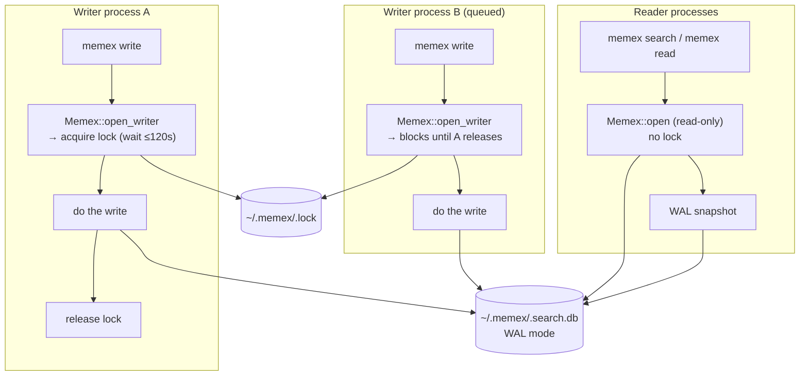

<!-- /autoplan restore point: /Users/zxiong/.gstack/projects/xiongzubiao-memex/feat-parallel-access-autoplan-restore-20260416-140110.md -->
# Memex — Parallel Access Design Specification

**Status:** DRAFT (revision 7 — AGENTS.md scope correction)
**Date:** 2026-04-17
**Branch:** `feat/parallel-access`

### Revision history

- **r1 (initial):** designed through brainstorming (see section "Overview").
- **r7 (AGENTS.md scope correction):** r5's addition of `plugin/AGENTS.md` as an output-contract target was reversed during the post-implementation review-fix-loop. `plugin/AGENTS.md` is loaded into an AI agent's runtime context — the agent is the consumer, not a skill author. Agents handle memex CLI output by reading it as English, not by parsing exit codes or line prefixes; the self-describing error messages + per-variant `actionable_hint` lines are sufficient at runtime. Skill authors and benchmark-harness authors who want a machine-readable contract can reference this spec directly. `plugin/AGENTS.md` row removed from the Components changing table; r5's rationale is preserved below for context.
- **r6 (review-fix-loop dependency audit):** second `/review-fix-loop` pass cross-checked spec claims against the current `core/Cargo.toml` and found three external crates referenced in code samples but not listed as new deps. All added to the Components changing table:
  - `toml` — config.rs parser (already mentioned in Section 3 prose; now also in the table)
  - `rand` — `random_nonce_hex` for tmp filename entropy (was missing entirely)
  - `libc` (unix target only) — POSIX errno constants for `is_transient_io_error` (was missing entirely)
  - Cargo `[features] test-utils = []` declaration (required for `#[cfg(any(test, feature = "test-utils"))]` on `open_writer_with_timeout` — was implied, now explicit as an implementation task)
  - `cli/Cargo.toml` dev-dependency update to pull in `memex-core` with `test-utils` feature enabled
  - Also verified all existing code line-number references (storage.rs:9-19, 22-71, 63-71; search.rs:478-480, 491; lib.rs:44-47; main.rs:712) match the current tree — no stale refs.
- **r5 (DX review fix-ups):** `/plan-devex-review` surfaced 4 concrete improvements (plus a rename) on r4. All applied:
  - Renamed env var `MEMEX_LOCK_TIMEOUT` → `MEMEX_LOCK_TIMEOUT_SECONDS` so the unit is in the name (avoids "is it ms, seconds, or minutes?" confusion)
  - Added `actionable_hint(&anyhow::Error)` helper in CLI dispatch: every new error variant emits a follow-on guidance line keyed on the variant and (for `FileOpFailed`) on `io::ErrorKind`. `FileOpExhausted`'s existing "close any programs" message now comes from this helper, so all variants hit the same quality bar.
  - `LockTimeout` Display no longer bakes in the POSIX-only `lsof` hint; the hint lives in `actionable_hint` and is platform-agnostic ("lsof on macOS/Linux or handle.exe on Windows")
  - Added `plugin/AGENTS.md` to the "Components changing" table: implementation must document the new output contract (exit codes, env var, stdout line prefixes, error shapes) for skill authors. Without this, consumers can't find the contract in a stable place.
- **r4 (Eng third-pass consistency fixes):** spec-text drift cleanup from r3 edits — error-variant table, test expectations for POSIX PermissionDenied, `cfg(any(test, feature = "test-utils"))` wording, tmp filename terminology.
- **r3 (Eng re-review fix-ups):** second pass of Codex Eng review caught 7 items that r2 missed or partially addressed. Fixes:
  - `try_acquire_lock` helper itself now classifies contention vs hard I/O (r2's error mapping was correct but the helper swallowed non-contention errors in its polling loop, making `LockAcquireIo` effectively unreachable from the helper)
  - `is_transient_io_error` treats POSIX `PermissionDenied` as permanent (was default-transient; meant RO-filesystem / RO-parent-dir errors waited 1.9s and got misclassified as `FileOpExhausted` instead of `FileOpFailed`)
  - `open_writer_with_timeout` exposed via `cfg(any(test, feature = "test-utils"))` instead of `cfg(test)` only — integration tests in `core/tests/*.rs` / `cli/tests/*.rs` need it and don't inherit `cfg(test)` from the library
  - `apply_fix_locked` uses a real runtime guard (not `debug_assert!`, which is a no-op in release) — when called on a writer handle it now delegates to `apply_fix` instead of self-timing-out
  - `is_memex_tmp_name` tightened: requires exactly 8 hex-char nonce, basename stem must be non-empty and contain no additional dots (beyond the `.md` extension)
  - `memex delete` re-resolves the target by docid under the writer lock; aborts with a clear error if the resolved docid changed between user confirmation and lock acquisition (TOCTOU guard)
  - Doc consistency: "only adding 4 variants" → "only adding 6 variants" (full list spelled out)
- **r2 (review-driven):** folded blocking + should-fix findings from first dual-voice Eng review. Key changes:
  - `apply_fix_locked` now opens a fresh short-lived connection for re-verify + apply (fixes WAL-snapshot-staleness bug where the reader's long-lived connection kept an older snapshot)
  - Dropped `pid_alive` FFI approach entirely; tmp cleanup is now mtime-based with a nonce in the filename (no PID reuse races, no platform-specific FFI)
  - `retry_io` now classifies errors (retries known-transient OS codes only; fail-fast on permanent errors like `NotFound`)
  - Lock-acquire errors preserve taxonomy: only true timeout maps to `LockTimeout`; other I/O errors flow through new `LockAcquireIo` variant
  - Lock boundary explicitly excludes the stdin/`$EDITOR` input phase — input happens *before* `Memex::open_writer`
  - Corrected SIGINT crash row: default handling is process termination, not guaranteed unwind
  - Test harness uses a test-only constructor (`open_writer_with_timeout`) instead of process-global env vars
  - Concrete injection hook for `atomic_write` retry tests: a `#[cfg(test)]` thread-local `AtomicUsize` that fails first N calls
  - Config bounds: file size cap + `timeout_seconds ∈ [1, 3600]` range check
  - Backlink-failure reporting adds `backlink-failed-count:` summary line (CI workflows can gate on it with `grep`)
  - `lint()` method kept as-is; `apply_fix_locked` is added as a method on the existing handle (no new `lint_scan`)

---

## Overview

Make the `memex` CLI safe to invoke concurrently from multiple processes (parallel agents, benchmark harnesses, interactive users in different terminals) without corrupting the SQLite database or wiki files. Preserve concurrent reads while serializing writes.

This is a process-level coordination layer, not a daemon or a library. The existing CLI surface, storage model, search pipeline, and skills do not change. Readers continue to benefit from SQLite WAL's snapshot isolation; writers acquire an exclusive file lock for the duration of their mutations (with a carve-out for `lint --fix`, which takes the lock per-fix instead of per-command).

### Core invariant

> At any moment, at most one process is mutating the memex (wiki files + SQLite). Readers proceed concurrently with at most one writer, observing snapshot-consistent state via WAL + `atomic_write`.

### Scope

In scope:
- Multi-process safety for `memex write`, `memex delete`, `memex lint --fix`
- Concurrent `memex search`, `memex read`, `memex lint` (without `--fix`) with writers
- A minimal config file at `~/.memex/config.toml`, overridable via `MEMEX_LOCK_TIMEOUT_SECONDS` env var
- `atomic_write` retry against transient OS-level file contention (AV scan, sync daemon, editor FDs)
- Reporting backlink rewrite failures instead of silently skipping them
- Distinct exit codes for retry-worthy errors (lock timeout, file op exhausted)
- Standardization of CLI error messages in paths this design touches

Out of scope: see Section 9.

### Architecture at a glance



### Components changing

| File | Change | Why |
|---|---|---|
| `core/src/config.rs` *(new)* | Loads `~/.memex/config.toml`, applies env overrides | New config plumbing (timeout only for v1) |
| `core/src/lib.rs` | `Memex::open` → read-only handle; new `Memex::open_writer` acquires lock | Writer vs reader split |
| `core/src/storage.rs` | `atomic_write` gets bounded retry; remove `try_acquire_lock_async` (YAGNI) | Handle OS-level transient contention; drop speculative async helper |
| `core/src/lint.rs` | Pre-scan is lock-free; `apply_fix` has a re-verify step | Don't hold lock during long embed loops |
| `cli/src/main.rs` | `run_write` / `run_delete` use `open_writer`; `run_lint --fix` uses per-fix locking; backlink-failed reporting; exit code mapping; error message standardization | Wire into CLI |
| `core/src/error.rs` | New variants: `LockTimeout`, `LockAcquireIo`, `FileOpExhausted`, `FileOpFailed`, `MalformedConfig`, `InvalidEnvVar` | Distinct exit codes + retry-worthy vs fail-fast taxonomy |
| `core/Cargo.toml` | Add dependencies: `toml = "0.8"` (config.rs), `rand = "0.8"` (random_nonce_hex for tmp filenames); add `[target.'cfg(unix)'.dependencies] libc = "0.2"` (POSIX errno constants in `is_transient_io_error`); add `[features] test-utils = []` for the `open_writer_with_timeout` constructor | New deps for config parsing, nonce generation, and POSIX-specific error classification; feature flag for integration-test visibility |
| `cli/Cargo.toml` | Add `memex-core = { path = "../core", features = ["test-utils"] }` to `[dev-dependencies]` (not `[dependencies]` — production CLI doesn't need the test-only constructor) | Integration tests in `cli/tests/*.rs` link against memex-core with the test feature enabled; production build stays clean |

Components explicitly unchanged: SQLite schema, FTS5 triggers, storage model, wiki file format, skills, plugin/npm distribution, search/ranking pipeline.

---

## 1. Problem & Goals

### Today's state

- `Bm25Search` wraps a single `rusqlite::Connection` in a `Mutex` — protects only in-process access, not cross-process (`core/src/search.rs:478-480`)
- `storage.rs` has lock helpers (`acquire_lock`, `try_acquire_lock`, `try_acquire_lock_async`) that the CLI never invokes (`core/src/storage.rs:22-71`)
- SQLite WAL mode is already enabled (`core/src/search.rs:491`) — readers already have snapshot isolation; there's just no process-level coordination for writers
- `Memex::open` unconditionally rebuilds from disk if the documents table is empty (`core/src/lib.rs:44-47`) — races if two processes both detect empty
- `atomic_write` has no retry logic; OS-level transient errors surface as hard failures (`core/src/storage.rs:9-19`)
- Backlink rewrite failures are silently skipped (`cli/src/main.rs:712`, `.is_err() { continue; }`) — a pre-existing bug made worse by parallel access

### What can go wrong under concurrent access

Two parallel `memex write` invocations racing:
- Both compute forward links against the current wiki state, then both write
- One's backlink pass can clobber the other's new page
- `documents.docid` unique index conflicts if both allocate the same hash prefix
- FTS5 state can diverge from the content table under interleaved commits

Non-memex processes briefly holding wiki files open:
- Editors (VS Code, Obsidian, Vim) viewing a page
- Cloud sync (Dropbox, iCloud, OneDrive) mid-sync
- Antivirus or content indexer scanning on file change
- Backup software (Time Machine, restic) snapshotting

On POSIX these rarely cause issues; on Windows they can trigger sharing violations during `rename`. These are everyday scenarios, not benchmark artifacts.

### Goals

1. **Safety:** No corruption of SQLite or wiki files under any concurrent access pattern we can support (single-host, non-network-FS).
2. **Parallel query:** `memex search` / `memex read` must not block behind writers.
3. **Bounded contention:** Writers wait for each other, with a configurable timeout, surfacing clear errors on exhaustion rather than hanging indefinitely.
4. **Graceful handling of non-memex contention:** Editors, sync daemons, etc. should cause bounded retries, not hard failures with raw OS errors.
5. **No loss of diagnostic information:** Backlink failures that are silently dropped today become visible.

### Non-goals

1. Daemon / server mode — each `memex` invocation is still a fresh process
2. Multi-writer concurrent throughput — SQLite WAL serializes writers at the DB level anyway
3. Cross-machine coordination (e.g., shared `~/.memex/` via cloud sync)
4. NFS or network filesystem support
5. Library / language bindings

---

## 2. Architecture

### Lock primitives

One lock file: `~/.memex/.lock`. A zero-byte file on which writers hold an OS-advisory exclusive lock via `fs2::FileExt` — `flock(2)` on POSIX, `LockFileEx` on Windows.

| Platform | Syscall | Type | Released on crash? |
|---|---|---|---|
| Linux / macOS / BSD | `flock(2)` | Advisory (BSD-style) | Yes, by kernel |
| Windows | `LockFileEx` | Mandatory byte-range | Yes, on handle close |

Only one lock file for the whole memex instance. Rationale for not using per-file locks:

1. SQLite WAL serializes writers at the DB level — per-file locks at the filesystem layer would not actually parallelize DB writes.
2. Backlink rewrites mutate other pages; per-file locks introduce deadlock ordering concerns and backlink scan races.
3. Forward-link scans read all pages; a per-file model needs either a snapshot mechanism or a read lock on every page.
4. The gain is small because of (1); the complexity is large.

### Lock scope per command

| Command | Handle | Lock behavior |
|---|---|---|
| `memex search` | `Memex::open` | None (WAL gives snapshot isolation) |
| `memex read` | `Memex::open` | None |
| `memex lint` (no `--fix`) | `Memex::open` | None |
| `memex write` | `Memex::open_writer` | Single lock hold for the whole command |
| `memex delete` | `Memex::open_writer` | Single lock hold for the whole command |
| `memex lint --fix` | `Memex::open` for pre-scan, then per-fix locking | Pre-scan runs without lock; each fix acquires & releases the lock independently with a re-verify step |

### Why `lint --fix` is split

`lint --fix` can re-embed many documents (model upgrade, bulk reindex). Embedding is the slow path: ~100ms–1s per chunk on CPU. Holding the writer lock through the full operation blocks all other writers for minutes on a large wiki. The split achieves:

- **Pre-scan (no lock):** walk the wiki, compare on-disk hashes to SQLite, collect candidate fixes. Reads only.
- **Per-fix lock:** for each candidate, acquire the writer lock, re-verify the issue is still present (state may have changed since pre-scan), apply the fix, release.
- **Re-verify is critical:** between pre-scan and fix-apply, another writer may have already fixed the issue or invalidated it. The re-verify under lock turns an inconsistent pre-scan snapshot into a correct action.

### Why readers don't take a lock

SQLite WAL gives each reader a consistent snapshot at transaction start, concurrent with one writer. `atomic_write` ensures readers of wiki `.md` files see either the fully-old or fully-new content (POSIX `rename` is atomic; Windows `MoveFileEx(MOVEFILE_REPLACE_EXISTING)` same).

A reader observing a *stale but consistent* state is a correct snapshot, not corruption. For `lint --fix`, the re-verify under lock handles the case where the stale snapshot disagrees with current state.

### Crash safety at a glance

| Event | flock | SQLite | tmp files | Result |
|---|---|---|---|---|
| Normal exit | RAII drop releases | Commit / rollback clean | Cleaned up | Clean |
| Ctrl-C (SIGINT) | OS releases on termination | Rolled back on next open via WAL | **Leaked** (Drop not guaranteed to run on signal-default termination) | Tmp file leak — recovered by next `open_writer` (see Section 7) |
| SIGKILL (`kill -9`) | OS releases | Rolled back on next open via WAL | Leaked (`.{name}.{pid}.{nonce}.tmp`) | Tmp file leak — recovered by next `open_writer` |
| Power loss / panic | OS releases on boot | Rolled back on next open via WAL | Leaked | Tmp file leak — recovered by next `open_writer` |
| SIGSTOP (suspended) | Held until resume | — | — | Other writers wait until lock timeout (intentional) |

Important correction vs r1: Rust's default SIGINT behavior is process termination — it does **not** unwind the stack, so `WriterLock::Drop` is not guaranteed to run on Ctrl-C. What is guaranteed is that the OS releases the `flock` on process exit. SQLite WAL handles any in-flight transaction rollback on the next connection open. Tmp files may leak in *all* non-clean-exit paths and are cleaned up on the next `Memex::open_writer` (Section 7).

If graceful Ctrl-C handling becomes a UX priority, we'd install an explicit signal handler (out of scope for this design).

---

## 3. Config

New module `core/src/config.rs`. Hand-rolled loader for one knob.

New dependencies required by this spec as a whole (see Components changing table for the full Cargo.toml delta):
- `toml` — this module's TOML parser
- `rand` — `random_nonce_hex` in `atomic_write` (Section 5)
- `libc` (unix target only) — POSIX errno constants in `is_transient_io_error` (Section 5)

The `toml` crate is the only one this config module introduces directly. The others are called out here so the full dep list is visible from one place.

### File format

Location: `~/.memex/config.toml` (sibling of `.search.db`, `wiki/`, and the new `.lock`).

```toml
[locking]
timeout_seconds = 120
```

### Precedence

Highest to lowest:
1. `MEMEX_LOCK_TIMEOUT_SECONDS` environment variable (numeric seconds)
2. `config.toml` `[locking] timeout_seconds`
3. Compile-time default: **120s**

### API

```rust
pub struct Config {
    pub lock_timeout: Duration,
}

/// Max config file size (prevents a pathological config from pinning the process).
const MAX_CONFIG_BYTES: u64 = 64 * 1024;
/// Valid range for timeout_seconds. Below 1s is pointless; above 1h is a usage bug.
const TIMEOUT_RANGE_SECS: std::ops::RangeInclusive<u64> = 1..=3600;

impl Config {
    pub fn load(memex_root: &Path) -> Result<Self> {
        let mut cfg = Config::default();
        let path = memex_root.join("config.toml");
        if path.exists() {
            let metadata = fs::metadata(&path)?;
            if metadata.len() > MAX_CONFIG_BYTES {
                return Err(MemexError::MalformedConfig {
                    path: path.clone(),
                    reason: format!(
                        "config file is {} bytes; max allowed is {}",
                        metadata.len(), MAX_CONFIG_BYTES
                    ),
                });
            }
            let raw = fs::read_to_string(&path)?;
            let parsed: TomlConfig = toml::from_str(&raw)
                .map_err(|e| MemexError::MalformedConfig {
                    path: path.clone(),
                    reason: e.to_string(),
                })?;
            if let Some(secs) = parsed.locking.and_then(|l| l.timeout_seconds) {
                if !TIMEOUT_RANGE_SECS.contains(&secs) {
                    return Err(MemexError::MalformedConfig {
                        path: path.clone(),
                        reason: format!(
                            "[locking] timeout_seconds = {} is outside allowed range {:?}",
                            secs, TIMEOUT_RANGE_SECS
                        ),
                    });
                }
                cfg.lock_timeout = Duration::from_secs(secs);
            }
        }
        if let Ok(v) = env::var("MEMEX_LOCK_TIMEOUT_SECONDS") {
            let secs: u64 = v.parse().map_err(|_| MemexError::InvalidEnvVar {
                var: "MEMEX_LOCK_TIMEOUT_SECONDS",
                value: v.clone(),
                reason: "not a non-negative integer".into(),
            })?;
            if !TIMEOUT_RANGE_SECS.contains(&secs) {
                return Err(MemexError::InvalidEnvVar {
                    var: "MEMEX_LOCK_TIMEOUT_SECONDS",
                    value: v,
                    reason: format!("outside allowed range {:?}", TIMEOUT_RANGE_SECS),
                });
            }
            cfg.lock_timeout = Duration::from_secs(secs);
        }
        Ok(cfg)
    }
}

impl Default for Config {
    fn default() -> Self {
        Self { lock_timeout: Duration::from_secs(120) }
    }
}

#[derive(serde::Deserialize)]
struct TomlConfig {
    locking: Option<TomlLocking>,
}

#[derive(serde::Deserialize)]
struct TomlLocking {
    timeout_seconds: Option<u64>,
}
```

### Error behavior

- File missing → silent defaults
- File too large (>64KB) → `MalformedConfig` with reason string → CLI exits 1
- File present but malformed TOML → `MalformedConfig` with parser reason → CLI exits 1
- `[locking] timeout_seconds` outside `[1, 3600]` → `MalformedConfig` → CLI exits 1
- `MEMEX_LOCK_TIMEOUT_SECONDS` non-numeric or outside `[1, 3600]` → `InvalidEnvVar` → CLI exits 1
- Unknown keys in TOML → ignored silently (no `serde(deny_unknown_fields)`; supports forward-compat with future sections)

**Why bounded:** a malicious or accidental `MEMEX_LOCK_TIMEOUT_SECONDS=99999999` would pin every waiting agent for ~3 years. Upper bound (1h) is generous for any real scenario and catches the foot-gun.

### Default choice — why 120s

A `memex write` holds the lock for its whole operation. Realistic hold times:

| Operation | Hold time |
|---|---|
| `memex write` small page, no source | <1s |
| `memex write` with `--source` (small file) | 1–5s |
| `memex write` with `--source` (large transcript) | 5–30s |
| `memex lint --fix` re-embedding many docs | per-fix only; not a contiguous hold |

For a benchmark harness with 10 workers each holding ~2s, the 10th waits ~18s — comfortably inside 120s. With source attachments it would exceed 30s, so the 120s default gives headroom. Users on very large sources can raise via env/config.

We explicitly do not support "infinite wait" — a hung holder must surface as an error, not block all agents silently forever.

### Call site

Loaded in both `Memex::open` and `Memex::open_writer`. Readers need it too because `apply_fix_locked` (used by `memex lint --fix` on a reader handle) consults `config.lock_timeout` when acquiring the per-fix writer lock. Cost is one file existence check + (if present) a small TOML parse — negligible per invocation.

If `config.toml` is malformed, all commands fail with `MalformedConfig` (exit code 1) until the file is fixed. This is preferred over "readers silently ignore config" because the user's intent (custom timeout) wouldn't take effect, and debugging that asymmetry is worse than the upfront error.

### Why not the `config` crate

Evaluated the `config` crate (popular, handles file + env + defaults automatically). Rejected for v1:
- One knob doesn't justify ~30 transitive dependencies (serde_json, serde_yaml, toml, json5, ron, pathdiff, ...)
- Crate's auto env-var mapping convention would give us `MEMEX__LOCKING__TIMEOUT_SECONDS`; keeping the agreed flat name `MEMEX_LOCK_TIMEOUT_SECONDS` would require custom handling that partly defeats the crate's purpose
- Hand-rolled is ~25 lines and explicit

Revisit this decision when the config grows to 4+ keys across 2+ sections.

---

## 4. Lock Lifecycle & Memex API

### Types

```rust
// core/src/lib.rs

pub struct Memex {
    root: PathBuf,
    search: search::Bm25Search,
    _writer_lock: Option<WriterLock>,  // Some = writer, None = reader
    config: Config,
}

pub(crate) struct WriterLock {
    file: fs::File,
}

impl Drop for WriterLock {
    fn drop(&mut self) {
        use fs2::FileExt;
        let _ = FileExt::unlock(&self.file);  // OS releases on crash regardless
    }
}
```

### Constructors

```rust
impl Memex {
    /// Read-only handle. No lock taken. Multiple readers OK concurrently with
    /// one writer. Returns an empty-but-usable handle if the DB has never been
    /// populated — search returns empty, lint can still pre-scan.
    pub fn open(root: PathBuf) -> Result<Self> {
        let config = Config::load(&root)?;
        let search = Bm25Search::open(&root.join(SEARCH_DB_NAME))?;
        Ok(Self { root, search, _writer_lock: None, config })
    }

    /// Writer handle. Acquires exclusive flock on `~/.memex/.lock`, waiting
    /// up to `config.lock_timeout` (default 120s). If the DB is empty, rebuilds
    /// from disk while holding the lock. Also runs opportunistic tmp-file
    /// cleanup (see Section 7).
    ///
    /// Error taxonomy: true timeout → `LockTimeout` (exit 2). Other I/O errors
    /// during lock acquisition (e.g., permission denied on `.lock`, read-only FS,
    /// parent dir not writable) → `LockAcquireIo` (exit 1). This matters because
    /// `LockTimeout` is retry-worthy but a permission error is not.
    pub fn open_writer(root: PathBuf) -> Result<Self> {
        Self::open_writer_with_config(root, Config::load(&root)?)
    }

    /// Internal constructor that takes a pre-built `Config`. Exposed via
    /// `open_writer_with_timeout` (gated `cfg(any(test, feature = "test-utils"))`)
    /// so tests can inject a custom timeout without touching the process-global
    /// environment (which would race with parallel tests).
    fn open_writer_with_config(root: PathBuf, config: Config) -> Result<Self> {
        // Ensure wiki/ exists (current lazy-init behavior, preserved)
        if !root.join("wiki").is_dir() {
            fs::create_dir_all(root.join("wiki"))?;
        }

        // Acquire lock with timeout. Preserve error taxonomy:
        //   - TimedOut  → LockTimeout (retry-worthy)
        //   - other I/O → LockAcquireIo (usually not retry-worthy)
        //
        // This requires that storage::try_acquire_lock NOT swallow non-contention
        // errors during its polling loop (see "Lock helper update" below).
        let lock_path = root.join(".lock");
        let lock_file = storage::try_acquire_lock(&lock_path, config.lock_timeout)
            .map_err(|e| match e.kind() {
                std::io::ErrorKind::TimedOut => MemexError::LockTimeout {
                    timeout_secs: config.lock_timeout.as_secs(),
                    lock_path: lock_path.clone(),
                },
                _ => MemexError::LockAcquireIo {
                    lock_path: lock_path.clone(),
                    source: e,
                },
            })?;
        let writer_lock = WriterLock { file: lock_file };

        // Open search connection (under lock, so rebuild-if-empty is safe).
        // busy_timeout set inside Bm25Search::open before any DDL runs.
        let search = Bm25Search::open(&root.join(SEARCH_DB_NAME))?;
        if search.is_empty()? {
            search.rebuild(&root)?;
        }

        // Tmp file cleanup (Section 7). Runs under the writer lock, so no race
        // against a concurrent writer creating fresh temp files.
        storage::cleanup_stale_tmp_files(&root.join("wiki"));

        Ok(Self {
            root,
            search,
            _writer_lock: Some(writer_lock),
            config,
        })
    }
}

// Note: Bm25Search::open is updated to call `conn.busy_timeout(5000)` *before*
// running init_schema, so any DDL from first-open is also covered by the SQLite
// busy_timeout safety net.

// Test-support constructor: inject a custom timeout without using process-global
// env vars. std::env::set_var is unsafe in recent Rust and races with parallel tests.
//
// Gated by both `cfg(test)` (library-internal tests) AND a `test-utils` Cargo
// feature (so integration tests in core/tests/*.rs and cli/tests/*.rs can use it
// too — #[cfg(test)] alone only exposes it to the library's own unit tests).
// Add to core/Cargo.toml:
//   [features]
//   test-utils = []
// and use `core = { path = "../core", features = ["test-utils"] }` in
// cli/Cargo.toml [dev-dependencies].
#[cfg(any(test, feature = "test-utils"))]
impl Memex {
    pub fn open_writer_with_timeout(root: PathBuf, timeout: Duration) -> Result<Self> {
        Self::open_writer_with_config(root, Config { lock_timeout: timeout })
    }
}
```

### Lock helper update (storage.rs)

The existing `try_acquire_lock` helper swallows ALL errors from `try_lock_exclusive()` during its polling loop and always returns `ErrorKind::TimedOut` at the end. That collapses "permission denied on the lock file" into "timeout" — which is wrong under the r2 error taxonomy (`LockAcquireIo` would be unreachable from the helper).

Required change: the polling loop must distinguish **contention** errors (WouldBlock / EAGAIN) from other I/O errors, and return the latter immediately.

```rust
/// Try to acquire exclusive flock on `lock_path`, polling every 10ms until
/// `timeout` elapses. Contention errors (WouldBlock / EAGAIN) cause continued
/// polling; any other I/O error returns immediately so the caller can
/// distinguish `LockTimeout` (retry-worthy) from `LockAcquireIo` (configuration
/// problem — don't retry).
pub(crate) fn try_acquire_lock(lock_path: &Path, timeout: Duration) -> std::io::Result<fs::File> {
    use fs2::FileExt;
    let file = fs::OpenOptions::new()
        .create(true)
        .write(true)
        .truncate(false)
        .open(lock_path)?;

    let is_contention = |e: &std::io::Error| -> bool {
        if matches!(e.kind(), std::io::ErrorKind::WouldBlock) { return true; }
        // Windows: fs2 returns Error::last_os_error() for contention, which
        // Rust std maps to ErrorKind::Uncategorized rather than WouldBlock.
        // Match the raw OS code explicitly.
        #[cfg(windows)]
        if e.raw_os_error() == Some(33) { return true; }  // ERROR_LOCK_VIOLATION
        false
    };

    // First attempt — uncontended fast path.
    match file.try_lock_exclusive() {
        Ok(()) => return Ok(file),
        Err(e) if !is_contention(&e) => return Err(e),
        Err(_) => {}  // contention; fall through to polling loop
    }

    let start = std::time::Instant::now();
    while start.elapsed() < timeout {
        std::thread::sleep(Duration::from_millis(10));
        match file.try_lock_exclusive() {
            Ok(()) => return Ok(file),
            Err(e) if !is_contention(&e) => return Err(e),  // ← no longer swallowed
            Err(_) => continue,
        }
    }
    Err(std::io::Error::new(
        std::io::ErrorKind::TimedOut,
        format!("could not acquire lock within {:?}", timeout),
    ))
}
```

Also changes the signature from `timeout_secs: u64` to `timeout: Duration` — aligns with `Config::lock_timeout` and avoids sub-second truncation.

### Mutating methods (runtime check)

Any method that mutates requires a writer handle. Enforced at runtime:

```rust
impl Memex {
    fn require_writer(&self) -> Result<()> {
        if self._writer_lock.is_none() {
            return Err(MemexError::Internal(
                "attempted mutating operation on read-only Memex handle".into()
            ));
        }
        Ok(())
    }

    pub fn write_page(&self, ...) -> Result<...> {
        self.require_writer()?;
        // ... existing write logic, now guaranteed to run under lock
    }

    pub fn delete_page(&self, ...) -> Result<...> {
        self.require_writer()?;
        // ...
    }
}
```

Compile-time enforcement via a separate `MemexWriter` type would be cleaner but adds API surface. Runtime check is adequate for v1 — misuse panics loudly in tests before reaching production.

### Per-fix lint: `apply_fix_locked`

**Key design point (fix for WAL snapshot-staleness bug in r1):** the reader's
long-lived SQLite connection is pinned to whatever snapshot it first observed.
Simply acquiring the file lock doesn't advance that snapshot — SQLite WAL's
snapshot is bound to the connection's open read transaction. To re-verify a
lint issue against the *current* committed state, `apply_fix_locked` opens a
**fresh short-lived connection** for the re-verify + apply transaction, then
drops it on return.

No new `lint_scan` method. `apply_fix_locked` takes a `LintIssue` from the
existing `Memex::lint() -> LintReport` output (pre-scan is lock-free; any
reader handle can call it).

```rust
impl Memex {
    /// Re-verify the issue under an exclusive writer lock and apply the fix
    /// if it's still present. Safe to call on either a reader or writer handle:
    ///
    ///   - Reader handle: acquires the file lock, opens a fresh connection for
    ///     re-verify + apply (avoids WAL-snapshot staleness from the reader's
    ///     pinned connection), releases on return.
    ///   - Writer handle: delegates to `apply_fix` (lock already held).
    ///
    /// Returns FixOutcome::Stale if the issue was already resolved by a
    /// concurrent writer between the pre-scan and this call.
    pub fn apply_fix_locked(&self, issue: &LintIssue) -> Result<FixOutcome> {
        // Runtime guard (NOT debug_assert! — that's a no-op in release).
        // If we're already a writer, just run apply_fix — don't try to
        // re-acquire the lock (which would self-block until LockTimeout).
        if self._writer_lock.is_some() {
            return self.apply_fix(issue);
        }

        let lock_path = self.root.join(".lock");
        let lock_file = storage::try_acquire_lock(&lock_path, self.config.lock_timeout)
            .map_err(|e| match e.kind() {
                std::io::ErrorKind::TimedOut => MemexError::LockTimeout {
                    timeout_secs: self.config.lock_timeout.as_secs(),
                    lock_path: lock_path.clone(),
                },
                _ => MemexError::LockAcquireIo {
                    lock_path: lock_path.clone(),
                    source: e,
                },
            })?;
        let _guard = WriterLock { file: lock_file };

        // Open a fresh connection for re-verify + apply. This is the WAL fix:
        // the new connection sees the latest committed state, not the reader's
        // pinned snapshot from process start.
        let fresh = Bm25Search::open(&self.root.join(SEARCH_DB_NAME))?;

        if !is_issue_still_present(&fresh, &self.root, issue)? {
            return Ok(FixOutcome::Stale);
        }

        apply_fix_inner(&fresh, &self.root, issue)?;
        Ok(FixOutcome::Applied)
        // WriterLock and fresh connection drop here
    }

    /// Writer-handle fix path: lock is already held by self._writer_lock.
    /// Used when bulk-fixing inside a writer context (rare).
    pub fn apply_fix(&self, issue: &LintIssue) -> Result<FixOutcome> {
        self.require_writer()?;
        if !is_issue_still_present(&self.search, &self.root, issue)? {
            return Ok(FixOutcome::Stale);
        }
        apply_fix_inner(&self.search, &self.root, issue)?;
        Ok(FixOutcome::Applied)
    }
}

pub enum FixOutcome {
    Applied,
    Stale,  // issue was already resolved (no-op)
}
```

### CLI dispatch changes (`cli/src/main.rs`)

```rust
match cli.command {
    Commands::Search { .. } | Commands::Read { .. } => {
        // Memex::open — no lock
    }
    Commands::Lint { fix: false } => {
        // Memex::open — no lock; existing Memex::lint() reused
    }
    Commands::Write { .. } | Commands::Delete { .. } => {
        // Memex::open_writer — lock held for command duration
        //
        // Important (spec r2): the lock is acquired AFTER stdin / $EDITOR
        // input has been collected. run_write's current flow — read stdin,
        // validate frontmatter, slugify — happens *before* calling
        // Memex::open_writer, so we never hold the lock while a user is
        // typing into $EDITOR (which could take minutes).
    }
    Commands::Lint { fix: true } => {
        // Pre-scan on reader handle; per-fix lock via apply_fix_locked
        let memex = Memex::open(root)?;
        let report = memex.lint()?;
        let mut applied = 0usize;
        let mut stale = 0usize;
        for issue in &report.issues {
            match memex.apply_fix_locked(issue)? {
                FixOutcome::Applied => {
                    println!("fixed: {}", issue.page);
                    applied += 1;
                }
                FixOutcome::Stale => {
                    // Emit diagnostic so users aren't left wondering whether
                    // pre-scan issues disappeared silently.
                    println!("already-fixed: {}", issue.page);
                    stale += 1;
                }
            }
        }
        if applied + stale > 0 {
            println!("lint-fix-summary: applied={applied} stale={stale}");
        }
    }
}
```

### Lock boundary — explicit phases for `memex write` and `memex delete`

To avoid holding the lock during user interaction (editor, stdin, confirmation
prompt), mutating commands are structured in phases, with the lock acquired
only around the actual mutation.

**`memex write`:**
1. **Input (no lock, no handle):** read stdin or open `$EDITOR`. User may take
   arbitrary time here.
2. **Validate (no lock):** parse frontmatter, slugify filename. Pure local.
3. **Mutate (lock held for this phase only):** `Memex::open_writer` → file
   write → content insert → embed → documents upsert → backlink pass →
   orphan cleanup → `WriterLock::drop` releases.

**`memex delete`:** has a TOCTOU hazard that the write path doesn't — the
doc being deleted can be mutated by another writer between confirmation and
the lock acquire. So we re-verify by stable docid under the lock:

1. **Resolve + confirm (no lock):** open a reader, resolve `page_ref` → `doc`
   (stem, docid, title). If TTY and `!--force`, prompt the user with the
   resolved title. User confirms `delete docid=a3f2b1`.
2. **Re-resolve under lock:** `Memex::open_writer` → re-resolve `page_ref` from
   the fresh writer handle → compare docid against the one the user confirmed.
   If they differ (another process overwrote the page between confirm and lock
   acquire), abort with:
   ```
   Error: {page_ref} changed between confirmation and delete
   (confirmed: docid=a3f2b1, now: docid=9c4e8d). Re-run to verify.
   ```
   Exit code 1. User re-runs if they still want to delete the new version.
3. **Mutate (under lock):** actual `delete_page(doc)` → file remove → DB row
   delete → dangling-link scan → release.

This turns a silent-wrong-delete into an explicit "state changed" error. The
TTY prompt stays non-locked (don't hold the lock while a human decides).

### Rebuild-on-empty moves to writer path

Current `Memex::open` rebuilds the index from disk if the documents table is empty (`lib.rs:44-47`). Under the new design, only `open_writer` rebuilds — a reader sees whatever state is committed.

Rationale: the current behavior races when two processes both detect empty (both attempt rebuild concurrently). Moving rebuild into the writer path eliminates the race, because only the lock holder rebuilds.

This is a clean design choice; no migration path is preserved (per explicit user direction — the project is young enough to drop existing data).

---

## 5. atomic_write Retry & Backlink Failure Reporting

### Problem

`atomic_write` today does one `fs::write` + one `fs::rename` with no retry. Both can fail with transient OS-level errors under everyday conditions:

- Antivirus holding a file handle during a scan (50–500ms)
- Cloud sync (Dropbox, iCloud) holding during upload
- Editor briefly holding the file for read
- Windows `rename` can fail with sharing violation if the destination is held open for read by another process

Surfacing these as raw `(os error 5)` failures is user-hostile. Retrying is the right answer; the retry must be bounded so genuinely stuck files surface as errors.

### Retry schedule

```rust
const RETRY_SCHEDULE: &[Duration] = &[
    Duration::from_millis(10),
    Duration::from_millis(20),
    Duration::from_millis(50),
    Duration::from_millis(100),
    Duration::from_millis(200),
    Duration::from_millis(500),
    Duration::from_millis(500),
    Duration::from_millis(500),
];
// total: ~1.9s across 9 attempts (1 immediate + 8 backoffs)
```

2 seconds covers typical AV/sync/indexer holds without the process feeling frozen. If it's still failing at 2s, the file is genuinely in use (e.g., an editor holding it long-term) — waiting longer doesn't help and delays the error the user needs to see.

Budget is hardcoded, not configurable: YAGNI, and a user with slow-NFS problems should file an issue before we add a knob.

### Implementation

```rust
pub fn atomic_write(path: &Path, content: &[u8]) -> Result<()> {
    // Temp filename includes a random nonce so PID reuse cannot cause a
    // cleaner to mistake an unrelated process's live temp for a stale one.
    // Format: .{filename}.{pid}.{nonce}.tmp where {filename} is the full
    // wiki filename (e.g., `rest-patterns.md`). Example:
    //   for wiki/rest-patterns.md → .rest-patterns.md.12345.a1b2c3d4.tmp
    let nonce = random_nonce_hex();
    let temp_name = format!(
        ".{}.{}.{}.tmp",
        path.file_name().unwrap_or_default().to_string_lossy(),
        std::process::id(),
        nonce,
    );
    let temp = path.with_file_name(temp_name);

    // Write to temp with retry
    retry_io(&temp, "write temp", || fs::write(&temp, content))?;

    // Rename temp → final with retry
    if let Err(e) = retry_io(path, "rename", || fs::rename(&temp, path)) {
        let _ = fs::remove_file(&temp);  // best-effort cleanup
        return Err(e);
    }
    Ok(())
}

fn random_nonce_hex() -> String {
    // 4 bytes = 32 bits of entropy; plenty to disambiguate concurrent writes
    // by the same PID (which already can't happen, but nonce defends against
    // PID reuse across process lifetimes).
    let n: u32 = rand::random();
    format!("{:08x}", n)
}

fn retry_io<F>(path: &Path, operation: &'static str, mut f: F) -> Result<()>
where F: FnMut() -> std::io::Result<()>
{
    let mut last_err = None;
    for (attempt, delay) in std::iter::once(&Duration::ZERO).chain(RETRY_SCHEDULE).enumerate() {
        if attempt > 0 {
            std::thread::sleep(*delay);
        }
        // Test-only hook: when enabled, fail the first N calls regardless
        // of what `f` would return. See Section 8 for the injection mechanism.
        #[cfg(test)]
        if let Some(e) = test_injected_failure() {
            last_err = Some(e);
            continue;
        }
        match f() {
            Ok(()) => return Ok(()),
            Err(e) => {
                if !is_transient_io_error(&e) {
                    // Fast-fail: this error is not something retrying fixes.
                    return Err(MemexError::FileOpFailed {
                        path: path.to_path_buf(),
                        operation,
                        source: e,
                    });
                }
                last_err = Some(e);
            }
        }
    }
    Err(MemexError::FileOpExhausted {
        path: path.to_path_buf(),
        operation,
        source: last_err.expect("loop ran at least once"),
    })
}

/// Classify an I/O error as "worth retrying" (transient OS contention)
/// or "fail-fast" (permanent — retrying would just delay the real error).
///
/// Transient classes:
///   - POSIX: EBUSY, EAGAIN / EWOULDBLOCK, EINTR, ETXTBSY, ESTALE
///   - Windows: ERROR_SHARING_VIOLATION (32), ERROR_LOCK_VIOLATION (33)
///   - Platform-independent: ErrorKind::WouldBlock, Interrupted,
///     ResourceBusy, ReadOnlyFilesystem (sometimes briefly under sync)
///
/// Permanent (never retried): NotFound (parent dir missing), PermissionDenied
/// on the PARENT DIR (vs the file, which may be transiently held), InvalidInput,
/// InvalidData, UnexpectedEof.
///
/// When in doubt: treat as transient. Worst case we wait 1.9s instead of
/// failing immediately. That's an acceptable bias given the retry budget is
/// small and the cost of wrongly fail-fasting (spurious errors under real
/// transient contention) is higher than the cost of a brief wait.
fn is_transient_io_error(err: &std::io::Error) -> bool {
    use std::io::ErrorKind::*;

    // Definitely permanent — fail fast.
    match err.kind() {
        NotFound | InvalidInput | InvalidData | UnexpectedEof => return false,
        _ => {}
    }

    // Definitely transient by kind.
    match err.kind() {
        WouldBlock | Interrupted | ResourceBusy | TimedOut => return true,
        _ => {}
    }

    // Check raw OS error codes for cases not captured by ErrorKind.
    if let Some(code) = err.raw_os_error() {
        #[cfg(unix)]
        {
            let transient_posix = [
                libc::EBUSY,
                libc::EAGAIN,   // == EWOULDBLOCK on most unix
                libc::EINTR,
                libc::ETXTBSY,
                libc::ESTALE,
            ];
            if transient_posix.contains(&code) { return true; }
        }
        #[cfg(windows)]
        {
            const ERROR_SHARING_VIOLATION: i32 = 32;
            const ERROR_LOCK_VIOLATION: i32 = 33;
            const ERROR_ACCESS_DENIED: i32 = 5;  // transient on rename-over-open-handle
            if [ERROR_SHARING_VIOLATION, ERROR_LOCK_VIOLATION, ERROR_ACCESS_DENIED]
                .contains(&code) { return true; }
        }
    }

    // POSIX PermissionDenied: almost always permanent (RO filesystem, RO
    // parent dir, SELinux denial). No transient path reaches this after the
    // raw_os_error check above caught EBUSY/EAGAIN/etc. The Windows analog
    // (ERROR_ACCESS_DENIED=5) IS transient (sharing violation during rename)
    // and was already classified as transient via raw_os_error.
    #[cfg(unix)]
    if matches!(err.kind(), PermissionDenied) { return false; }

    // Default: treat as transient (bias toward retry — see doc above).
    true
}
```

Key change vs r1: `retry_io` no longer retries on every `io::Error`. It fast-fails on clearly permanent errors (e.g., `NotFound` — the parent directory is gone, no amount of waiting will bring it back), which produces the *right* error message immediately instead of a misleading "file busy after 2s" after pointless waiting.

The classifier biases toward "transient" when unsure — if a new error code appears on a new OS / filesystem, we wait 1.9s and then report it. That trade-off (brief unnecessary wait on unknown errors) beats the alternative (falsely fail-fasting on a transient error and annoying the user).

### Error message on exhaustion

CLI formats `FileOpExhausted` as:

```
Error: file operation failed after retries: rename on /Users/you/.memex/wiki/caching.md
  caused by: Access is denied. (os error 5)
A process likely has the file open (editor, cloud sync, antivirus, backup).
Close any programs using that file, then retry.
```

The "A process likely has..." hint is generated by the CLI dispatcher's
`actionable_hint` (Section 6), not baked into the error Display — library
callers get a clean error, CLI users get the user-friendly follow-on.

Exit code: **3** (see Section 6).

### Backlink-failure reporting

Current behavior in `cli/src/main.rs:712` silently skips backlink failures:

```rust
if memex_core::storage::atomic_write(&path, updated_content.as_bytes()).is_err() {
    continue;  // ← the bug
}
```

Under parallel access with `atomic_write` now reporting `FileOpExhausted`, this silent skip becomes untenable. Replace with:

```rust
let mut backlink_failed: Vec<(String, String)> = Vec::new();

if was_linked {
    let updated_content = reconstruct_page(&other_content, &updated_body);
    match memex_core::storage::atomic_write(&path, updated_content.as_bytes()) {
        Ok(()) => {
            // existing reindex + backlinked_stems.push logic
        }
        Err(e) => {
            let reason = match &e {
                MemexError::FileOpExhausted { .. } => "file busy after retry".to_string(),
                other => format!("{other}"),
            };
            backlink_failed.push((other_stem, reason));
        }
    }
}
```

Output section adds both per-item lines AND a structured summary line:

```rust
if !backlink_failed.is_empty() {
    for (stem, reason) in &backlink_failed {
        println!("backlink-failed: {stem} ({reason})");
    }
    // Machine-parseable summary for automation.
    println!("backlink-failed-count: {}", backlink_failed.len());
}
```

Example output when a backlink rewrite fails:

```
written: a3f2b1
wiki_pages: 42
linked: rest-patterns
backlinked: api-design
backlink-failed: caching-strategies (file busy after retry)
backlink-failed-count: 1
```

Exit code remains 0 (primary write succeeded). CI workflows that want to gate on partial success can grep for `backlink-failed-count: 0` themselves — no dedicated flag needed for v1.

**Partial-success model:** the primary page write succeeded, some backlinks succeeded, one failed. The agent / user sees exactly what happened. Re-running `memex write foo --force` will re-attempt the backlinks. `memex lint` will flag the missing backlink as `missing-link` until resolved.

The primary write is **not** rolled back on backlink failure — that would be worse UX than partial success with clear reporting.

---

## 6. Error Surface & Exit Codes

### New error variants

```rust
// core/src/error.rs
#[derive(thiserror::Error, Debug)]
pub enum MemexError {
    // ... existing variants

    #[error("timed out waiting for writer lock after {timeout_secs}s (lock held by another process at {})", lock_path.display())]
    LockTimeout {
        timeout_secs: u64,
        lock_path: PathBuf,
    },
    // Hint (added by CLI's actionable_hint): platform-agnostic guidance
    // pointing at `lsof` on POSIX and `handle.exe` on Windows, plus the
    // env var escape hatch. Keeping the hint out of Display lets library
    // callers log a clean error without terminal-only tool suggestions.

    /// Non-timeout I/O error while trying to acquire the writer lock file.
    /// Distinguished from LockTimeout so callers can distinguish contention
    /// (retry-worthy) from configuration problems (permission, missing dir).
    #[error("cannot acquire writer lock at {}: {source}", lock_path.display())]
    LockAcquireIo {
        lock_path: PathBuf,
        #[source] source: std::io::Error,
    },

    /// Retry budget exhausted — file is still held after atomic_write's
    /// retry schedule. Exit code 3 (retry-worthy at caller level).
    #[error("file operation failed after retries: {operation} on {}", path.display())]
    FileOpExhausted {
        path: PathBuf,
        operation: &'static str,
        #[source] source: std::io::Error,
    },

    /// Non-transient I/O error on atomic_write. Exit code 1 (NOT retry-worthy).
    /// Produced when is_transient_io_error returns false (e.g., NotFound on
    /// parent directory). Distinguished from FileOpExhausted so skills can
    /// avoid pointless retries.
    #[error("file operation failed: {operation} on {}", path.display())]
    FileOpFailed {
        path: PathBuf,
        operation: &'static str,
        #[source] source: std::io::Error,
    },

    /// Config file is present but cannot be used. `reason` is a human-readable
    /// explanation (TOML parse error, size exceeded, value out of range).
    /// Not a `#[source]`-wrapped toml::de::Error because MalformedConfig now
    /// covers multiple root causes (size, range, parse).
    #[error("malformed config file at {}: {reason}", path.display())]
    MalformedConfig {
        path: PathBuf,
        reason: String,
    },

    /// Env var present but unusable. `reason` explains which constraint failed.
    #[error("invalid value for {var} = {value:?}: {reason}")]
    InvalidEnvVar {
        var: &'static str,
        value: String,
        reason: String,
    },

    #[error("internal invariant violated: {0}")]
    Internal(String),
}
```

### Exit code contract

| Code | Meaning | When |
|---|---|---|
| 0 | Success | Command completed |
| 1 | Generic error | Input validation, file not found, SQL error, frontmatter invalid, ambiguous ref, path traversal rejected, malformed config, invalid env var, `LockAcquireIo`, `FileOpFailed` (non-transient I/O) |
| 2 | Lock timeout | Writer couldn't acquire `.lock` within `config.lock_timeout` (retry-worthy) |
| 3 | File op exhausted | `atomic_write` exceeded retry budget on transient errors (retry-worthy) |

**Why 2 and 3 are distinct from 1:** skills and benchmark harnesses can decide on exit 2 or 3 to backoff-and-retry; on 1, surface to the user immediately. This is the correctness reason `retry_io` now distinguishes `FileOpFailed` (permanent, exit 1) from `FileOpExhausted` (transient, exit 3) — see Section 5.

**Key change vs r1:** `LockAcquireIo` and `FileOpFailed` are new. Their purpose is to preserve the error taxonomy: a permission error on the lock file is NOT a "lock timeout" (it won't clear with retry), and a missing parent directory is NOT a "file is busy" (it's a bug). The r1 spec collapsed these into timeout / exhausted categories, producing misleading errors.

### CLI dispatch with source-chain printing

Replace the current `fn main() -> anyhow::Result<()>` pattern:

```rust
fn main() {
    let cli = Cli::parse();
    let result = dispatch(cli);
    let exit_code = match result {
        Ok(()) => 0,
        Err(e) => {
            eprintln!("Error: {e}");
            let mut src = e.source();
            while let Some(s) = src {
                eprintln!("  caused by: {s}");
                src = s.source();
            }
            // Print an actionable follow-on hint when the surfaced error has
            // a useful one. Keeps FileOpFailed / LockAcquireIo / LockTimeout
            // at the same quality bar as FileOpExhausted.
            if let Some(hint) = actionable_hint(&e) {
                eprintln!("{hint}");
            }
            exit_code_for(&e)
        }
    };
    std::process::exit(exit_code);
}

fn exit_code_for(err: &anyhow::Error) -> i32 {
    for cause in err.chain() {
        if let Some(me) = cause.downcast_ref::<MemexError>() {
            return match me {
                MemexError::LockTimeout { .. } => 2,
                MemexError::FileOpExhausted { .. } => 3,
                _ => 1,
            };
        }
    }
    1
}

/// Post-error hint, keyed on the error variant (and for FileOpFailed, on
/// the underlying io::ErrorKind). Returns None when no useful hint exists.
fn actionable_hint(err: &anyhow::Error) -> Option<String> {
    let me = err.chain().find_map(|c| c.downcast_ref::<MemexError>())?;
    use std::io::ErrorKind as K;
    Some(match me {
        MemexError::LockTimeout { lock_path, .. } => format!(
            "To see the holder: `lsof {}` (macOS/Linux) or SysInternals `handle.exe` (Windows).\n\
             If your workload legitimately needs longer, raise MEMEX_LOCK_TIMEOUT_SECONDS.",
            lock_path.display()
        ),
        MemexError::LockAcquireIo { lock_path, source } => {
            let parent = lock_path.parent()
                .map(|p| p.display().to_string())
                .unwrap_or_else(|| "its parent directory".into());
            match source.kind() {
                K::PermissionDenied => format!(
                    "Check permissions on {} (is {} writable by your user?).",
                    lock_path.display(), parent
                ),
                K::NotFound => format!(
                    "Parent directory of {} is missing. Create {} or check your MEMEX_ROOT.",
                    lock_path.display(), parent
                ),
                _ => format!("Underlying I/O: check {}'s path and permissions.", lock_path.display()),
            }
        },
        MemexError::FileOpExhausted { .. } => String::from(
            "A process likely has the file open (editor, cloud sync, antivirus, backup).\n\
             Close any programs using that file, then retry."
        ),
        MemexError::FileOpFailed { path, source, .. } => match source.kind() {
            K::NotFound => format!("Check that the parent directory of {} exists.", path.display()),
            K::PermissionDenied => format!(
                "Check write permission on the parent directory of {}.", path.display()
            ),
            K::InvalidInput | K::InvalidData => format!(
                "The path {} is invalid or contains unsupported characters.", path.display()
            ),
            _ => return None,
        },
        MemexError::MalformedConfig { path, .. } => format!(
            "Edit {} to fix the issue, or delete it to fall back to defaults.",
            path.display()
        ),
        MemexError::InvalidEnvVar { var, .. } => format!(
            "Set {var} to a number between 1 and 3600 (seconds), e.g. `export {var}=60`."
        ),
        MemexError::Internal(_) => return None,
        // Existing variants: no hint (they already carry enough info).
        _ => return None,
    })
}
```

Two changes vs r1:

1. **Error-chain traversal** in `exit_code_for`: `downcast_ref` on the top-level `anyhow::Error` won't traverse wrapped causes. `err.chain()` walks the whole cause chain, so a `MemexError::LockTimeout` wrapped two layers deep still produces exit code 2.
2. **Actionable hints** via `actionable_hint`: every new error variant gets a follow-on line telling the user what to do, keyed on `io::ErrorKind` where relevant. Matches the hint quality already present in `FileOpExhausted`'s "close any programs" message. Skill authors parsing stdout only see the `Error:` line and hint; they don't need to pattern-match on OS codes.

### Message standardization

Principles:

| Prefix | Stream | Meaning | Exit effect |
|---|---|---|---|
| `Error: ` | stderr | Command failed, non-zero exit | Terminates command |
| `warning: ` | stderr | Issue occurred but command continues | No exit effect |
| `note: ` | stderr | Informational | No exit effect |

Rules:
- First line: what happened (one sentence, concrete, names the resource)
- Subsequent lines: context, then cause chain indented as `  caused by: ...`
- Actionable guidance when the user can do something
- Structured machine-parseable output (e.g., `conflict:`, `dangling:`, `backlink-failed:`) stays on stdout — it's data, not errors

Audit of existing CLI messages:

Already conform:
- `Error: path traversal rejected: {path}` (×2)
- `Error: {ref} resolves to a source document, not a wiki page`
- `Error: {ref} is ambiguous, matches N documents`
- `note: N documents have hash-based embeddings; install the ONNX model to upgrade them`
- `Aborted.` (delete confirmation bail)

Changing:

| Location | Before | After |
|---|---|---|
| `main.rs:332` (`run_read`) | `Not found: {ref}` | `not found: {ref}` (per-ref warning, command may succeed overall) |
| `main.rs:638` (`run_write` source check) | `Warning: source not found: {path}` | `warning: source not found: {path} (skipping)` |
| `main.rs:905` (`run_lint --fix` read error) | `Error reading {}: {e}` | `Error: failed to read {path}` + `  caused by: {e}` |
| `main.rs:910` | `Error fixing {}: {e}` | `Error: failed to fix {page}` + `  caused by: {e}` |
| `main.rs:939` | `Error reading content for hash {hash}: {e}` | `Error: failed to read content for hash {hash}` + `  caused by: {e}` |
| `storage.rs` timeout | `Could not acquire lock within {}s` (raw `io::Error`) | Remove — replaced by `MemexError::LockTimeout` Display |

### Before/after — the change most users will notice

Before (current, rename failing during concurrent read on Windows):
```
$ memex write caching
Access is denied. (os error 5)
$ echo $?
1
```

After (file-op exhausted, exit 3):
```
$ memex write caching
Error: file operation failed after retries: rename on /Users/you/.memex/wiki/caching.md
  caused by: Access is denied. (os error 5)
A process likely has the file open (editor, cloud sync, antivirus, backup).
Close any programs using that file, then retry.
$ echo $?
3
```

After (lock timeout, exit 2 — with platform-agnostic holder hint):
```
$ memex write caching
Error: timed out waiting for writer lock after 120s (lock held by another process at /Users/you/.memex/.lock)
To see the holder: `lsof /Users/you/.memex/.lock` (macOS/Linux) or SysInternals `handle.exe` (Windows).
If your workload legitimately needs longer, raise MEMEX_LOCK_TIMEOUT_SECONDS.
$ echo $?
2
```

### Not in scope for error work

- i18n / l10n
- Redesigning error categories (keeping existing `MemexError` structure; only adding 6 variants: `LockTimeout`, `LockAcquireIo`, `FileOpExhausted`, `FileOpFailed`, `MalformedConfig`, `InvalidEnvVar`)
- Changing which errors trigger non-zero exits (e.g., conflict-without-`--force` still returns 0 — changing is a separate CLI UX discussion)
- Reformatting errors buried in internal module code (they bubble via `?`; their formatting follows in a future error pass)
- Structured / JSON error output

---

## 7. Edge Cases & Invariants

### Invariants preserved

1. **One writer at a time.** Holds for the full scope of `memex write` / `memex delete`, and for the duration of each individual fix in `memex lint --fix`. Concurrent reads always allowed.
2. **No partial file content ever visible to readers.** `atomic_write` (temp + atomic rename) guarantees the wiki `.md` file is either fully old or fully new.
3. **SQLite state is always transactionally consistent from a reader's POV.** WAL gives each reader a snapshot; writer commits atomically; crash mid-commit rolls back on next open.
4. **Existing mutation ordering (spec §2, original design) is untouched.** File write → content insert → embed → documents upsert → orphan cleanup → file delete. The writer lock wraps this envelope; ordering within is unchanged.
5. **Disk/DB mismatches self-heal via `lint --fix`.** If a crash leaves the filesystem and SQLite disagreeing, `lint` detects via `stale-index` / `untracked` / `missing-file`, and `lint --fix` resolves it.

### Crash / kill behavior

See the table in Section 2. Summary: OS releases `flock` on any process death; WAL rolls back partial transactions; `atomic_write` guarantees no partial files; tmp files may leak on SIGKILL / power loss.

### Tmp file cleanup

After a hard kill, tmp files in the form `.{filename}.{pid}.{nonce}.tmp` (e.g., `.rest-patterns.md.12345.abcd1234.tmp`) can accumulate in `wiki/`. The existing `walkdir` traversal in `search.rs:3` naturally skips dotfiles, so indexing isn't affected — but they take disk space over time.

**Change vs r1: dropped the PID-alive FFI approach entirely.** Reasons:

1. `libc::__errno_location()` is glibc-only — **won't compile on macOS / BSD** (found in Eng review).
2. `kill(pid, 0)` + errno read via raw FFI is fragile without a wrapper like `nix`.
3. **PID reuse race:** even if PID-alive is implemented correctly, a crashed process's PID may be reused by an unrelated live program — the tmp file would be preserved forever because the "PID is alive" check returns true.

The r2 design is simpler and more correct: **mtime-based cleanup with a strict filename regex + random nonce in the filename.** No FFI, no PID checking.

```rust
use std::time::{Duration, SystemTime};

/// One hour. Long enough that a slow legit write (holding the tmp mid-rename)
/// won't be cleaned; short enough that genuine leaks clear quickly.
const STALE_TMP_AGE: Duration = Duration::from_secs(60 * 60);

/// Strict match for memex-generated tmp names.
///
/// Format: `.{filename}.{pid}.{nonce}.tmp` where `filename` is the full wiki
/// filename produced by `path.file_name()` (e.g., `rest-patterns.md`).
/// Concretely the shape is: `.{stem}.md.{pid}.{nonce}.tmp`.
///
/// Validation:
///   - `stem` (the part before `.md`) is non-empty and contains no `.`
///   - `pid` is 1+ decimal digits (u32)
///   - `nonce` is exactly 8 hex characters (matches `random_nonce_hex` output)
///   - `filename` must end in `.md` (currently only wiki/*.md use atomic_write;
///     if memex later stores other file types in wiki/, broaden this matcher)
fn is_memex_tmp_name(name: &str) -> bool {
    let Some(rest) = name.strip_prefix('.').and_then(|s| s.strip_suffix(".tmp")) else {
        return false;
    };
    let mut parts = rest.rsplitn(3, '.');
    let (Some(nonce), Some(pid), Some(basename)) = (parts.next(), parts.next(), parts.next())
    else { return false; };

    // nonce: exactly 8 hex chars
    if nonce.len() != 8 || !nonce.chars().all(|c| c.is_ascii_hexdigit()) { return false; }
    // pid: 1+ decimal digits
    if pid.is_empty() || !pid.chars().all(|c| c.is_ascii_digit()) { return false; }
    // basename: must end in ".md" and the stem before .md must be non-empty
    // and contain no additional dots (prevents matching e.g. `.foo.bar.md`).
    let Some(stem) = basename.strip_suffix(".md") else { return false; };
    if stem.is_empty() || stem.contains('.') { return false; }
    true
}

fn cleanup_stale_tmp_files(wiki_dir: &Path) {
    let now = SystemTime::now();
    // WalkDir recurses into subdirectories — tmp files can leak anywhere
    // under wiki/ if we grow to nested wiki structures later.
    for entry in walkdir::WalkDir::new(wiki_dir).into_iter().filter_map(|e| e.ok()) {
        if !entry.file_type().is_file() { continue; }
        let name = entry.file_name().to_string_lossy();
        if !is_memex_tmp_name(&name) { continue; }

        let Ok(meta) = entry.metadata() else { continue };
        let Ok(mtime) = meta.modified() else { continue };
        let Ok(age) = now.duration_since(mtime) else { continue };
        if age >= STALE_TMP_AGE {
            let _ = fs::remove_file(entry.path());
        }
    }
}

```

Runs under the writer lock. Cost is a single WalkDir scan per writer invocation (milliseconds on wikis of any realistic size). No PID FFI, no platform-specific `cfg` arms, no PID-reuse races.

**Why 1 hour as the stale threshold:** a slow-but-legitimate `memex write` (say, 30s to embed a large source) will still have a tmp file less than 30s old. 1h gives huge headroom while catching leaks quickly enough that disk usage doesn't balloon.

### Rebuild-on-empty migration hint

Change from r1: `Memex::open` no longer rebuilds when the DB is empty (Section 4). To avoid silently-empty search results after someone manually deletes `.search.db` but keeps `wiki/`, `Memex::open` detects this mismatch and emits a hint:

```rust
pub fn open(root: PathBuf) -> Result<Self> {
    let config = Config::load(&root)?;
    let search = Bm25Search::open(&root.join(SEARCH_DB_NAME))?;

    // Warn once if the DB looks empty but wiki/ has indexable files.
    if search.is_empty()? {
        let wiki_dir = root.join("wiki");
        if wiki_dir.is_dir() && any_md_file(&wiki_dir) {
            eprintln!(
                "note: search index is empty but `{}` contains markdown files; \
                 run `memex lint --fix` or any write command to rebuild.",
                wiki_dir.display()
            );
        }
    }

    Ok(Self { root, search, _writer_lock: None, config })
}
```

Cheap (one `is_empty()` + one directory scan for `*.md`). Only triggers on the mismatch case, not on a genuinely-empty fresh install.

### Known limitations (documented, not solved)

1. **NFS:** `flock` on NFSv3 is unreliable. Users running memex with `~/.memex/` on NFS may see races. Recommend local filesystem only. Not solved; flagged clearly.

2. **Cross-machine cloud sync (Dropbox, iCloud, OneDrive with `~/.memex/` synced):** `flock` is kernel-local — two machines writing concurrently won't coordinate. File-level conflicts fall to the sync service's own resolution. SQLite WAL on a sync'd directory is structurally hazardous (the `-wal` and `-shm` sidecar files can desync). **Explicitly unsupported.** Document: "don't run memex on multiple machines against the same synced directory."

3. **Manual edits outside memex during a concurrent writer:** If a user hand-edits `wiki/foo.md` in Vim while another process does `memex write bar` that triggers a backlink rewrite on `foo.md`, the backlink may clobber the edit or vice versa. Not new behavior; typical editors save atomically too; `lint` eventually catches mismatches. Worth noting.

---

## 8. Test Plan

### Test harness primitives

Two primitives to make concurrency tests deterministic instead of `sleep`-fragile:

1. **`Memex::open_writer_with_timeout(root, Duration)`** — constructor gated `#[cfg(any(test, feature = "test-utils"))]` that injects a timeout without touching `MEMEX_LOCK_TIMEOUT_SECONDS`. The two-gate form ensures integration tests in `core/tests/*.rs` / `cli/tests/*.rs` can use it too (a plain `#[cfg(test)]` would only expose it to the library's own unit-test module). Avoids the `unsafe { env::set_var }` race against parallel tests.
2. **Injection hook for `atomic_write` retry** — concrete mechanism:
   ```rust
   #[cfg(test)]
   thread_local! {
       static TEST_FAILURE_COUNT: std::cell::Cell<usize> = std::cell::Cell::new(0);
   }
   #[cfg(test)]
   pub fn inject_atomic_write_failures(n: usize) {
       TEST_FAILURE_COUNT.with(|c| c.set(n));
   }
   #[cfg(test)]
   fn test_injected_failure() -> Option<std::io::Error> {
       TEST_FAILURE_COUNT.with(|c| {
           let remaining = c.get();
           if remaining == 0 { return None; }
           c.set(remaining - 1);
           Some(std::io::Error::new(std::io::ErrorKind::WouldBlock, "test-injected"))
       })
   }
   ```
   Thread-local → no cross-test interference under parallel cargo test runs.

### Unit tests (alongside the code)

**`core/src/config.rs`:**
- Missing `config.toml` → defaults (120s)
- Valid `config.toml` with `[locking] timeout_seconds = 60` → 60s
- `MEMEX_LOCK_TIMEOUT_SECONDS=30` env var overrides config → 30s (set via scoped env helper, not raw env::set_var)
- Config file `>64KB` → `MalformedConfig` with size reason
- Config with `timeout_seconds = 0` → `MalformedConfig` (range violation)
- Config with `timeout_seconds = 99999999` → `MalformedConfig` (range violation)
- `MEMEX_LOCK_TIMEOUT_SECONDS=99999999` → `InvalidEnvVar` (range violation)
- Malformed TOML → `MalformedConfig` error with path + parse error
- `MEMEX_LOCK_TIMEOUT_SECONDS=abc` → `InvalidEnvVar` error
- Unknown keys in TOML → ignored silently
- BOM-prefixed config → parses or `MalformedConfig` cleanly (no panic)

**`core/src/storage.rs` — `atomic_write` retry:**
- Normal write succeeds first try
- `inject_atomic_write_failures(3)` then a write that would succeed → retries and succeeds (total 4 attempts, all within budget)
- `inject_atomic_write_failures(20)` → gives up after 9 attempts, returns `FileOpExhausted`
- `io::Error::new(NotFound, "")` error path → returns `FileOpFailed` immediately (no retries — classifier says permanent)
- `io::Error::new(PermissionDenied, "")` on POSIX → returns `FileOpFailed` immediately (classifier treats as permanent after r3 fix)
- `io::Error::new(PermissionDenied, "")` on Windows via `raw_os_error() == Some(5)` (ERROR_ACCESS_DENIED) → retries (sharing-violation-on-rename classification)
- Tmp file cleaned up on rename failure
- Tmp filename matches `.{wiki_filename}.{pid}.{8hex}.tmp` pattern where `wiki_filename` = `{stem}.md` (e.g., `.rest-patterns.md.12345.abcd1234.tmp`)
- `is_memex_tmp_name` accepts valid names, rejects `.swp`, `.DS_Store`, `.foo.bar`, etc.

**`core/src/lib.rs` — Memex API:**
- `Memex::open` doesn't create `.lock` file
- `Memex::open_writer` creates `.lock` file, acquires exclusive
- Dropping a writer Memex releases the lock (second `open_writer` succeeds immediately)
- Calling `write_page` on a reader returns `MemexError::Internal`
- `Memex::open_writer` on empty DB rebuilds from disk
- `Memex::open` on empty DB returns handle with zero documents (no rebuild)
- `Memex::open` on empty DB + non-empty `wiki/` → prints migration hint to stderr
- `Memex::open_writer` when `.lock` parent dir is read-only → `LockAcquireIo` (not `LockTimeout`)
- `Memex::open_writer` when `wiki/` is a regular file (not a directory) → error with clear message
- `Memex::open` on a corrupted `.search.db` (missing tables, wrong schema) → `MemexError::Sqlite` with source chain

**`core/src/error.rs`:**
- `LockTimeout`, `LockAcquireIo`, `FileOpExhausted`, `FileOpFailed`, `MalformedConfig`, `InvalidEnvVar` Display output
- Source chain traversal works for `FileOpExhausted` / `FileOpFailed` wrapping `io::Error`
- `exit_code_for` returns 2 for `LockTimeout`, 3 for `FileOpExhausted`, 1 for others, including when wrapped in `anyhow` at 2+ layers

### Integration tests

**`core/tests/parallel_writes.rs`** — uses `std::sync::Barrier` for deterministic handoff instead of `sleep`-based timing. Each stress test asserts **invariants** post-run, not just "no panic":

```rust
#[test]
fn two_writers_serialize() {
    let root = setup_temp_memex();
    let barrier = Arc::new(Barrier::new(2));
    let b1 = barrier.clone();
    let root1 = root.clone();

    let handle_a = std::thread::spawn(move || {
        let memex = Memex::open_writer(root1.clone()).unwrap();
        b1.wait();  // Signal B: I've taken the lock
        std::thread::sleep(Duration::from_millis(200));  // Hold
        memex.write_page("alpha", TEST_CONTENT, &[]).unwrap();
    });

    barrier.wait();  // B: wait until A is holding the lock
    let start = Instant::now();
    let memex_b = Memex::open_writer(root.clone()).unwrap();  // blocks
    assert!(start.elapsed() >= Duration::from_millis(150),
        "expected B to wait behind A, waited only {:?}", start.elapsed());

    memex_b.write_page("beta", TEST_CONTENT, &[]).unwrap();
    handle_a.join().unwrap();

    // Invariants: both pages present, FTS/chunks consistent
    let memex = Memex::open(root).unwrap();
    assert!(memex.search().lookup_stem("alpha").unwrap().is_some());
    assert!(memex.search().lookup_stem("beta").unwrap().is_some());
    assert_invariants(&memex);  // see below
}

#[test]
fn writer_timeout_returns_correct_error() {
    // No env vars — use the test-only constructor instead.
    let root = setup_temp_memex();
    let _holder = Memex::open_writer(root.clone()).unwrap();
    let result = Memex::open_writer_with_timeout(
        root.clone(),
        Duration::from_millis(100),
    );
    assert!(matches!(result, Err(MemexError::LockTimeout { .. })));
}

#[test]
fn lock_acquire_io_preserves_error_taxonomy() {
    // Create a .memex/ where .lock's parent is read-only → not a timeout
    let root = setup_temp_memex_readonly_lock_parent();
    let result = Memex::open_writer(root.clone());
    assert!(matches!(result, Err(MemexError::LockAcquireIo { .. })));
}

#[test]
fn concurrent_readers_ok_while_writer_holds() {
    let root = setup_temp_memex_with_pages(10);
    let _writer = Memex::open_writer(root.clone()).unwrap();

    let mut handles = vec![];
    for _ in 0..10 {
        let r = root.clone();
        handles.push(std::thread::spawn(move || {
            let memex = Memex::open(r).unwrap();
            memex.search().search_by_doc_type("test", "wiki", 5).unwrap()
        }));
    }
    for h in handles {
        let results = h.join().unwrap();
        assert!(!results.is_empty());  // readers see something
    }
}

#[test]
fn stress_10_parallel_writes_integrity() {
    let root = setup_temp_memex();
    let barrier = Arc::new(Barrier::new(10));

    let handles: Vec<_> = (0..10).map(|i| {
        let r = root.clone();
        let b = barrier.clone();
        std::thread::spawn(move || {
            b.wait();  // all 10 start simultaneously
            let memex = Memex::open_writer(r).unwrap();
            memex.write_page(&format!("page-{i}"), TEST_CONTENT, &[]).unwrap();
        })
    }).collect();

    for h in handles { h.join().unwrap(); }

    // Invariants (stronger than "no panic"):
    let memex = Memex::open(root).unwrap();
    assert_eq!(memex.wiki_page_count().unwrap(), 10);
    assert_invariants(&memex);
}

/// Post-stress invariants. Every test that mutates under contention should call.
fn assert_invariants(memex: &Memex) {
    // 1. Every document row's hash exists in content table
    // 2. No orphan chunks (every chunks.hash has a documents row)
    // 3. FTS row count == documents row count
    // 4. No duplicate docids
    // 5. No temp files in wiki/ (all renamed or cleaned)
    // Implementation: direct SQL queries in test helpers (see common/mod.rs)
}
```

**`cli/tests/atomic_write_retry.rs`:**

```rust
#[test]
fn backlink_failure_reports_but_primary_succeeds() {
    // Set up: page A exists. Make A's file read-only (or hold exclusive FD on Windows).
    // memex write B  (B has content referencing A → triggers backlink rewrite)
    // Verify: primary write succeeded (B in DB), backlink-failed: A line emitted, exit 0
}
```

**`core/tests/lint_fix_concurrent.rs`:**

```rust
#[test]
fn lint_fix_releases_lock_between_items() {
    // Set up: 3 stale-index issues
    // Start lint --fix in one thread
    // While it runs, spawn a memex write in another thread
    // Both should complete (write squeezes in between lint's per-fix locks)
}

#[test]
fn lint_fix_reverify_skips_already_fixed() {
    // Pre-scan finds issue X
    // Concurrent writer fixes X (via memex write --force)
    // Lint's apply_fix_locked re-verifies, sees X resolved, returns FixOutcome::Stale
    // Verify: no mutation side effects (content hash unchanged between two reads).
}

/// Critical WAL-snapshot test: if apply_fix_locked used the reader's long-lived
/// connection for re-verify, it would see stale state and apply the fix on
/// already-correct data. This test catches that regression.
#[test]
fn apply_fix_locked_sees_current_state_not_reader_snapshot() {
    let root = setup_temp_memex();

    // Phase 1: create a page with stale-index condition
    let memex_a = Memex::open_writer(root.clone()).unwrap();
    memex_a.write_page("foo", CONTENT_V1, &[]).unwrap();
    drop(memex_a);

    // Reader opens connection — this is when WAL snapshot is anchored
    let reader = Memex::open(root.clone()).unwrap();
    let report = reader.lint().unwrap();
    // Simulate: at this point the reader sees `report.issues`.
    // Induce a "stale-index" by modifying the file on disk without going through memex:
    induce_stale_index(&root, "foo", CONTENT_V2);
    let report = reader.lint().unwrap();
    assert_eq!(report.issues.len(), 1);  // stale-index flagged

    // Meanwhile, concurrent writer also fixes the same issue
    {
        let w = Memex::open_writer(root.clone()).unwrap();
        w.apply_fix(&report.issues[0]).unwrap();  // writer fixes it
    }

    // Now the reader's apply_fix_locked MUST see that the fix is already applied
    // (uses a fresh connection, not self.search). If it used self.search it
    // would see stale snapshot and apply the fix a second time.
    let outcome = reader.apply_fix_locked(&report.issues[0]).unwrap();
    assert!(matches!(outcome, FixOutcome::Stale));
}
```

**`core/tests/crash_recovery.rs`** (uses `std::process::Command` to fork + kill):

```rust
#[test]
fn sigkilled_writer_releases_lock_via_os() {
    // Fork child: acquires lock, sleeps
    // Parent: kill -9 the child
    // Parent: open_writer within 100ms → succeeds (OS released flock)
}

#[test]
fn stale_tmp_files_cleaned_on_next_open_writer() {
    // Create fake .foo.99999.abcd1234.tmp in wiki/
    // Set its mtime to 2h ago (past STALE_TMP_AGE threshold)
    // Call Memex::open_writer → release
    // Verify the stale tmp is gone
}

#[test]
fn fresh_tmp_files_preserved_on_open_writer() {
    // Create .foo.12345.abcd1234.tmp with mtime = now
    // Call Memex::open_writer → release
    // Verify the fresh tmp is STILL there (younger than threshold)
}

#[test]
fn cleanup_ignores_non_memex_dotfiles() {
    // Create .DS_Store, .swp, .nomedia, .keep in wiki/ (old mtime)
    // Call Memex::open_writer
    // Verify NONE were deleted — our cleanup is strict to memex pattern.
}
```

### CLI-level smoke tests (`cli/tests/`)

- `memex write` under contention → `Error: timed out waiting for writer lock...`, exit code 2
- `memex write` with a locked backlink target → `backlink-failed:` line + `backlink-failed-count: 1`, exit 0 (primary succeeded)
- `memex search` while a `memex write` is in flight → returns results without blocking
- `memex lint --fix` during concurrent `memex write` → no deadlock; both complete
- `memex write` with `MEMEX_LOCK_TIMEOUT_SECONDS=99999999` → `InvalidEnvVar`, exit 1
- `memex write` after `rm ~/.memex/.search.db` with wiki/ intact → migration hint on first `memex search`; write triggers rebuild

### Known limitation: `lint --fix` fairness under heavy ingest

The per-fix lock model lets writers interleave, but if a long-running `memex lint --fix` on a 1000-page wiki needs ~0.5s per fix, and each fix re-acquires the lock immediately, concurrent writers can be repeatedly starved. We don't add fairness primitives (like a short post-fix yield) in v1 — the workload ("concurrent lint --fix during heavy ingest") is pathological and rare. If real users hit it, add a brief `thread::sleep(Duration::from_millis(5))` between fixes or a per-lease fix count.

**Documented recommendation:** don't run `memex lint --fix` against a busy concurrent-ingest workload. Run it during quiet periods.

### Explicitly not tested

- Windows-specific sharing violation path (no Windows CI — retry logic is OS-agnostic so POSIX coverage gives high confidence)
- NFS edge cases (flagged as known limitation; no NFS CI)
- Cross-machine cloud sync (explicitly unsupported)
- Real ONNX model load timing (use hash_embedding fallback in tests for speed)
- Timing-dependent contention probabilities (flaky; we test correctness, not throughput)

### Test infrastructure

- Existing: `tempfile::TempDir` (already a dev-dependency)
- New: nothing. `std::thread`, `std::process::Command`, `std::time` all from stdlib.

---

## 9. Out of Scope

### Deferred (may add later if real demand emerges)

| Item | Why deferred | Trigger to reconsider |
|---|---|---|
| Daemon mode (`memex serve`) | Every agent shells out today; no perf complaint yet | If fork/SQLite-open overhead dominates benchmarks (>10% total) |
| In-process batch ingest (`memex write --batch`) | CLI-per-page fine for LOCOMO scale | If ingestion throughput is a benchmark bottleneck |
| Library bindings (Python / Node FFI) | No non-CLI consumer exists | If a harness wants to avoid process spawning |
| ONNX model load caching in `lint --fix` | Model reload is ~100ms–1s per fix; orthogonal to locking | When anyone runs `lint --fix` on a 1k+ page wiki and notices wall-clock |
| `lint --fix` auto-fixes `missing-link` / `dangling` | Original spec says "report only"; keeping that boundary | If `backlink-failed:` partial-success makes the gap more visible |
| Compile-time `MemexReader`/`MemexWriter` type split | CEO review called `require_writer` runtime check a code smell. Runtime check chosen for v1 to minimize API surface churn; misuse panics loudly in tests. | If the runtime check misses a real bug in practice or API users complain |
| Lint auto-fix of `missing-link` backlink failures (reconciliation loop) | Original memex spec says "report only"; ship `backlink-failed:` reporting first, add reconciliation only if users accumulate integrity debt | Users report many `missing-link` items traceable to `backlink-failed:` events |
| `lint --fix` fairness primitive (per-lease yield) | Workload is pathological (concurrent ingest + lint-fix) and rare | Real users report starvation |
| Structured / JSON error output | Current line-based output parses fine for skills | MCP integration needing machine-readable errors |
| Windows CI | Retry logic is OS-agnostic; POSIX coverage high-confidence | First Windows bug report |
| Exit code for conflict-without-`--force` | Currently exits 0 with `conflict:` line; separate CLI UX call | Broader CLI UX pass |
| i18n / l10n of error messages | Single developer, English only | If memex gets non-English users |

### Explicitly unsupported (design-level "no")

| Item | Why |
|---|---|
| Cross-machine cloud sync on `~/.memex/` | `flock` is kernel-local; SQLite WAL sidecar files desync under sync |
| NFS / network filesystems for `~/.memex/` | `flock` on NFSv3 unreliable; NFSv4 has quirks. Recommend local FS. |
| Per-file locking for parallel write throughput | SQLite WAL serializes writers at DB level; per-file gain is small, correctness cost is high |
| Shared-exclusive (RW) semantics at lock level | WAL + `atomic_write` already give equivalent guarantees |
| Unbounded lock timeout ("wait forever") | Hung processes must surface as errors, not silently block agents |

### Orthogonal (real issues, just not this design)

- **Reformatting unrelated error messages.** Standardization in Section 6 covers CLI paths this design touches; errors buried in internal modules surface via Display at the CLI boundary and follow in a future pass.
- **Graceful SIGINT handling.** Corrected in r2: SIGINT's default behavior is termination, not unwind; `WriterLock::Drop` is NOT guaranteed to run. What IS guaranteed: OS releases flock, WAL rolls back, `atomic_write` never leaves partial content, tmp files cleaned up by next `open_writer`. If graceful Ctrl-C becomes important, install an explicit signal handler.
- **Read-your-writes consistency for the same process.** Not applicable — each `memex` command is a fresh process. Across processes, WAL gives last-committed semantics.
- **Removing `try_acquire_lock_async`** from `storage.rs:63-71` is part of this change. It was speculative for a future async daemon that doesn't exist. YAGNI.

---

## References

- Original memex design: `docs/specs/2026-04-07-memex-design.md`
- SQLite WAL documentation: <https://www.sqlite.org/wal.html>
- `fs2` crate (file lock primitives): <https://docs.rs/fs2>
- POSIX `flock(2)`: <https://man7.org/linux/man-pages/man2/flock.2.html>
- Windows `LockFileEx`: <https://learn.microsoft.com/en-us/windows/win32/api/fileapi/nf-fileapi-lockfileex>
