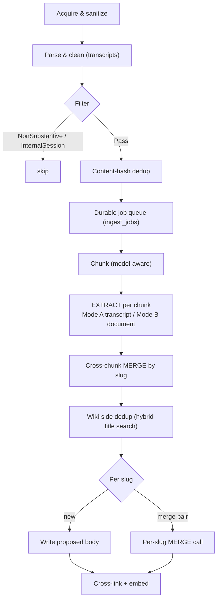
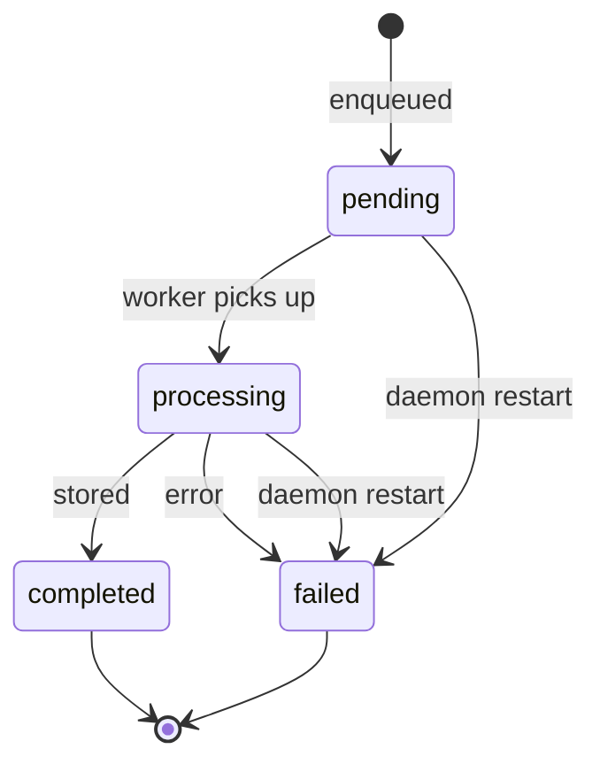

# Ingest Pipeline — Transcripts, Documents, Collections, Plan Flow

**Status:** Living design doc — describes the system as implemented.
**Last updated:** 2026-05-29

Part of the consolidated memex design set ([`README.md`](README.md)). This consolidates the former daemon-ingestion, web-page-ingestion, document-collections, ingest-skill-redesign, and chunked-ingest specs. Companion to [`architecture.md`](architecture.md), [`concurrency.md`](concurrency.md), and [`daemon.md`](daemon.md) (the daemon it runs on).

## Overview

Ingest turns source material — session transcripts and documents — into curated wiki pages, all through the daemon (the single writer). The pipeline is: **acquire → parse/clean → dedup → queue → chunk → EXTRACT (per chunk) → cross-chunk MERGE → wiki-side dedup → per-slug store (+ per-slug MERGE) → cross-link → embed.** Handlers live in `cli/src/daemon/handler/ingest.rs`; chunking in `core/src/chunk.rs`; the EXTRACT/MERGE prompt in `cli/src/daemon/worker/prompt.txt`.



## Inputs & entry points

- **Session transcripts (automatic).** The agent session hook runs `memex hook ingest <agent>` (`cli/src/hook.rs`): it reads the transcript path from the hook payload on stdin and detaches a `memex ingest --agent <agent> <path>` child, which sends `Request::Ingest` to the daemon. Supported agents: `claude-code`, `codex`, `gemini-cli`, `openclaw`, `hermes`, `opencode`. The `MEMEX_INTERNAL=1` guard makes the hook a no-op for the daemon's own worker sessions.
- **Documents (manual / scripted).** `memex ingest <path>` with no `--agent` ingests a generic document; a converter (e.g. markitdown) runs outside memex and pipes Markdown in. Source storage is `memex source add <url|path>`.
- **Inline transcript.** Gateways that already hold the bytes use `IngestSource::TranscriptInline { content, agent, source_label }` to avoid a temp-file round-trip.
- **Backfill.** `memex backfill <agent>` discovers existing sessions and batch-ingests them; content-hash dedup skips already-ingested ones.

`memex install` wires the hooks (see [`packaging.md`](packaging.md)). The former `/memex-distill` and `/memex-backfill` skills are gone — replaced by the daemon and the `backfill` command.

### Protocol

`Request::Ingest { source: IngestSource, collections }`. `IngestSource` is one of:

```
Transcript       { path, agent }
TranscriptInline { content, agent, source_label }
Document         { source_path, content }
```

Raw-source management uses `SourceAdd` / `SourceDelete`. See [`daemon.md`](daemon.md) for the full protocol.

## Pipeline

### 1. Acquire & sanitize

Transcripts: validate the path is within a known agent session directory (path-traversal guard). Documents: enforce a payload size cap (`INGEST_MAX_BYTES`) and sanitize. Both run secret redaction (API keys, AWS creds, token/secret assignments) on kept content.

### 2. Parse & clean (transcripts)

An agent-specific parser yields a `CleanedTranscript`. The cleaner keeps the **knowledge** and drops the **machinery**:

- **Keep:** user messages, assistant text (reasoning/analysis/explanations), and one-line tool-call summaries (`[Tool: Read — file: src/auth.rs]`).
- **Strip:** tool *result* blocks (file contents, command output — they're point-in-time and on disk), full tool-input JSON, metadata lines, thinking blocks, and the tags `<system-reminder>`, `<private>`, `<memex-context>`, `<persisted-output>`.

A **filter** then classifies the cleaned transcript:

| Filter | Meaning | Action |
|---|---|---|
| `Pass` | real session with user + assistant turns | continue |
| `NonSubstantive` | aborted/empty (missing one side) | skip, `Done` |
| `InternalSession` | daemon-spawned work | skip, `Done` |

### 3. Content-hash dedup

SHA-256 of the source content. If the raw file already exists on disk, skip early (`Done{0}`). Content-based, so renames/moves don't re-ingest and content changes do.

### 4. Durable job queue

Before acking, the job is written to `ingest_jobs` (`pending → processing → completed/failed`). On daemon restart, jobs stuck in `pending`/`processing` are flipped to `failed: interrupted by daemon restart` (not re-dispatched — rebuilding the payload can fail in new ways; the user re-runs ingest).



### 5. Chunking (model-aware)

The chunk cap is derived from the worker model's context window (`worker_chunk_max_tokens` = model max input − prompt overhead), so a large-context worker takes whole sections in one pass and a small one splits. Both paths produce `Vec<Vec<ExtractSegment>>`:

- **Transcripts** — `chunk_transcript_segments`: greedy turn-atomic packing (never split a turn), with the last ~3 turns of the previous chunk prepended as overlap (anchor context, trimmed to fit). A single turn larger than the cap → `TooLargeSegment`; too many chunks → `TooManyChunks`.
- **Documents** — `chunk_markdown`: split on H1/H2 boundaries, then paragraph, then line; never split inside a fenced code block. Each chunk string is wrapped as a one-element `Vec<ExtractSegment>` with `role`/`timestamp`/`index = None`.

### 6. EXTRACT (per chunk, parallel)

Each chunk is one EXTRACT call (`extract_pages_from_chunked_jobs` fans them out to the worker pool). Worker input envelope:

```json
{"segments":[{"text":"…","role":"user","timestamp":"…","index":1}],
 "source":"…","chunk_index":0,"total_chunks":2}
```

The presence of `role` on segments selects the mode:

- **Mode A — transcript** (`role` present): one page per person; emit a `## Timeline` entry for every discrete dated action/milestone/occurrence (not for preferences/opinions/states); a subject page with any dated action-events **must** carry a `## Timeline` H2; relative dates resolve against segment `timestamp`s.
- **Mode B — document** (no `role`): H1/H2 headings are page boundaries; no forced Timeline (only for event-narrative docs); no one-page-per-speaker rule.

Both modes share the page-authoring principles (name the subject in every bullet and section opener; preserve specific facts/named entities verbatim; prefer fewer larger pages; one stable subject per slug — no dates/episodes/multi-subject slugs). Output is strict JSON, **no `tags`**:

```json
{"pages":[{"slug":"…","title":"…","body":"…"}]}
```

Empty → `{"pages":[]}`. A worker may `fit_miss`-restart its subprocess before a chunk whose prompt wouldn't fit alongside accumulated context.

### 7. Cross-chunk MERGE

Pages with the same slug emitted by different chunks are consolidated by a MERGE call before wiki-side dedup, so a subject spanning chunks becomes one page (Timeline entries unioned).

### 8. Wiki-side dedup

`find_dedup_slugs` runs a hybrid title search — BM25 over existing wiki titles with a vector re-rank (RRF) when ambiguous — and reads candidate bodies from disk. Results split into **new** pages and **merge pairs** (proposed + existing).

### 9. Per-slug store

A per-slug fan-out (`store_extracted_pages`): each slug holds its own lock from re-read through DB commit + embed, so unrelated slugs proceed in parallel.

- **New slug:** write the proposed body.
- **Merge pair:** a single-slug MERGE call (`run_one_slug_merge`), input `{"pages":[{"slug","existing","proposed"}]}`. Rules: preserve slug/title; extend existing H2s (integrate a proposed sub-topic into its parent H2 rather than adding a sibling); `## Timeline` is a **strict union** of both inputs (never drop an event); contradictions resolve in favor of newer information.
- **Validate:** require `slug`/`title`/`body`; normalize slug; truncate body to 20K chars; downgrade create↔update on slug collision. **No page-count cap** — page count is content-driven and cross-chunk consolidation bounds it.
- `scrub_wiki_links` drops `[[orphan]]` references; `forward_link` adds links to existing subjects; `created_at` is preserved from the existing page and the source appended.

### 10. Store ordering & embed

Per-slug wiki files are written, then their DB rows committed, then embedded. The raw source file is written **after** the per-slug commits (preserving the `raw-on-disk ⇒ wiki-on-disk` invariant), its row committed, then `maintain_backlinks_batch` runs and the raw source is embedded — both under one embed-model lock acquisition.

## Auto cross-linking

Deterministic, no LLM, gated by `auto_link_eligible` (only multi-token stems, e.g. `oauth-migration`, link; single-token stems are skipped to avoid matching common English words):

- **`forward_link`** — in a new body, replace the first un-linked occurrence of an existing page's title/stem with `[[stem]]` (longest titles matched first).
- **`maintain_backlinks_batch`** — one walk over the wiki; on any page whose body mentions a newly-written slug, add the backlink; touched pages are re-embedded in the same pass.
- **`suggest_create`** — `[[ ]]` targets that don't exist are surfaced (not written).

The filesystem watcher and `lint --fix` deliberately do **not** auto-link — LLM-driven write/ingest is the only auto-linking path.

## Collections

A per-ingest `collections` list tags the stored documents via the `collections` / `document_collections` tables; wiki frontmatter carries a `collections` field. Queries can filter by collection (`Request::Query.collections`). Collections were chosen over `collection:*` tags or a comma-separated column for clean identity and join semantics.

## Interactive plan flow (`/memex-ingest`)

For human-in-the-loop ingestion, EXTRACT/MERGE runs in the daemon but commits are gated on user review:

1. `memex source add <url|path>` stores the raw source, returns a docid (`SourceAdd` → `SourceAdded`).
2. `memex source plan <docid>` (`SourcePlan`): the daemon runs EXTRACT (chunked) plus a MERGE **dry-run** for overlapping slugs and streams a plan JSON of proposals (`slug`, `title`, `body`, action) via `PlanContent` (or `EmptyExtract` when nothing is wiki-worthy). The skill owns the plan file.
3. The skill renders proposals for review; the user edits/drops entries (including title edits).
4. `memex plan apply` (`PlanApply`): validates the plan and commits each non-dropped proposal, re-running MERGE for any user-edited slug that now overlaps an existing page. Exit codes signal partial commits / required re-review; terminal success emits `PlanApplied { committed }`.

This keeps source content out of the agent's context (the skill pipes content straight into `source add` rather than reading it) and uses the daemon's merge-aware writer. A known crash-consistency limitation (a microsecond window between a wiki write and the stdout flush) is tracked in [`README.md`](README.md) (per-write journal, deferred).
