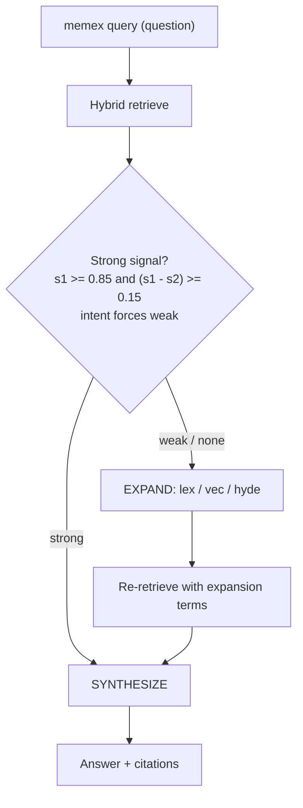

# Query & Retrieval

**Status:** Living design doc — describes the system as implemented.
**Last updated:** 2026-05-29

Part of the consolidated memex design set ([`README.md`](README.md)). Query runs on the daemon — the process model, worker pool, IPC protocol, and the warm embedding model live in [`daemon.md`](daemon.md).

## Query path (`memex query`)

`Request::Query { question, raw, top_k, collections, intent }`:

1. **Retrieve** on the question (hybrid retrieval, below). Returns fused results plus a `signal`.
2. **Strong-signal gate** (`core/src/search/mod.rs::is_strong_signal`): `s1 >= 0.85 && (s1 − s2) >= 0.15`, where `s1`/`s2` are the top two BM25 scores *within a lane* — the wiki and raw lanes are checked independently **before** fusion, and a strong winner in either lane counts as strong (a single high result with `s2 = 0` still qualifies). A non-empty `intent` forces *weak* so the expansion pipeline always runs when the caller signalled extra intent.
3. **EXPAND** (only when signal is weak/none): the worker rewrites the question into `{ lex, vec, hyde }` — a lexical keyword, a semantic reformulation, and a hypothetical-answer sentence (the last shaped to match `## Timeline` rows for temporal questions). The daemon emits an `Expansion` event, then re-retrieves with the expansion terms added.
4. **SYNTHESIZE**: the worker composes a cited answer over the retrieved context (a JSON array of entries carrying `doc_type` `wiki` or `raw`, plus `rank`, `signal`, `id`, `title`, `body`). It follows a fixed multi-step routine (scan all entries, verify entity attribution, combine/decompose facts, temporal grounding, inclusion check) and returns `{ answer, citations: [id, …] }`. The daemon emits the final `Answer`.

`--raw` skips synthesis and returns the retrieved context (`Context` event) directly.

## Hybrid retrieval

`core/src/retrieval.rs`, `core/src/search/`.

- **Lexical (BM25).** FTS5 over `titles_fts(title)` and `chunks_fts(chunk_text)`. The query uses bare `bm25(<table>)` (FTS5 default column weights). Raw FTS5 scores are negative (lower is better); `normalize_bm25` maps them into `0..1` (≈ `-10 → 0.91`, `-2 → 0.67`, `-0.5 → 0.33`, `0 → 0`). Each chunk is its own result so fusion dedupes at chunk granularity.
- **Vector.** Chunk-level kNN over `chunks_vec` (768-dim; the `embedding-gemma-300m` model in [`daemon.md`](daemon.md)). Chunk bodies are sliced from the on-disk file via `(pos, len)` — not stored in SQLite.
- **Fusion (RRF).** `search::rrf_fuse(lists, weights, k=60)`: contribution per list is `weight / (k + rank)` plus a top-rank bonus (`+0.05` for rank 1, `+0.02` for ranks 2–3); fused scores are then reassigned as `1/rank`. The top-rank bonus (ported from QMD) keeps a doc that wins #1 in any lane from being diluted when query expansion drifts off-topic; QMD also framed it as shielding results from a reranker, which memex doesn't have, so only the expansion-drift rationale applies here. Per-list weights are primary `2×` / expansion `1×`, applied uniformly to wiki and source. Fused scores pass a `MIN_SCORE` filter that is currently `0.0`, so it filters nothing today. The strong-signal gate above runs on the pre-fusion per-lane BM25 tops, not on these fused scores.

## Snippets & intent

Snippets are chunk-direct: a retrieved chunk is returned as-is (the earlier line-windowed "focused snippet" picker was retired). `core/src/snippet.rs::extract_intent_terms` pulls intent terms that nudge chunk scoring (`INTENT_WEIGHT_CHUNK = 0.5`).

## Skill

`memex-query` is a thin skill wrapper that issues `Request::Query` and renders the streamed `Expansion` / `Answer` (or `Context` for `--raw`). See [`README.md`](README.md) for the skill catalog.
