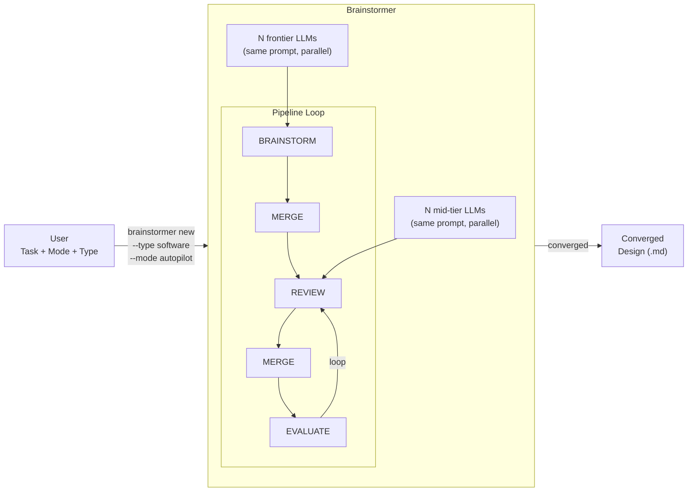
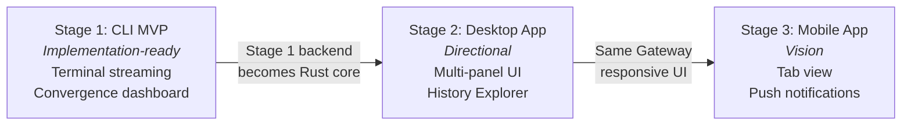
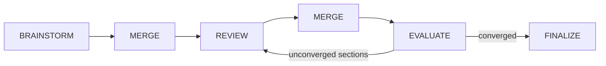
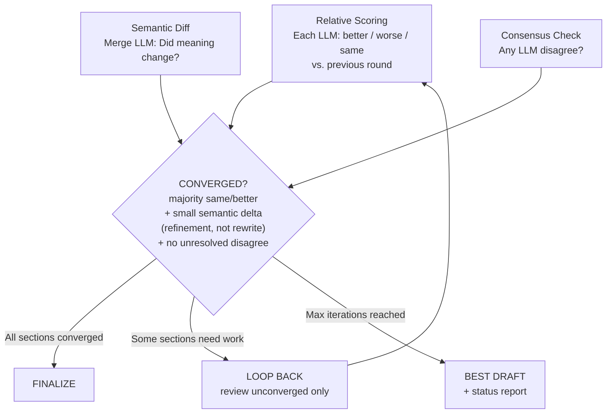
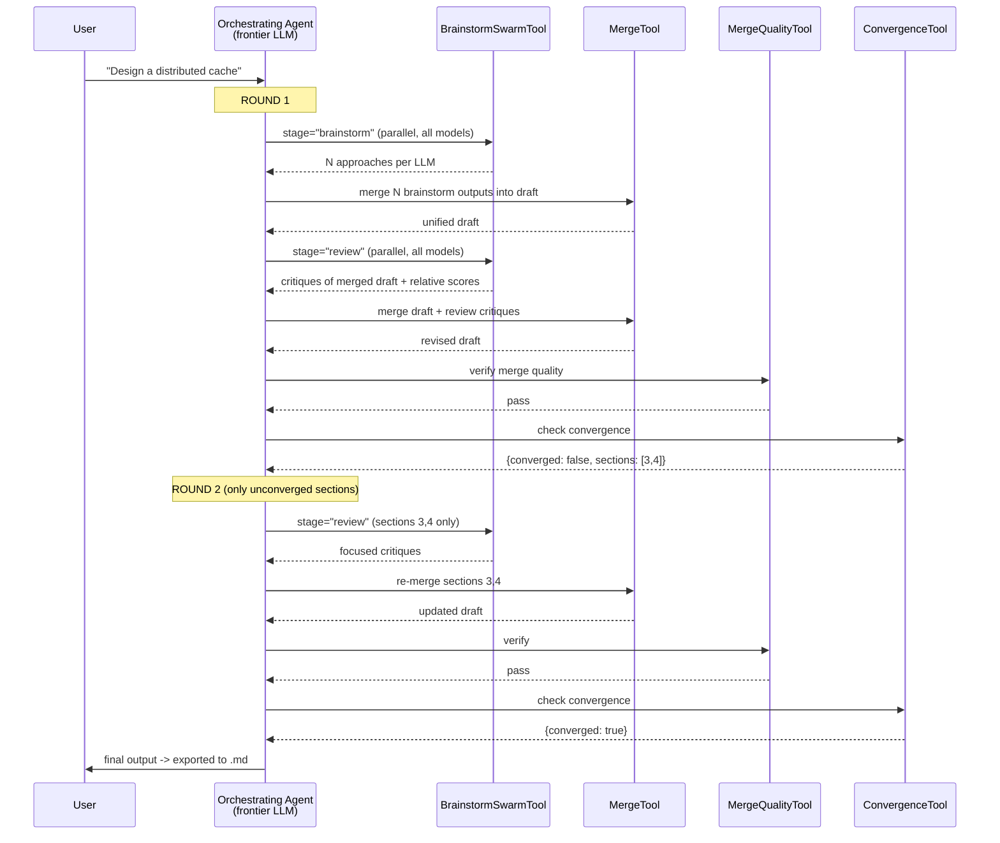
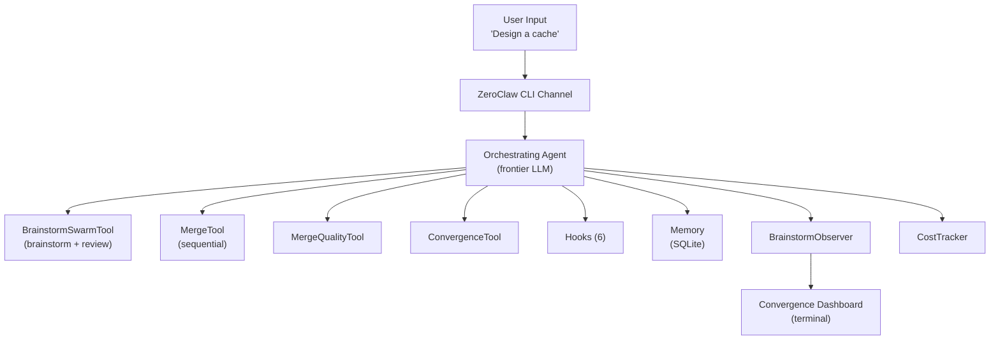
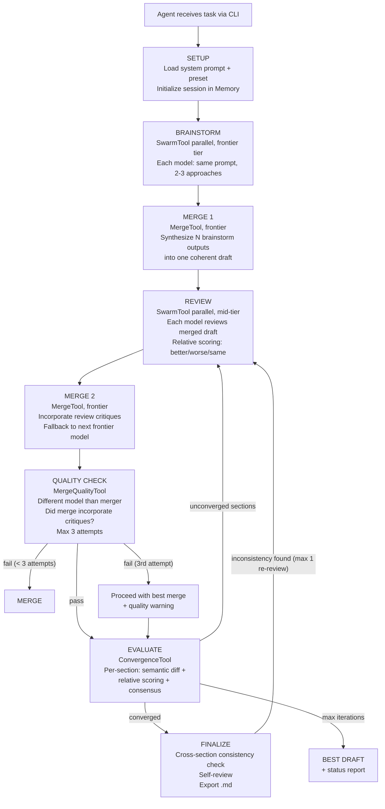
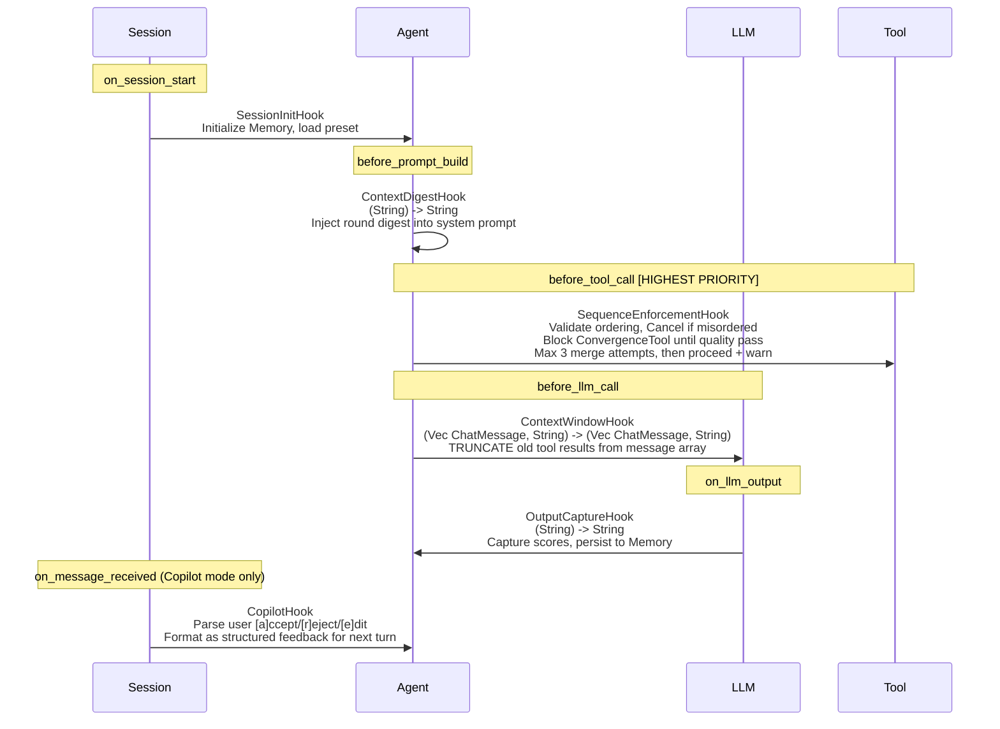

# Brainstormer - Design Specification

**Status:** REVIEWED (CEO x5, ENG x5, CODEX x4, 5 outside voices)
**Date:** 2026-04-02
**Updated:** 2026-04-03

---

## Overview

Brainstormer orchestrates multiple LLMs to collaboratively brainstorm, cross-check, and converge on a design for any kind of task.



**Two user choices at session start (+ optional flags):**

| Choice | Flag | Options |
|---|---|---|
| **Type** | `--type` | **software**, **research**, **article**, **book**, **strategy**, **general**. Each preset defines evaluation dimensions and section structure. Stage 1 ships software + general; others in Stage 2. |
| **Mode** | `--mode` | **autopilot** (hands-off), **copilot** (review every stage), **cruise** (check in every N rounds) |

Optional: `--no-loop` runs a single pass (brainstorm, merge, review, merge, quality, evaluate) without looping back. Quality catches merge errors; evaluate renders the dashboard and persists the round (no extra LLM call since there's no previous draft to compare).

**Development stages:**



---

## Framework Selection: Why ZeroClaw

Two Rust agent frameworks evaluated: **ZeroClaw** and **IronClaw**.

```
                          ZeroClaw                    IronClaw
                     (zeroclaw-labs)                  (NEAR AI)
  PROVIDERS          50+ built-in ++++++         8 dedicated +++
  SWARM              SwarmTool    [==========]   None         [          ]
  TOOL REG.          Compile-time [====      ]   Runtime      [==========]
  MEMORY             SQLite       [==========]   PostgreSQL   [======    ]
  CHANNELS           28+          [==========]   ~5           [===       ]
  COST TRACKING      Token-level  [==========]   Job-level    [=====     ]
  SECURITY           Workspace    [======    ]   WASM sandbox [==========]
  ZERO-DEP INSTALL   Yes          [==========]   No (Postgres)[          ]
  STARS              29k          [========= ]   11k          [=====     ]
```

**Decision: ZeroClaw dependency.** Two factors that aren't close:

```
  FACTOR 1: Local install                       FACTOR 2: Parallel multi-LLM
  +---------------------------------------+    +--------------------------------------+
  | ZeroClaw: cargo install brainstormer  |    | ZeroClaw: Provider + Memory traits   |
  | -> Works. SQLite embedded. Done.      |    | -> 50+ providers, SQLite memory,     |
  |                                       |    |    Agent orchestration. All public.   |
  | IronClaw: cargo install brainstormer  |    |                                      |
  | -> Fails. Needs PostgreSQL 15+        |    | IronClaw: (nothing)                  |
  |    running. User must install,        |    | -> Build from scratch with Tokio     |
  |    configure, create database.        |    |    JoinSet. 2-3 days work.           |
  +---------------------------------------+    +--------------------------------------+
```

IronClaw's runtime tool registration is better engineering. But brainstormer needs zero-dependency install + parallel swarm more than it needs clean extensibility.

**Integration scope:** Brainstormer is a standalone crate that depends on upstream ZeroClaw as a git dependency. No fork needed: all required modules (`agent`, `providers`, `memory`, `observability`, `tools`, `config`) are public in upstream.

```
  zeroclawlabs (git dependency, v0.6.8)     brainstormer (standalone crate)
  +-------------------------------+        +-------------------------------+
  | pub mod agent                 |        | Cargo.toml                    |
  | pub mod providers        -----|------->|   zeroclawlabs = { git }      |
  | pub mod memory           -----|------->|                               |
  | pub mod observability    -----|------->| src/                          |
  | pub mod config           -----|------->|   pipeline.rs (orchestrator)  |
  | pub mod tools                 |        |   tools/ (utility functions)  |
  +-------------------------------+        |   hooks/ (state + copilot)    |
                                           |   cli/ (auto-detect, UI)      |
  Uses: Provider, Memory, Agent,           | presets/, prompts/            |
  SqliteMemory, NoneMemory,                +-------------------------------+
  create_provider(), NoopObserver
```

---

## Core Concepts

### Multi-LLM Orchestration

```
  USER'S TASK: "Design a distributed cache"
       |
       v
  +----------------------------------------------------------------------+
  | MULTI-MODEL, SAME PROMPT (diversity from models, not personas)       |
  |                                                                      |
  | BRAINSTORM stage (frontier tier, same prompt, N models):             |
  |  +------------------+ +------------------+     +------------------+  |
  |  | Model 1          | | Model 2          | ... | Model N          |  |
  |  | (frontier)       | | (frontier)       |     | (frontier)       |  |
  |  +------------------+ +------------------+     +------------------+  |
  |  All N get same brainstorm prompt. Model diversity provides          |
  |  perspective diversity (different training, different reasoning).    |
  |  Minimum 2 models. Uses all configured frontier-tier providers.      |
  |                                                                      |
  | REVIEW stage (mid-tier, same prompt, N models):                      |
  |  +------------------+ +------------------+     +------------------+  |
  |  | Model 1          | | Model 2          | ... | Model N          |  |
  |  | (mid-tier)       | | (mid-tier)       |     | (mid-tier)       |  |
  |  +------------------+ +------------------+     +------------------+  |
  |  All N get same review prompt. Review the MERGED draft, not raw      |
  |  brainstorm outputs. Brainstorm context available via Memory.        |
  |                                                                      |
  | MERGE: Single frontier LLM synthesizes all outputs + reviews.        |
  +----------------------------------------------------------------------+
```

### Pipeline



`--no-loop` runs one pass without the convergence loop. All stages run (brainstorm, merge, review, merge, quality, evaluate) but the loop does not repeat. Quality verifies the merge; evaluate renders the dashboard and persists the round at zero extra LLM cost (no previous draft to diff against).

| Stage         | Who runs it                                       |
|---------------|---------------------------------------------------|
| BRAINSTORM    | N frontier LLMs (parallel, same prompt)           |
| MERGE 1       | Single merge LLM (frontier) synthesizes N outputs |
| REVIEW        | N mid-tier LLMs review merged draft (parallel)    |
| MERGE 2       | Single merge LLM incorporates review critiques    |
| QUALITY CHECK | Different model than merger (fallback: mid-tier)  |
| EVALUATE      | ConvergenceTool (mid-tier LLM call)               |

**Approximate LLM calls per round** (M = models per stage, S = sections):

```
  Per round: M (brainstorm) + 1 (merge1) + M (review) + 1 (merge2)
             + 1 (quality) + (1 + S semantic diff) = 2M + 4 + S

  With --no-loop: one pass = 2M + 3 calls total (includes quality; evaluate is local, no LLM call)

  Example (M=3, S=6): 16 per round, ~48 over 3 rounds
  With --no-loop: 9 calls total

  Minimum M=2. Works with any number of configured providers.
  Cost scales linearly with M. Default 3 models at $15-35/session.
```

### Three User Modes

```
  AUTOPILOT                     COPILOT                     CRUISE
  +---------------------+      +---------------------+      +----------------------+
  |  LLMs run freely.   |      |  User reviews each  |      |  Autonomous rounds   |
  |  Full pipeline in   |      |  stage output.      |      |  with checkpoints    |
  |  one Agent turn.    |      |                     |      |  every N rounds.     |
  |  Pauses only on:    |      |  ONE tool per turn. |      |                      |
  |  - convergence guard|      |  CLI prompts user   |      |  At checkpoint:      |
  |  - max iterations   |      |  between turns.     |      |  - review progress   |
  |                     |      |                     |      |  - steer direction   |
  |  Best for:          |      |  Per section:       |      |  - switch modes      |
  |  "Run overnight"    |      |  [a]ccept           |      |                      |
  |                     |      |  [r]eject+feedback  |      |                      |
  |                     |      |  [e]dit in $EDITOR  |      |                      |
  +---------------------+      +---------------------+      +----------------------+
  
  HOW IT WORKS: Mode controls the orchestrator's system prompt.
  - Autopilot: "Run full pipeline in sequence. Loop until converged."
  - Copilot:   "Call ONE tool. Present results. Wait for user input."
  - Cruise:    "Run N rounds autonomously. Then checkpoint."
  
  ZeroClaw's Agent turn() naturally processes one LLM response.
  In Copilot, the LLM calls one tool per turn -> turn ends ->
  CLI prompts user -> user response starts next turn.
  No hook hacks needed. The pause is between turns, not within.
  
  Users can switch modes mid-session at any checkpoint.
```

### Convergence Mechanism

For each section independently, three checks run in parallel:



**Tie-breaking (even M):** If relative scores are split (no majority), section stays unconverged and loops. Tie counts toward max iterations.

**Convergence guard:** Same objection from same LLM for 2 consecutive rounds -> flag as "irreconcilable" -> surface to user. "Same" detected via semantic similarity (embedding cosine > 0.85 threshold) using ZeroClaw's built-in embedding support, not exact string match. This catches paraphrased objections across rounds.

### Model Tiering

```
  +----------------------+----------------------+
  |      FRONTIER        |       MID-TIER       |
  |  Claude Opus 4.6     |  Claude Sonnet 4.6   |
  |  GPT-5.4             |  GPT-5.4 mini        |
  |  Gemini 3.1 Pro      |  Gemini 3.1 Flash    |
  +----------------------+----------------------+
  |  Used for:           |  Used for:           |
  |  - BRAINSTORM        |  - REVIEW            |
  |  - MERGE             |  - EVALUATE          |
  |  - Orchestrator      |  - Quality check     |
  +----------------------+----------------------+
  
  User configurable: any model can be assigned to any stage.
```

---

## Technology Foundation: ZeroClaw Dependency

Brainstormer is a **standalone crate** that uses upstream ZeroClaw (`zeroclawlabs v0.6.8`) as a git dependency. No fork required. Brainstormer uses:
1. **Providers:** `create_provider()` for multi-provider LLM access (50+ providers)
2. **Memory:** `SqliteMemory` for session persistence, `NoneMemory` for tests
3. **Agent:** `Agent::builder()` + `agent.turn()` for merge/quality stages
4. **Pipeline drives directly:** `dispatch_parallel()` calls providers for brainstorm/review stages, bypassing the Agent tool loop

### How the Agent Tool Loop Drives the Pipeline



### Context Management (Two Hooks)

```
  AGENT'S INTERNAL HISTORY (grows unbounded):
  [msg1] [msg2] [tool_call_1] [tool_result_1] ... [tool_call_25] [tool_result_25]
                                                        |
                    WHAT THE LLM ACTUALLY SEES:         |
                    (after hooks process it)            |
                                                        v
  +-------------------------------------------------------------------+
  | ContextDigestHook (before_prompt_build)                           |
  | Signature: (String) -> String                                     |
  | Injects digest into system prompt:                                |
  | "Round 1: Claude proposed X, GPT flagged Y,                       |
  |  merged to Z. Sections 1,2,5 converged."                          |
  +-------------------------------------------------------------------+
                         +
  +-------------------------------------------------------------------+
  | ContextWindowHook (before_llm_call)                               |
  | Sig: (Vec<ChatMessage>, String) -> (Vec<ChatMessage>, String)     |
  | TRUNCATES old messages from array. Only latest round's full       |
  | tool results pass through. Older rounds pruned.                   |
  | Full history stays in Memory for session log.                     |
  |                                                                   |
  | ROUND DETECTION: OutputCaptureHook tags each tool result with     |
    | a round number prefix (e.g., "[round:2]..."). ContextWindowHook |
  | reads these tags to identify round boundaries in the flat         |
  | Vec<ChatMessage>. Messages without tags are kept (system, user).  |
  +-------------------------------------------------------------------+
                         =
  +-------------------------------------------------------------------+
  | What orchestrator LLM sees:                                       |
  | [system prompt + digest] + [latest round tool calls/results only] |
  +-------------------------------------------------------------------+
```

### What Brainstormer Builds vs What ZeroClaw Provides

```
  +========================================+  +========================================+
  |        BRAINSTORMER (novel code)       |  |        ZEROCLAW (inherited)            |
  +========================================+  +========================================+
  |                                        |  |                                        |
  | TOOLS:                                 |  | INFRASTRUCTURE:                        |
  |   ConvergenceTool (semantic diff,      |  |   Agent tool loop (turn())             |
  |     relative scoring, consensus)       |  |   SwarmTool (parallel + sequential)    |
  |   BrainstormSwarmTool (brainstorm +    |  |   DelegateAgentConfig                  |
  |     review, multi-model, sanitize)     |  |   50+ LLM providers                    |
  |   MergeTool (single-LLM synthesis)     |  |   Memory (SQLite hybrid search)        |
  |   MergeQualityTool (verify merge)      |  |   CostTracker (token-level)            |
  |                                        |  |   LoopDetector                         |
  | HOOKS:                                 |  |   CLI Channel                          |
  |   SequenceEnforcementHook              |  |   Gateway (Axum + React dashboard)     |
  |   ContextDigestHook                    |  |   28+ messaging channels               |
  |   ContextWindowHook                    |  |   Encrypted credential storage         |
  |   OutputCaptureHook                    |  |   129+ security tests                  |
  |   SessionInitHook                      |  |                                        |
  |   CopilotHook                          |  | AGENT FEATURES:                        |
  |                                        |  |   Streaming (TurnEvent)                |
  | OBSERVER:                              |  |   Tool dispatch                        |
  |   BrainstormObserver                   |  |   Prompt construction                  |
  |                                        |  |   Message classification               |
  | CLI:                                   |  |   Memory loading                       |
  |   Convergence dashboard                |  |   Failover + retry                     |
  |   Copilot mode interaction             |  |   Rate limiting                        |
  |                                        |  |                                        |
  | CONFIG:                                |  |                                        |
  |   2 task type presets                  |  |                                        |
  |   7 prompt templates                   |  |                                        |
  |   3 orchestrator system prompts        |  |                                        |
  +========================================+  +========================================+
```

### Package Structure

```
  brainstormer/                          # Standalone crate
  |
  +-- Cargo.toml                         # Depends on zeroclawlabs (git dep)
  +-- src/
  |   +-- main.rs                        # CLI entry (clap)
  |   +-- lib.rs                         # Module exports
  |   +-- pipeline.rs                    # Core pipeline orchestrator
  |   +-- types.rs                       # Domain types
  |   +-- template.rs                    # Prompt template loading
  |   +-- sanitize.rs                    # LLM output sanitization
  |   +-- dry_run.rs                     # Mock provider for testing
  |   +-- input.rs                       # File/URL context loading
  |   +-- export.rs                      # Markdown export
  |   +-- resume.rs                      # Session resume logic
  |   +-- observer.rs                    # BrainstormObserver
  |   +-- agent_setup.rs                 # Observer construction
  |   +-- tools/
  |   |   +-- brainstorm_swarm.rs        # Parallel LLM dispatch
  |   |   +-- convergence.rs             # Convergence detection
  |   |   +-- merge.rs                   # Output merge utilities
  |   |   +-- merge_quality.rs           # Quality verification
  |   +-- hooks/
  |   |   +-- sequence_enforcement.rs    # PipelineState tracking
  |   |   +-- output_capture.rs          # Round tagging utilities
  |   |   +-- copilot.rs                 # Copilot input parsing
  |   +-- cli/
  |       +-- auto_detect.rs             # Provider auto-detection
  |       +-- dashboard.rs               # Convergence dashboard
  |       +-- copilot_ui.rs              # Copilot UI interaction
  |       +-- setup.rs                   # First-run provider setup
  +-- presets/                           # 6 task type presets
  +-- prompts/                           # 7 prompt templates
  +-- system_prompts/                    # 3 mode instructions
  +-- tests/                             # 89 tests
```

---

# Stage 1: CLI MVP

**Goal:** Prove the multi-LLM brainstorming pipeline works. Dogfood with software design tasks.

## S1.1 Architecture



**Convergence Dashboard** (CLI output after each EVALUATE round):

```
  +----------------------------------------------------------+
  |  Round 3/5 | Standard pipeline | Software Design         |
  |----------------------------------------------------------|
  |  Section        | Status    | Trend | Agreement          |
  |  ---------------+-----------+-------+------------------- |
  |  Problem        | CONVERGED |  =    | 3/3 agree          |
  |  Architecture   | Round 2   |  ^    | 2/3 agree          |
  |  Data Model     | Round 1   |  ^    | 1/3 agree !        |
  |  Error Handling | CONVERGED |  =    | 3/3 agree          |
  |  Testing        | Round 2   |  =    | 2/3 agree          |
  |----------------------------------------------------------|
  |  Cost: $1.23 | Tokens: 45.2K in / 12.8K out              |
  |  ! Data Model: GPT disagrees (2nd round, watching)       |
  +----------------------------------------------------------+
```

## S1.2 Pipeline Control Flow

**One tool, multiple stages.** `BrainstormSwarmTool` handles both brainstorm and review via a `stage` parameter. Pipeline uses 4 registered tools:

```
  BrainstormSwarmTool(brainstorm) -> MergeTool ->
  BrainstormSwarmTool(review) -> MergeTool ->
  MergeQualityTool -> ConvergenceTool -> [loop]

  --no-loop: BrainstormSwarmTool(brainstorm) -> MergeTool ->
             BrainstormSwarmTool(review) -> MergeTool ->
             MergeQualityTool -> ConvergenceTool (local only) -> done
```

**Detailed flow (Standard pipeline):**



## S1.3 Hooks (verified signatures)



Note: Hooks are utility modules called directly by the pipeline, not registered with the Agent's hook system.

## S1.4 MVP Presets

```
  SOFTWARE DESIGN
  +---------------------------------------------------------------------+
  | Dimensions: Feasibility, Scalability, Maintainability, Security     |
  | Sections: Problem, Architecture, API, Data Model, Errors, Testing   |
  +---------------------------------------------------------------------+

  GENERAL
  +---------------------------------------------------------------------+
  | Dimensions: Completeness, Coherence, Feasibility, Originality       |
  | Sections: User defines, or LLMs propose during brainstorm           |
  +---------------------------------------------------------------------+

  Presets define evaluation dimensions and section structure.
  All models get the same stage-appropriate prompt (brainstorm or review).
  Diversity comes from model differences, not persona assignment.
```

## S1.5 CLI Commands

```
  brainstormer new [--type software|general] [--mode autopilot|copilot|cruise] [--no-loop]
  brainstormer resume [session-id]       # Resume interrupted session from last completed stage
  brainstormer list                      # List all sessions with status + model stats
  brainstormer show [session-id]         # Show session details, final output, convergence history
  brainstormer stats                     # Show per-model accept/reject rates across sessions
  brainstormer config providers          # Manage LLM provider configurations
  brainstormer config presets            # Manage task type presets
```

Session state persisted to Memory after every stage completion. On crash or ctrl-C, `brainstormer resume` picks up from last completed stage.

## S1.6 Custom Tool Internals

```
  ConvergenceTool.execute(draft, prev_draft, evaluations):
  +-------------------------------------------------------------------+
  | 1. For each section:                                              |
  |    Ask merge LLM via DelegateAgentConfig:                         |
  |    "How much did this section change?" (semantic diff)            |
  |    Response: small (refinement) / large (rewrite) / none          |
  |                                                                   |
  | 2. Parse each LLM's relative scoring (better/worse/same)          |
  |                                                                   |
  | 3. Check consensus (any unresolved "disagree"?)                   |
  |                                                                   |
  | 4. Run convergence guard:                                         |
  |    Embed current objection, compare to prior round's objections   |
  |    via cosine similarity (threshold 0.85).                        |
  |    Same objection from same LLM 2 rounds? -> irreconcilable       |
  |                                                                   |
  | 5. Return structured JSON:                                        |
  |    { sections: [{name, converged, trend, agreement}], loop: bool }|
  +-------------------------------------------------------------------+
  
  BrainstormSwarmTool.execute(task, stage):
  +-------------------------------------------------------------------+
  | 1. Load stage-appropriate prompt template                         |
  | 2. Inject round context (prior outputs, task desc, sections)      |
  | 3. Apply model tiering (frontier for brainstorm, mid for review)  |
  | 4. Call SwarmTool(parallel) with DelegateAgentConfig per model    |
  |    - Per-model timeout: 30 seconds                                |
  |    - If M >= 3: 1 failure -> proceed with M-1 results + warning   |
  |    - If M = 2:  1 failure -> pause, ask user to retry or add      |
  |      provider (can't brainstorm with 1 model)                     |
  |    - Minimum 2 results required for meaningful multi-LLM output   |
  | 5. Sanitize outputs (cross-LLM prompt injection delimiters)       |
  | 6. Return collected results                                       |
  +-------------------------------------------------------------------+
```

## S1.7 Prompt Templates

```
  prompts/
  +-- brainstorm.md            "Given this task, propose 2-3 approaches with pros/cons"
  +-- review.md                "Review merged draft. For each section: better/worse/same + critiques"
  +-- merge.md                 "Synthesize all outputs and critiques into unified draft"
  +-- evaluate.md              "Compare this section to previous round. Better/worse/same?"
  +-- merge_quality.md         "Did this merge faithfully incorporate the critiques?"
  +-- finalize.md              "Review for placeholders, contradictions, ambiguity"
  +-- convergence_semantic.md  "Did the meaning of this section change vs previous round?"
  
  Each uses {{variable}} interpolation: task, section, prior_output, critiques
```

## S1.8 Observability

```
  BrainstormObserver (implements ZeroClaw Observer trait) emits:
  
  +-- Round start/complete with round number
  +-- Per-section convergence status after each EVALUATE
  +-- Cost per round (tokens in/out, USD) and cumulative
  +-- Convergence guard triggers (which section, which LLM, which objection)
  +-- Session completion (total rounds, total cost, final convergence status)
  
  CLI convergence dashboard subscribes to these events.
  Future Gateway UI will also subscribe (same events, different rendering).
```

## S1.9 Distribution

```
  INSTALL:
  $ cargo install brainstormer          # from crates.io
  $ brainstormer new                    # first run triggers setup
  
  FIRST RUN (auto-detect):
  +------------------------------------------------+
  | Checking environment variables...              |
  | Found: ANTHROPIC_API_KEY, OPENAI_API_KEY,      |
  |        GEMINI_API_KEY                          |
  | Validating... Anthropic: OK, OpenAI: OK,       |
  |               Gemini: OK                       |
  | 3 providers ready. Starting brainstorm.        |
  +------------------------------------------------+
  
  FIRST RUN (manual fallback, <2 providers auto-detected):
  +--------------------------------------------------+
  | Found 1 provider (Anthropic). Need at least 2.   |
  |                                                  |
  | Add a provider:                                  |
  |   [1] OpenAI (API key)                           |
  |   [2] Google Gemini (API key)                    |
  |   [3] OpenRouter (multi-model, recommended)      |
  |   [4] Ollama (local, no key needed)              |
  |                                                  |
  | Enter API key for OpenAI: sk-***                 |
  | Validating... OpenAI: OK                         |
  |                                                  |
  | Pick a task type: [1] Software Design            |
  |                   [2] General                    |
  |                                                  |
  | Starting brainstorm session...                   |
  +--------------------------------------------------+
  
  Target: install to first brainstorm in under 3 minutes.
```

### Upstream Dependency Mitigation

```
  +---------------------------------------------------------------+
  | 1. Pin to specific ZeroClaw commit in Cargo.toml              |
  | 2. CI integration tests exercise every ZeroClaw type used:    |
  |    Tool, HookHandler, Observer, Memory, SwarmTool, Agent,     |
  |    DelegateAgentConfig, TurnEvent, Provider, CostTracker      |
  | 3. Before upgrading: run full test suite. Breaks caught       |
  |    before they ship.                                          |
  | 4. Upstream rebase cadence: monthly or on major releases      |
  +---------------------------------------------------------------+
```

## S1.10 Memory Schema

```
  SQLite (hybrid search: vector embeddings + FTS5 keyword)
  
  Category: Custom("brainstorm")
  Namespace: session_{id}
  
  PER ROUND:
    brainstorm:{session}:round:{n}:contributions   # All LLM outputs
    brainstorm:{session}:round:{n}:reviews          # All reviews
    brainstorm:{session}:round:{n}:merged_draft     # Merged output
    brainstorm:{session}:round:{n}:convergence      # Per-section status
    brainstorm:{session}:round:{n}:cost             # Round cost
  
  PER SESSION:
    brainstorm:{session}:config                     # Task type, mode, complexity
    brainstorm:{session}:final_output               # Converged document
  
  PER MODEL (Copilot mode, cross-session):
    brainstorm:model_stats:{model_id}:accepted      # e.g., claude-opus-4-6
    brainstorm:model_stats:{model_id}:rejected      # Tracks each model separately
    brainstorm:model_stats:{model_id}:edited        # (not per-provider, per-model)
    # CopilotHook records accept/reject/edit per model per stage.
    # brainstormer stats reads these to show per-model preference.
```

## S1.11 Error Handling

```
  ERROR                 RESCUE                 USER SEES
  +-------------------+ +--------------------+ +---------------------------+
  | LLM timeout       |>| Retry 1x backoff   |>| "X timed out, retrying"   |
  | LLM 429           |>| Respect Retry-After|>| "Rate limited, Ns..."     |
  | LLM 5xx           |>| Retry 1x           |>| "Server error, retry"     |
  | Auth 401/403      |>| Pause pipeline     |>| "Auth failed. Fix cred"   |
  | LLM refusal       |>| Mark refused, skip |>| "X refused. Others OK"    |
  | Parse error       |>| Retry strict prompt|>| "Retrying format..."      |
  | Score parse fail  |>| Text fallback      |>| "Using text review"       |
  | Context overflow  |>| Hook trims before  |>| "Older rounds trimmed"    |
  | Convergence guard |>| Flag, surface      |>| "Section X: disagree"     |
  | Digest LLM fail  |>| Drop oldest round  |>| (transparent)              |
  +-------------------+ +--------------------+ +---------------------------+
  
  DEGRADED MODE: minimum 2 LLMs required. Merge LLM has automatic fallback.
```

## S1.12 Security

```
  +------------------------------------------------------------------------+
  |                  SECURITY MODEL (inherited from ZeroClaw)              |
  +------------------------------------------------------------------------+
  |                                                                        |
  |  CREDENTIALS          GATEWAY           FILESYSTEM                     |
  |  +---------------+    +-------------+   +------------------+           |
  |  | AES-256-GCM   |    | localhost   |   | Workspace-scoped |           |
  |  | encrypted     |    | only        |   | 14 system dirs   |           |
  |  | at rest       |    | OTP pairing |   | blocked          |           |
  |  | ~/.zeroclaw/  |    | Port 42617  |   | Symlink escape   |           |
  |  | .secret_key   |    |             |   | detection        |           |
  |  +---------------+    +-------------+   +------------------+           |
  |                                                                        |
  |  BRAINSTORMER-SPECIFIC                                                 |
  |  +------------------------------------------------------------------+  |
  |  | Cross-LLM prompt injection sanitization                          |  |
  |  | - Outputs wrapped in === [Model] === delimiters                  |  |
  |  | - System prompt patterns stripped                                |  |
  |  | - Reviewer LLMs instructed: treat content as data                |  |
  |  +------------------------------------------------------------------+  |
  |                                                                        |
  |  129+ security tests in CI. No telemetry. Fully local.                 |
  +------------------------------------------------------------------------+
```

## S1.13 Test Strategy

```
  TEST PYRAMID:
  
         /\
        /  \     Live smoke test (1 test, real APIs, scheduled)
       /    \    Catches API compatibility + prompt regressions
      /------\
     /        \   Integration tests (recorded LLM cassettes)
    /          \  Full Agent tool-loop replay in CI
   /------------\
  /              \  Unit tests (mock data)
 /                \ ConvergenceTool logic, structured output parsing,
/                  \ pipeline state machine transitions
+------------------+
  
  BUILD ORDER: ConvergenceTool tests first (core innovation),
  then SwarmTool wrappers, then hooks, then E2E.
```

**Test manifest (44 paths):**

```
  UNIT TESTS (mock data, no LLM calls):
  
  convergence.rs:
    T01  Semantic diff detects meaning change between rounds
    T02  Semantic diff detects no change (converged)
    T03  Relative scoring parse: better/worse/same from LLM output
    T04  Relative scoring parse: malformed output -> text fallback
    T05  Consensus check: all agree -> converged
    T06  Consensus check: 1 disagrees -> unconverged
    T07  Convergence guard: same objection 2 rounds -> irreconcilable
    T08  Mixed sections: some converged, some not -> loop only unconverged
    T09  All sections converge on first check -> no loop
  
  brainstorm_swarm.rs:
    T10  Parallel dispatch with N models returns N outputs
    T11  Output sanitization strips system prompt patterns
    T12  Output sanitization wraps in model delimiters
    T13  M>=3, one model timeout -> M-1 results returned + warning
    T14  M>=3, one model refusal -> M-1 results returned + warning
    T14b M=2, one model fails -> pipeline pauses, user prompted
    T15  stage="review" reads brainstorm context from Memory
  
  merge.rs:
    T16  Single LLM merge produces unified draft
    T17  Primary merge LLM fails -> fallback to next frontier model
    T18  Merge with no review input (Simple pipeline)
  
  merge_quality.rs:
    T19  Quality pass -> proceed to evaluate
    T20  Quality fail -> triggers re-merge
    T21  3rd quality failure -> proceed with best merge + warning
  
  sequence_enforcement.rs:
    T22  Valid tool sequence allowed (brainstorm->review->merge->...)
    T23  Invalid sequence cancelled (e.g., merge before brainstorm)
    T24  ConvergenceTool blocked until quality pass
  
  context_digest.rs:
    T25  Digest generated from round state (round 2+)
    T26  First round: empty digest (no prior rounds)
  
  context_window.rs:
    T27  Round-tagged messages truncated for old rounds
    T28  Untagged messages (system, user) preserved
  
  copilot.rs:
    T29  Parse accept/reject/edit commands
    T30  Structured feedback formatted for next Agent turn
  
  INTEGRATION TESTS (recorded LLM cassettes):
    T31  [E2E] Standard pipeline happy path: 3 rounds -> converge -> .md
    T32  [E2E] Max iterations reached -> best draft + status report
    T33  [E2E] Copilot mode: pause between turns, user accepts all
  
  ERROR PATH TESTS:
    T34  Provider auth fails mid-session -> pause + user message
    T35  All providers rate-limited -> backoff + retry
    T36  Ctrl-C during merge -> resume picks up from last stage
    T37  Corrupted Memory state -> graceful error + new session offer
  
  AUTO-DETECT TESTS:
    T38  Auto-detect finds 3 env vars -> skips manual setup
    T39  Auto-detect finds 1 env var -> falls back to manual setup
    T40  Auto-detect finds invalid key -> reports error, continues setup
  
  MODEL STATS TESTS:
    T41  Copilot accept/reject/edit increments per-model counters
    T42  brainstormer stats with no Copilot usage -> graceful empty state
  
  SMOKE TEST (real APIs, scheduled CI):
    T43  brainstormer new --no-loop -> produces .md output (single pass)
```

## S1.14 Parallelization Strategy

```mermaid
gantt
    title Implementation Lanes
    dateFormat X
    axisFormat %s
    
    section Lane A (tools)
    ConvergenceTool           :a1, 0, 3
    BrainstormSwarmTool       :a2, 0, 3
    MergeTool                 :a3, 0, 2
    MergeQualityTool          :a4, 0, 2
    
    section Lane B (config)
    Presets                   :b1, 0, 2
    Prompt templates          :b2, 0, 2
    System prompts            :b3, 0, 1
    
    section Lane C (observer)
    BrainstormObserver        :c1, 0, 2
    
    section Lane D (hooks)
    All 6 hooks               :d1, after a1, 3
    
    section Lane E (CLI)
    Convergence dashboard     :e1, after d1, 2
    Copilot mode interaction  :e2, after d1, 2
    
    section Lane F (integration)
    First-run experience      :f1, after e1, 2
    Integration tests         :f2, after e1, 2
    E2E smoke test            :f3, after f2, 1
```



**Execution:** Launch A + B + C in parallel. When A done -> D. When D + C done -> E. When all done -> F.

## S1.15 Typed State Model

```
  Round state (persisted to Memory after each stage):
  
  RoundState {
      round_num: u32,
      stage: Stage,                       // Brainstorm|Review|Merge|QualityCheck|Evaluate
      sections: Vec<SectionState>,
      cost: RoundCost { tokens_in, tokens_out, usd },
      timestamp: DateTime,
  }
  
  SectionState {
      name: String,
      content: String,
      converged: bool,
      trend: Trend,                       // Better|Worse|Same
      agreement: Vec<LlmVote>,           // per-LLM agree/disagree
      objection_history: Vec<String>,     // for convergence guard
  }
  
  SessionConfig {
      task_type: String,
      mode: Mode,                         // Autopilot|Copilot|Cruise
      loop: bool,                          // true by default, --no-loop sets false
      brainstorm_models: Vec<ModelRef>,    // Frontier tier
      review_models: Vec<ModelRef>,       // Mid tier
      max_rounds: u32,
      merge_llm: ModelRef,
  }
```

These structs are serialized to Memory as JSON. Typed in Rust for compile-time safety. Deserialized on session resume.

## S1.16 Evaluation Plan (ship and measure)

```
  HYPOTHESIS: Multi-LLM brainstorming produces higher quality
  output than a single frontier LLM with a good prompt.
  
  METRIC: Human quality rating (1-10) of final output.
  
  PROTOCOL:
  1. Collect 20 real brainstorming tasks (10 software, 10 general)
  2. For each task, produce:
     a) Single-LLM output (GPT-5.4 or Claude Opus 4.6, best prompt, one shot)
     b) Brainstormer output (N LLMs, Standard pipeline, Autopilot mode)
  3. Blind evaluation: rate each output 1-10 on task-type dimensions
  4. Compare: brainstormer win rate, average score delta, cost delta
  
  SUCCESS CRITERIA:
  - Brainstormer wins >60% of blind comparisons
  - Average score delta > +1.0 point
  - Cost per session < $25
  
  KILL CRITERIA:
  - Brainstormer wins <40% (worse than single LLM)
  - Average session > $50
  - Average latency > 15 minutes
  
  Timeline: run after MVP ships, before Stage 2 investment.
```

## S1.17 SQLite Concurrency

```
  RISK: Parallel swarm writes to SQLite from Tokio tasks.
  
  SQLite supports concurrent READS but serializes WRITES.
  ZeroClaw's Memory uses a single SQLite connection.
  
  MITIGATION:
  - SwarmTool collects all parallel results in memory (JoinSet)
  - Single sequential write to Memory AFTER swarm completes
  - No parallel writes to SQLite during a swarm round
  - Session-level writes (after each stage) are sequential by design
  
  If ZeroClaw's Memory impl uses connection pooling or WAL mode,
  concurrent writes are safe. Verify during implementation.
  Fallback: wrap Memory writes in a Mutex.
```

---

# Stage 2: Desktop App (Directional)

```
  +------------------------------------------------------------+
  | Tauri Shell (or standalone web app at localhost:42617)     |
  +------------------------------------------------------------+
  | Toolbar | Pipeline Stage Indicator [cost] [tokens] [round] |
  +-------------+-------------+-----------+--------------------+
  | LLM Panel 1 | LLM Panel 2 | LLM ...N  | Chat Sidebar       |
  | (Model name)| (Model name)| (Model)   |                    |
  | streaming...| streaming...| stream... | User steering      |
  |             |             |           | injected into      |
  +-------------+-------------+-----------+ next stage         |
  | MERGE PANEL                           |                    |
  |   Section 1: [CONVERGED]              |                    |
  |   Section 2: [Round 2, 2/3 agree]     |                    |
  |   Section 3: [Round 1, 1/3 agree !]   |                    |
  +---------------------------------------+--------------------+
  | ROUND SUMMARY (at checkpoints)                             |
  |   Round 2: Claude/Gemini agree on monolith.                |
  |   GPT wants microservices. Merged to monolith-with-bounds. |
  |   [Continue] [Switch Mode] [Edit Draft] [Stop Here]        |
  +------------------------------------------------------------+
  
  Built on ZeroClaw's React 19 + Vite 6 + Tailwind CSS 4 dashboard.
  Connects via existing Gateway WebSocket at 127.0.0.1:42617.
  Stage 1 CLI continues as: brainstormer --headless
```

**Stage 2 additions:** Input Processor (files/URLs/prior sessions), 4 more task presets, History Explorer, OAuth flow, file drag-and-drop, export to PDF/HTML, session search, CI/CD pipeline (GitHub Actions for cargo test/clippy/publish, cross-platform binary builds).

### Stage 2 Task Type Presets

```
  SCIENTIFIC RESEARCH              ARTICLE / ESSAY
  +----------------------------+   +----------------------------+
  | Dimensions:                |   | Dimensions:                |
  |   Novelty                  |   |   Clarity                  |
  |   Rigor                    |   |   Argument Strength        |
  |   Falsifiability           |   |   Evidence                 |
  |   Reproducibility          |   |   Flow                     |
  |   Significance             |   |   Originality              |
  +----------------------------+   +----------------------------+
  
  BOOK                              BUSINESS STRATEGY
  +----------------------------+   +----------------------------+
  | Dimensions:                |   | Dimensions:                |
  |   Narrative Arc            |   |   Market Fit               |
  |   Character Depth          |   |   Competitive Advantage    |
  |   Pacing                   |   |   Feasibility              |
  |   Thematic Coherence       |   |   ROI                      |
  |   Voice                    |   |   Risk                     |
  +----------------------------+   +----------------------------+
```

---

# Stage 3: Mobile App (Vision)

```
  +-----------------------+
  | [LLM | Merge | Chat]  |
  |  +----------------+   |
  |  | LLM 1          |   |  Same ZeroClaw Gateway backend.
  |  | streaming...   |   |  Mobile connects via WebSocket.
  |  |                |   |
  |  +----------------+   |  Options:
  |  | Convergence    |   |  - Tauri mobile (if mature)
  |  | +--+--+--+     |   |  - PWA (most portable)
  |  | |OK|^ |! |     |   |  - React Native (most native)
  |  | +--+--+--+     |   |
  |  +----------------+   |  Risk: Tauri mobile maturity.
  |  | $0.42 | R2/5   |   |  Re-evaluate when Stage 2 ships.
  |  +----------------+   |
  +-----------------------+
```

**Mobile features:** Push notifications, quick brainstorm widget, voice input, share sheet, offline session review.

---


## GSTACK REVIEW REPORT

| Review | Trigger | Why | Runs | Status | Findings |
|--------|---------|-----|------|--------|----------|
| CEO Review | `/plan-ceo-review` | Scope & strategy | 5 | CLEAN | Runs 1-4: MVP pivot, ZeroClaw extension, Agent-loop-as-pipeline, distribution, first-run UX, landscape validation. Run 5 (delta): persona removal validated, model-name labels, 2 expansions accepted (model preference tracking, provider auto-detect). |
| Codex Review | `/codex` | Independent 2nd opinion | 4 | ISSUES_FOUND | Runs 1-3: latency-to-value, convergence criteria, cost ceiling. Run 4: M=2 tie-breaking (fixed), cross-section regression (fixed). |
| Eng Review | `/plan-eng-review` | Architecture & tests (required) | 5 | CLEAN | Run 5: M=2 degraded mode, model stats key fix, stale persona refs in Stage 2/3, tie-breaking for even M, cross-section consistency check in FINALIZE, 44-path test manifest. |
| Design Review | `/plan-design-review` | UI/UX gaps | 0 | -- | -- |

- **OUTSIDE VOICE:** CEO runs 1-3: 22 findings, all resolved. Eng run 4: Codex outside voice, 2 findings resolved.
- **MAJOR DESIGN CHANGES (post run 4):** Personas removed (research-backed: 11 papers, neither superpowers/brainstorming nor gstack/office-hours use personas). Same-prompt-per-stage with model diversity. Variable model count (N, min 2). Economy tier removed. Cost ceiling removed.
- **CEO RUN 5 EXPANSIONS:** Model preference tracking (accept/reject stats in Copilot mode, `brainstormer stats` command). Provider auto-detect from env vars (install to first brainstorm in <1 min).
- **LANDSCAPE:** No competing desktop app with convergence loops + domain presets. AutoGen closest but Python + research-grade.
- **FRAMEWORK:** ZeroClaw as upstream git dependency (v0.6.8). Standalone crate, no fork.
- **UNRESOLVED:** 0
- **VERDICT:** CEO + ENG + CODEX CLEARED. Ready to implement.
