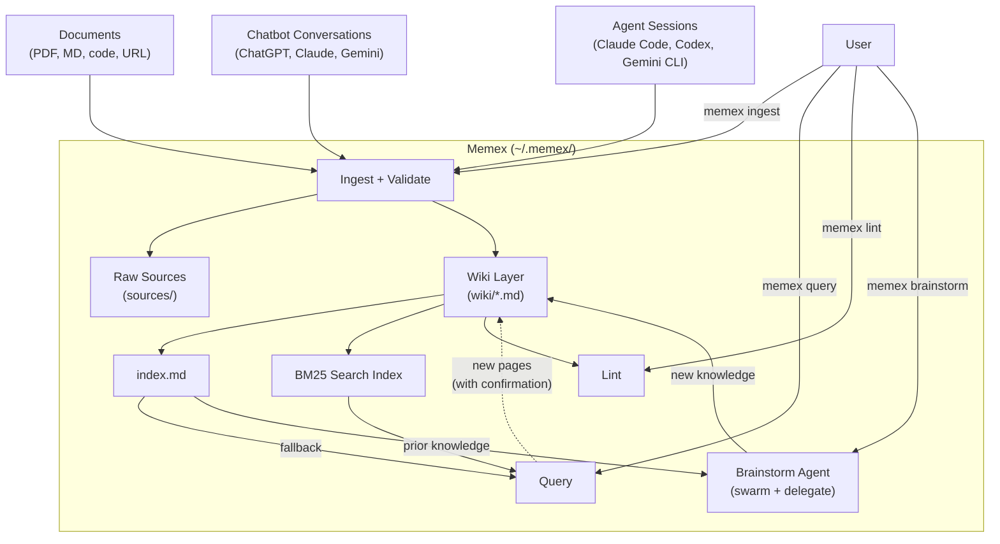
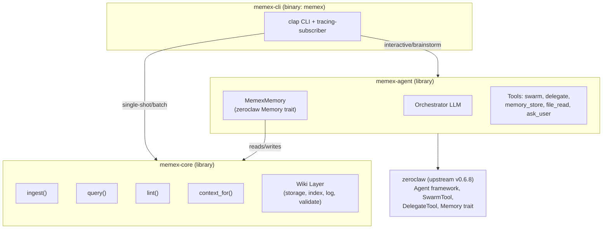
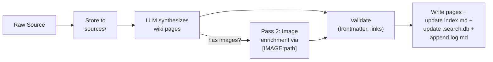
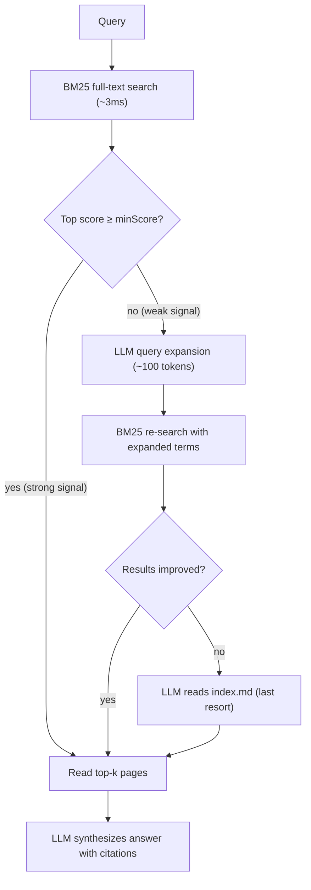
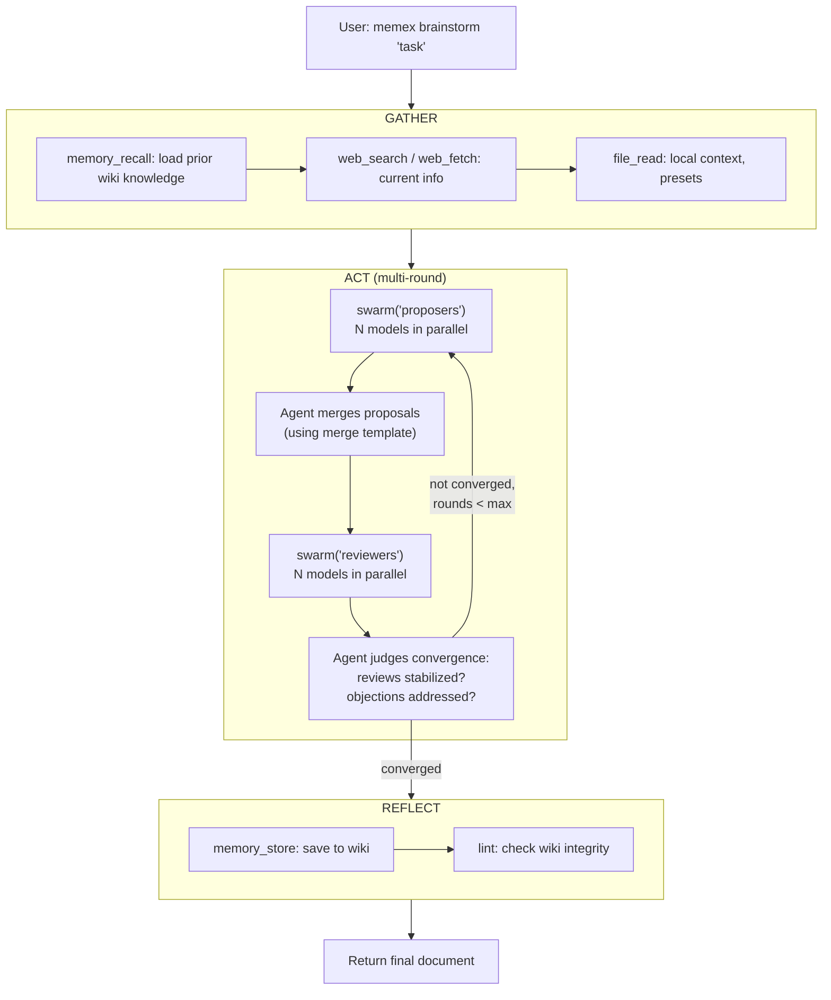
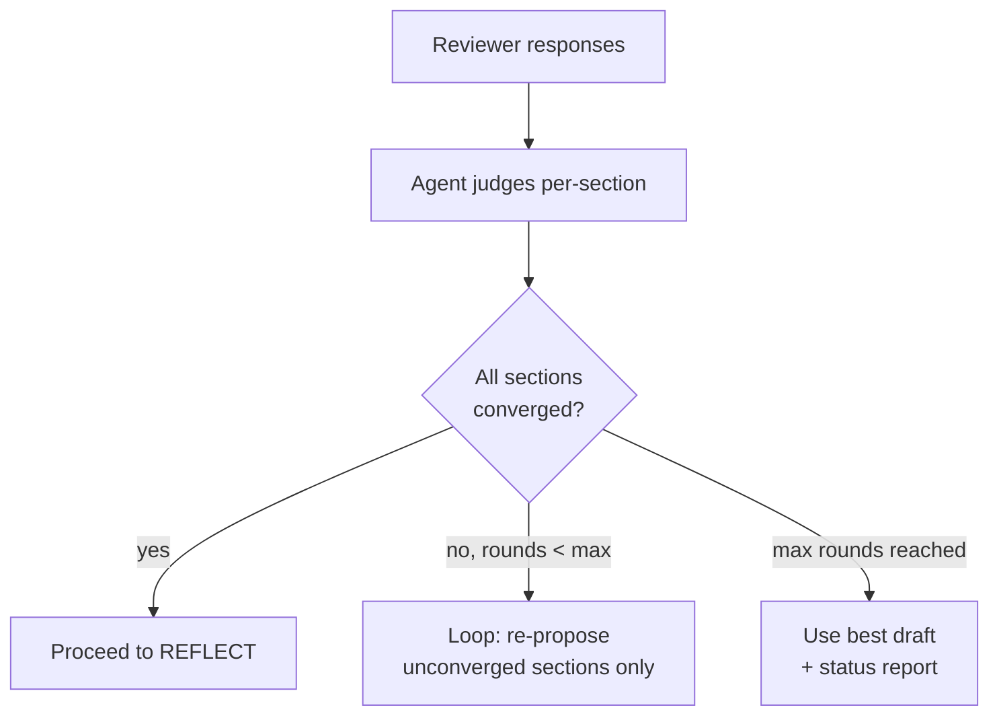

# Memex — Design Specification

**Status:** DRAFT
**Date:** 2026-04-07
**Supersedes:** 2026-04-05-memex-design.md, 2026-04-05-brainstormer-agent-design.md, 2026-04-02-brainstormer-design.md

---

## Overview

Memex is a personal knowledge system built on Karpathy's LLM-wiki pattern, named after Vannevar Bush's 1945 concept of a personal memory system with valued connections. It captures raw sources (documents, chatbot conversations, agent sessions), synthesizes them into a compounding wiki of interconnected knowledge, and answers questions with full citations.

Memex extends the LLM-wiki pattern with multi-LLM brainstorming: given a topic, multiple frontier models propose designs in parallel, a separate set of models review and critique, and the orchestrator merges and iterates until the reviewers converge. The result is written back to the wiki as new knowledge. This turns memex from a passive knowledge store into an active knowledge generator -- the wiki grows not just from ingested sources but from structured multi-model collaboration.

Reference: https://gist.github.com/karpathy/442a6bf555914893e9891c11519de94f

The core insight: "the wiki is a persistent, compounding artifact." Instead of rediscovering relevant information from raw documents on every query (RAG), the LLM reads sources once, extracts key information, and integrates it into an evolving knowledge structure. Cross-references are pre-established, contradictions are flagged, and synthesis improves with each addition.

Memex is an independent experiment exploring the wiki synthesis pattern, separate from MemVerge's MemBox product. If the pattern proves valuable, it can be ported to MemBox as an additional knowledge layer.

| LLM-Wiki Concept | Memex Implementation |
|---|---|
| Raw Sources Layer | `sources/` directory: immutable files (documents, chatbot conversations, agent sessions) |
| Wiki Layer | `wiki/` directory: flat, LLM-maintained markdown pages. Free-form tags in frontmatter (reserved tags: `contradiction`, `brainstorm`). |
| Schema Layer | `AGENTS.md`: conventions doc governing wiki structure, page naming, frontmatter rules, cross-ref conventions. The key configuration file, co-evolved with the LLM over time. Also readable by external AI agents visiting `~/.memex/`. |
| Ingest | LLM reads raw source (multimodal for images). Creates/updates wiki pages. Two-pass for conversations: text synthesis (pass 1), image enrichment (pass 2). Validated before writing. Batch or interactive (agent). |
| Query | BM25 full-text search finds relevant pages; LLM synthesizes answer. Fallback: LLM query expansion or index scan for semantic gap. Good answers can be filed back as new pages (with user confirmation). |
| Lint | LLM scans for stale pages, contradictions, orphaned cross-references. Suggests new questions to investigate and new sources to pursue. |
| index.md | Catalog of every wiki page with one-line summary. Used for LLM fallback search and display (CLI, citations). Primary retrieval is BM25. |
| .search.db | SQLite FTS5 database for BM25 full-text search. Primary retrieval mechanism for query and context_for. Updated incrementally on page writes. |
| log.md | Chronological wiki evolution journal. Each entry: `## [timestamp] operation \| subject -- counts`. Grep-friendly: `grep "^## \[" log.md \| tail -5`. |
| memex.log | Operational log file for debugging (tracing output). LLM call timings, validation warnings, parse errors. Not part of the wiki layer. |



---

## Quickstart

```
$ cargo install memex
$ export ANTHROPIC_API_KEY=sk-...
$ memex init
Memex created at ~/.memex/. Provider: anthropic (claude-sonnet-4-6).

$ memex ingest notes.md
Ingested notes.md -> 2 wiki pages created, index updated.

$ memex query "What do I know about caching?"
Based on your notes: [answer with citations]

$ memex brainstorm new --type software "Design a rate-limiting API"
Starting brainstorm session: 2026-04-08-rate-limiting-api
[SWARM] Dispatching to proposers...
[SWARM] Done (12.3s, ok)
[SWARM] Dispatching to reviewers...
[SWARM] Done (8.1s, ok)
[STORE] Writing wiki page...
Session saved to: ~/.memex/sources/brainstorms/2026-04-08-rate-limiting-api/
Session cost: 6 LLM calls, 45.2K input tokens, 12.8K output tokens

$ ls ~/.memex/wiki/
caching-strategies.md
notes-md.md
rate-limiting-api.md
```

**`memex init` first-run behavior:** Auto-detects API keys from environment variables (ANTHROPIC_API_KEY, OPENAI_API_KEY, GOOGLE_API_KEY) and preserves any existing memex-managed OAuth state. Creates `~/.memex/config.toml` with detected provider and default model when available. Scaffolds AGENTS.md, CLAUDE.md, GEMINI.md, IDENTITY.md, SOUL.md, and prompts/ with embedded defaults. If no provider is detected, falls back to `dry-run` mode with a warning; users can then run `memex auth login --provider codex|gemini` or set API keys later.

**`memex doctor` example output:**
```
$ memex doctor
Config:    ~/.memex/config.toml (ok)
Provider:  openai-codex/gpt-5.4 (ok, 200ms)
Auth:      codex (ok), gemini (ok)
Wiki:      47 pages, index.md in sync
Lock:      not held
Disk:      ~/.memex/ 12MB
```

---

## Architecture

Three Cargo workspace crates: a core library (wiki engine), an agent library (zeroclaw integration), and a thin CLI binary.



**Cargo workspace layout:**

```
core/                              # crate: memex-core
+-- src/                           # LLM-wiki library. No agent dependency.
agent/                             # crate: memex-agent
+-- src/                           # Zeroclaw agent for all operations.
+-- presets/                       # Task-type TOML presets (embedded at build time)
+-- prompts/                       # Prompt templates: proposer, reviewer, merge (embedded at build time)
cli/                               # crate: memex-cli (binary: memex)
+-- src/                           # Thin CLI layer.
```

### memex-core (library)

Pure wiki engine. No zeroclaw dependency. Defines its own `LlmProvider` trait for LLM calls (one method: `chat(system, message, model, temperature) -> Result<String>`). Embeddable in any Rust application.

Provides: `Memex::open`, `ingest`, `query`, `lint`, `reindex`, `context_for`, `analyze_source`, `synthesize_with_guidance`, `write_proposed_pages`, `apply_fix`.

Modules: storage (atomic writes, fs2 file locking), index (index.md management), **search** (BM25 inverted index, WikiSearch trait, query expansion), log (wiki evolution journal), validate (YAML frontmatter, wiki links), source_storage (deduplication), parsers (ChatGPT, Claude, Gemini, Claude Code, Codex, Gemini CLI), ingest pipeline, query pipeline, lint pipeline, context retrieval, model_catalog (vendored litellm token budgets), llm_output parsing.

### memex-agent (library)

Zeroclaw agent layer for all memex operations: ingest, query, lint, brainstorm. Uses zeroclaw builtins (swarm, delegate, memory_store, memory_recall, web_search, web_fetch, file_read, pdf_read, ask_user). All judgment (merge, convergence, quality) is done by the orchestrator LLM.

Modules: builder (agent construction, swarm/delegate wiring), copilot (lightweight agent for query/ingest/lint), config (per-operation settings), identity (SOUL.md, embedded prompts), session (persistence), agent_memory (MemexMemory bridge: zeroclaw Memory trait → memex-core, with auto wiki/ prefix, .md extension, and frontmatter generation), tools (shared tool construction, ProviderLlmAdapter), cost (CostTrackingProvider), preset (embedded brainstorm presets), progress (ProgressTool wrapper for step labels), template (prompt interpolation), sanitize (cross-model output sanitization).

### memex-cli (binary)

Thin CLI. All logic lives in core and agent. Wires tracing (stderr + file appender), parses CLI args (clap), dispatches to core or agent.

---

## Zeroclaw Dependency

Upstream: `https://github.com/zeroclaw-labs/zeroclaw.git`, tag `v0.6.8`. No fork needed.

| Crate | Zeroclaw surface |
|---|---|
| core | None. Core defines its own `LlmProvider` trait. |
| agent | Agent framework, SwarmTool, DelegateTool, Memory trait, AskUserTool, MemoryStoreTool, MemoryRecallTool, WebSearchTool, WebFetchTool, FileReadTool, PdfReadTool. SecurityPolicy constructed via `Arc::default()` (type inferred from tool constructors, avoids naming the `pub(crate)` module). |
| cli | `create_provider()` for provider instantiation, `Provider` trait for type signatures. `ProviderLlmAdapter` bridges zeroclaw Provider → core LlmProvider. |

**OAuth**: Memex exposes first-party auth commands (`memex auth login/status/logout`) and uses zeroclaw's provider auth implementations under the hood. Memex owns the credential store at `~/.memex/auth.json` and the encryption key at `~/.memex/.secret_key`. Login may import external credential caches such as `~/.codex/auth.json` and `~/.gemini/oauth_creds.json`, but runtime provider creation reads only from the memex-owned auth store rather than `~/.zeroclaw/` or provider-specific cache files.

### Why Zeroclaw

Two Rust agent frameworks evaluated: ZeroClaw (zeroclawlabs) and IronClaw (NEAR AI).

Four deciding factors:
1. **Zero-dep install.** ZeroClaw: `cargo install memex` works. IronClaw defaults to PostgreSQL 15+ (has opt-in libSQL for embedded use).
2. **50+ providers.** ZeroClaw supports 50+ LLM providers out of the box. IronClaw has 8. Multi-LLM brainstorming needs broad provider coverage.
3. **Parallel swarm.** ZeroClaw has SwarmTool and DelegateTool for parallel multi-model dispatch. IronClaw has neither; we'd build from scratch with Tokio JoinSet.
4. **Community presence.** ZeroClaw: 29K stars, active Discord (683 members), Reddit, multi-platform. IronClaw: 11K stars, no community Discord. Both launched Feb 2026.

IronClaw's runtime tool registration and WASM sandboxing are better engineering, but memex needs zero-dependency install, broad provider coverage, and parallel swarm more than security isolation or clean extensibility.

---

## Storage Layout

```
~/.memex/
+-- config.toml                         # provider configuration
+-- auth.json                           # encrypted provider auth state (codex, gemini)
+-- .secret_key                         # local key for decrypting auth.json
+-- .lock                               # file lock for write operations
+-- AGENTS.md                           # wiki conventions + LLM instructions (Karpathy's schema layer)
+-- CLAUDE.md                           # "@AGENTS.md" (Claude Code file import directive)
+-- GEMINI.md                           # "@AGENTS.md" (Gemini CLI file import directive)
+-- index.md                            # catalog: every wiki page with summary (fallback search + display)
+-- .search.db                       # SQLite FTS5 search database (primary retrieval, gitignored)
+-- log.md                              # wiki evolution journal (grep-friendly, rotates at 1MB)
+-- memex.log                           # operational log (tracing output, rotates at 1MB)
+-- IDENTITY.md                         # agent identity (auto-scaffolded)
+-- SOUL.md                             # agent personality (auto-scaffolded)
+-- prompts/                            # prompt templates (auto-scaffolded)
|   +-- proposer.md                     # proposer panelist system prompt
|   +-- reviewer.md                     # reviewer panelist system prompt
|   +-- merge.md                        # merge template for combining proposals
|
+-- wiki/                               # LLM-maintained synthesized pages (flat directory)
|   +-- caching-strategies.md           # tags: [caching, redis, performance]
|   +-- authentication-patterns.md      # tags: [auth, oauth2, security]
|   +-- consistency-vs-availability.md  # tags: [distributed-systems, cap-theorem]
|   +-- 2026-04-05-api-gateway.md       # tags: [brainstorm, api, rate-limiting]
|   +-- cache-invalidation.md           # tags: [contradiction, caching, ttl]
|
+-- sources/                            # immutable raw records
    +-- documents/                      # user-ingested files
    |   +-- {hash}-{filename}           # original file
    |   +-- {hash}-{filename}.meta.json # original path, URL, format, date
    |
    +-- brainstorms/                    # brainstorming session outputs
    |   +-- {session_id}/
    |       +-- session.jsonl           # tool calls, arguments, results, timestamps
    |       +-- final-output.md
    |
    +-- chatgpt/                        # from ChatGPT data export
    |   +-- user.json                   # user profile, settings
    |   +-- conversations/
    |   |   +-- {uuid}.json             # "id" field from conversations-*.json
    |   |   +-- {uuid}.json.meta.json   # id, title, message_count, images: [paths]
    |   +-- images/
    |       +-- {image_id}.png
    |
    +-- gemini/                         # from Google Takeout export
    |   +-- conversations/
    |   |   +-- {hash}.json             # hash of first prompt (no native ID)
    |   |   +-- {hash}.json.meta.json
    |   +-- images/
    |       +-- {image_id}.png
    |
    +-- claude/                         # from claude.ai export
    |   +-- memories.json               # Claude's memories (preserved)
    |   +-- conversations/
    |   |   +-- conv_{uuid}.json
    |   |   +-- conv_{uuid}.json.meta.json
    |   +-- images/
    |       +-- {image_id}.png
    |
    +-- claude-code/                    # from Claude Code CLI sessions
    |   +-- sessions/
    |       +-- {session_id}.jsonl
    |       +-- {session_id}.jsonl.meta.json
    |
    +-- codex/                          # from Codex CLI sessions
    |   +-- sessions/
    |       +-- {session_id}.jsonl
    |       +-- {session_id}.jsonl.meta.json
    |
    +-- gemini-cli/                     # from Gemini CLI sessions
        +-- sessions/
            +-- {session_id}.jsonl
            +-- {session_id}.jsonl.meta.json
```

### Conventions

- Wiki pages use `[[wiki links]]` for cross-references (Obsidian-compatible).
- Every wiki page has YAML frontmatter: `title`, `tags` (free-form list, see Tags below), `created`, `last_updated`, `sources` (list of source files it was synthesized from). Knowledge compounds through wiki pages, and source traceability is handled by the `sources` field in frontmatter.
- Raw sources are immutable after write. Only the wiki layer gets updated.
- Each conversation gets a `.meta.json` sidecar with id, title, message count, `images` list (relative paths to referenced images), and storage timestamp.
- `index.md` one entry per line: `- [Title](path) -- one-line summary`. Used for LLM fallback search and display (CLI, citations). Primary retrieval uses the BM25 `.search.db`. This format enables grep-based incremental updates on store() (find path, replace line) without full rebuild.
- `log.md` entries are `##` headings: `## [2026-04-06T12:00:00Z] ingest | ChatGPT export (262 conversations) -- 858 pages created, 28 contradictions`. One line per entry, grep-friendly. Rotates at 1MB (archived to `log-{date}.md`).
- `memex.log` written by `tracing-subscriber` with file rotation at 1MB. Structured log lines. Not part of the wiki layer. Rotates at 1MB.
- `AGENTS.md` is the schema layer (per Karpathy). See AGENTS.md Lifecycle below.
- Write operations acquire `~/.memex/.lock` via `fs2` crate (`flock` on POSIX, `LockFileEx` on Windows). Read operations do not acquire the lock.
- Write order: (1) wiki page files, (2) incremental index.md update (full rebuild only via `reindex()` or lint fix), (3) incremental BM25 `.search.db` update, (4) append log.md. If crash between steps, `reindex()` fixes the inconsistency.

### Tags

Tags replace the rigid `PageType` enum. Every wiki page has a free-form `tags` list in frontmatter:

```yaml
---
title: OAuth2 Authentication Patterns
tags:
  - auth
  - oauth2
  - security
  - pkce
created: 2026-04-10T12:00:00Z
last_updated: 2026-04-10T12:00:00Z
sources:
  - sources/chatgpt/conversations/abc123.json
---
```

**Reserved tags** with special semantic meaning:
- `contradiction` — page documents conflicting claims between sources. LLM should present information as contested, not authoritative.
- `brainstorm` — page is output from a multi-LLM brainstorming session. Exploratory content, not established knowledge.

All other tags are free-form. The LLM generates 3-6 tags during ingest, including:
- **Topic tags**: `auth`, `caching`, `kubernetes`, `deployment`
- **Source-derived tags**: `meeting`, `conversation`, `document` (inferred from source path prefix)
- **Nature tags**: `decision`, `tutorial`, `reference`, `debug`

Tags are indexed by BM25 (searchable as part of page content). No enum to maintain — adding new tag conventions is a prompt change, not a code change.

### Conversation Storage Principles

1. **Each platform gets its own directory under `sources/`.** ChatGPT, Gemini, Claude, Claude Code, Codex, Gemini CLI each own a top-level directory.
2. **Store native format, don't convert.** Conversations stored as JSON or JSONL. No conversion to markdown. The LLM reads JSON directly during ingest. Gemini Takeout HTML is parsed into structured JSON because HTML is a rendering format, not a data format.
3. **Preserve non-conversation data.** Claude exports `memories.json`. ChatGPT exports user profiles. These files are stored alongside conversations and ingested into the wiki.
4. **Flatten, don't archive.** Archives (ZIP, TGZ) are transport containers. Extract contents, discard archive.
5. **Images alongside conversations.** Web platforms can include images, stored under `{platform}/images/`. Images shared if multiple conversations reference the same image.
6. **Use original IDs.** UUID from ChatGPT/Claude, session ID from CLI sessions. For Gemini Takeout (no native ID), full SHA-256 of all message content. Full 64-char hash avoids collisions (truncated 12-char hash had 50% collision probability at ~16M conversations).
7. **Dedup by content hash.** Every conversation's `.meta.json` sidecar includes a `content_hash` field (SHA-256 of the serialized JSON). On re-ingest, the parser reads the small meta sidecar and compares hashes rather than reading and comparing full conversation files. If hash matches, skip. If hash differs (user continued the conversation and re-exported), overwrite source and re-synthesize. Documents: dedup by content hash embedded in filename (`{hash}-{filename}` naming). For Gemini (hash-based ID), a changed conversation produces a new ID, so it is stored as a new conversation alongside the old version.

### AGENTS.md Lifecycle

AGENTS.md is Karpathy's schema layer: the key configuration file that makes the LLM a disciplined wiki maintainer rather than a generic chatbot. It defines page naming (lowercase-kebab-case), required frontmatter fields (title, tags, created, last_updated, sources), when to create vs update, how to handle contradictions, citation format, cross-referencing rules, and wiki maintenance workflows. A version field is checked by `Memex::open()` for migration support.

**Who reads it:**
- **memex-core** injects AGENTS.md into the LLM system prompt for every `ingest()`, `query()`, and `lint()` call. This is how the LLM knows wiki conventions when reading or writing pages.
- **memex-agent**: zeroclaw's personality system auto-loads AGENTS.md (along with IDENTITY.md, SOUL.md, and other `.md` files) from the workspace directory into the orchestrator's system prompt. No manual assembly needed. Present every turn. SOUL.md covers agent workflow; AGENTS.md covers wiki conventions. The wiki is the memory, served dynamically via `MemexMemory::recall()`.
- **External agents** (Claude Code, Gemini CLI, Codex) discover it via CLAUDE.md/GEMINI.md `@AGENTS.md` imports when visiting `~/.memex/`.

**Who updates it:**
- **User edits manually.** This is the primary path. As Karpathy describes, you and the LLM co-evolve the schema as you figure out what works for your domain.
- **Lint suggests changes.** When lint detects recurring patterns not covered by current conventions (e.g., a new page type emerging, cross-ref rules that don't match actual usage), it proposes AGENTS.md updates via `ask_user`. The user approves, then core writes the update directly (not through `memory_store`).
- **`memex init` scaffolds defaults.** First-time setup writes an embedded default AGENTS.md covering the standard conventions.

**Why it's reserved:** AGENTS.md is in `RESERVED_PATHS`, so `memory_store()` rejects writes to it. The wiki's governance document should not be casually overwritten by agent tool calls. Updates go through explicit user approval or direct core methods.

---

## Source Parsing

| Source type | Parsing method | Notes |
|---|---|---|
| Markdown / text | Copy as-is | No LLM call needed |
| Code files | Wrap in fenced blocks with language tag | No LLM call needed |
| PDF | `pdf_read` tool (text extraction via `pdf-extract` crate) | Falls back gracefully on malformed PDFs |
| URL | Fetch HTML, send to LLM | LLM reads HTML directly |
| Images | Send raw image to LLM | LLM describes content (multimodal providers only) |
| JSON, JSONL, TOML | Deterministic parser | See conversation import table below |
| ZIP / TGZ archives | Extract, flatten, copy images | Archives not stored |

**Conversation and session imports:**

| Source | Format | Parsing | Storage |
|---|---|---|---|
| ChatGPT | ZIP with `conversations-*.json` + images | Extract, split by `id` field per conversation, preserve user.json | `sources/chatgpt/` |
| Gemini | Google Takeout ZIP or TGZ | Extract, parse `MyActivity.html` or `.json`, split per conversation | `sources/gemini/` |
| Claude | JSON/ZIP export from claude.ai | Split per-conversation JSON, preserve memories.json | `sources/claude/` |
| Claude Code | JSONL | Store as-is (one session per file) | `sources/claude-code/` |
| Codex | JSONL | Store as-is | `sources/codex/` |
| Gemini CLI | JSONL | Store as-is | `sources/gemini-cli/` |

---

## Core API Surface

memex-core is a library crate. External consumers (CLI, desktop app, browser extension, mobile app) call these methods. No CLI-specific assumptions. Uses `tracing` for diagnostic logging (no `eprintln!` in library crates).

| Method | Purpose |
|---|---|
| `Memex::open(root, provider, model)` | Open or create a memex, check AGENTS.md version |
| `ingest(source)` | Batch ingest (File, Url, or Directory). Large-file guard (default 100MB). |
| `analyze_source(content)` | Extract takeaways (building block for interactive ingest) |
| `synthesize_with_guidance(content, source_ref, guidance)` | Propose wiki pages without writing |
| `write_proposed_pages(proposed)` | Write validated pages (path traversal guard, incremental index) |
| `query(question)` | Synthesize answer with citations, suggest new pages |
| `lint()` | Health checks, propose fixes |
| `apply_fix(fix)` | Apply a lint fix |
| `reindex()` | Full index.md + BM25 `.search.db` rebuild |
| `context_for(task, max_tokens)` | Lightweight page retrieval for context injection |
| `search(query, top_k)` | BM25 full-text search via WikiSearch trait |
| `expand_query(query)` | LLM-based query expansion for semantic gap (fallback tier 2) |

Source types: `File { path }`, `Url { url }`, `Directory { path }`. ZIP extraction done by the app layer before calling ingest. Multimodal images sent via zeroclaw's `[IMAGE:path]` marker convention.

Modules (updated): storage, index, **search** (BM25 inverted index, WikiSearch trait), log, validate, source_storage, parsers, ingest pipeline, query pipeline, lint pipeline, context retrieval, model_catalog, llm_output parsing.

---

## Wiki Search

At scale (1000+ wiki pages), sending the full index.md to an LLM for page selection consumes 20-35K tokens per query. BM25 full-text search eliminates this cost for the majority of queries, with LLM fallback for the semantic gap.

Reference: [qmd](https://github.com/tobi/qmd) (Karpathy-recommended local search engine for markdown, hybrid BM25/vector/LLM reranking). Our BM25 + LLM fallback aligns with qmd's architecture, designed so embedding search can replace the LLM fallback later.

### BM25 Search via SQLite FTS5

Full-text search over wiki page content using SQLite FTS5, stored as `.search.db` in the memex root. This follows qmd's approach — SQLite FTS5 provides production-grade BM25 scoring, Porter stemming, and Unicode tokenization out of the box.

**Dependency:** `rusqlite` crate with `bundled` feature (embeds SQLite, no system dependency). FTS5 is accessed through standard SQL — no special rusqlite API needed.

**Schema:**

```sql
-- Document metadata (content table)
CREATE TABLE IF NOT EXISTS pages (
    path TEXT PRIMARY KEY,
    title TEXT NOT NULL,
    body  TEXT NOT NULL,
    tags  TEXT NOT NULL DEFAULT ''
);

-- LLM response cache (query expansion, future reranking)
CREATE TABLE IF NOT EXISTS llm_cache (
    key TEXT PRIMARY KEY,
    response TEXT NOT NULL,
    created TEXT NOT NULL
);

-- FTS5 full-text index (external content, Porter stemmer + Unicode tokenizer)
-- Column order: title, tags, body — matches bm25() weight arguments.
CREATE VIRTUAL TABLE IF NOT EXISTS pages_fts USING fts5(
    title, tags, body,
    content='pages',
    content_rowid='rowid',
    tokenize='porter unicode61'
);

-- Triggers to keep FTS in sync with the content table.
CREATE TRIGGER IF NOT EXISTS pages_ai AFTER INSERT ON pages BEGIN
    INSERT INTO pages_fts(rowid, title, tags, body)
    VALUES (new.rowid, new.title, new.tags, new.body);
END;

CREATE TRIGGER IF NOT EXISTS pages_ad AFTER DELETE ON pages BEGIN
    INSERT INTO pages_fts(pages_fts, rowid, title, tags, body)
    VALUES ('delete', old.rowid, old.title, old.tags, old.body);
END;

CREATE TRIGGER IF NOT EXISTS pages_au AFTER UPDATE ON pages BEGIN
    INSERT INTO pages_fts(pages_fts, rowid, title, tags, body)
    VALUES ('delete', old.rowid, old.title, old.tags, old.body);
    INSERT INTO pages_fts(rowid, title, tags, body)
    VALUES (new.rowid, new.title, new.tags, new.body);
END;
```

FTS5 indexes three fields in order: `title`, `tags`, `body`. This order matters — `bm25()` weight arguments map positionally to these columns. The `content='pages'` directive uses external content mode — FTS5 reads from the `pages` table rather than storing a copy, avoiding data duplication. Triggers keep the index synchronized on every INSERT, UPDATE, and DELETE. Porter stemming handles morphological variants ("caching" matches "cache"). Unicode61 tokenizer handles international text.

**BM25 search query:**

```sql
SELECT p.path, p.title, bm25(pages_fts, 4.0, 1.5, 1.0) AS raw_score,
       snippet(pages_fts, 2, '', '', '...', 32) AS snippet
FROM pages_fts f
JOIN pages p ON p.rowid = f.rowid
WHERE pages_fts MATCH ?
ORDER BY raw_score
LIMIT ?;
```

Column weights in `bm25(pages_fts, 4.0, 1.5, 1.0)` map to the FTS5 column order: title=4.0, tags=1.5, body=1.0 (following qmd: title dominates, metadata aids discovery, body is baseline). The `snippet()` column index 2 refers to `body` (the third FTS5 column). SQLite's `bm25()` returns negative scores (lower = more relevant). Normalize to 0-1 using `|x| / (1 + |x|)` — a query-independent sigmoid (following qmd). Strong(-10)=0.91, medium(-2)=0.67, weak(-0.5)=0.33, none(0)=0. Unlike min-max normalization, scores have absolute meaning regardless of other results in the set.

**FTS5 query syntax** — FTS5 natively supports phrase matching and term negation (following qmd's lex query syntax):
```
"connection pool" timeout -redis     -- exact phrase + exclude term
auth middleware -test -mock          -- multiple exclusions
"rate limiter" algorithm             -- phrase + keyword
```
These are passed directly to the MATCH clause. No extra parsing needed.

**Build** — during `reindex()` or first `Memex::open()`:
1. Create `.search.db` if missing, execute schema
2. Walk `wiki/` directory, read each `.md` file
3. Strip YAML frontmatter, extract title + body + tags
4. `INSERT OR REPLACE` into `pages` — triggers update FTS5 automatically
5. SQLite handles tokenization, stemming, and index construction

**Incremental update** — on `store()` / `write_proposed_pages()`:
- Add/update: `INSERT OR REPLACE INTO pages` — triggers handle FTS5 sync
- Remove: on `forget()`, `DELETE FROM pages WHERE path = ?` — trigger handles FTS5 cleanup
- SQLite transactions ensure atomicity — no partial index corruption

**WAL mode** for concurrent reads during writes:
```sql
PRAGMA journal_mode = WAL;
```

**Strong signal detection** (following qmd):
- `STRONG_SIGNAL_MIN_SCORE = 0.85` — top result is highly relevant
- `STRONG_SIGNAL_MIN_GAP = 0.15` — top result is clearly differentiated from runner-up
- Both conditions required to skip query expansion

### Query Expansion (Tier 2 Fallback)

When BM25 returns low-confidence results (top score < minScore), expand the query using the LLM:

```
Expand this search query into 10-15 alternative search terms.
Include synonyms, related technical terms, and specific technologies.
Return one term per line.

Query: {query}
Intent: {intent}
```

The `intent` parameter (following qmd's pattern) provides disambiguation context. For agent recall, the conversation context is the intent — "performance" in the context of "API throttling" expands differently than in the context of "page load times."

Cost: ~100-200 tokens. BM25 re-searches with expanded terms. Handles the semantic gap ("monitoring" → "prometheus, grafana, observability, alerting, metrics") without reading the full index.

**LLM cache** (following qmd): Expanded queries are cached in the `llm_cache` table keyed by `query + intent`. Repeated or similar queries skip the LLM entirely. Cache entries are evicted on `reindex()` or after a configurable TTL.

### Full Index Fallback (Tier 3)

When expansion also fails: LLM reads index.md (titles + summaries) and selects pages directly. Same as the pre-BM25 flow, but triggers for ~2% of queries. Scales linearly with page count — acceptable at 1000 pages (~15-20K tokens), problematic at 5000+.

### WikiSearch Trait

Abstracts the retrieval backend so BM25 can be replaced with embedding search later:

```rust
struct SearchResult {
    path: PathBuf,
    title: String,
    score: f32,       // 0.0-1.0 normalized
    snippet: String,  // relevant excerpt from body (FTS5 snippet())
}

trait WikiSearch: Send + Sync {
    /// Search for pages relevant to query. Scores normalized 0-1.
    /// `intent` provides optional disambiguation context (following qmd pattern).
    async fn search(&self, query: &str, top_k: usize, intent: Option<&str>) -> Vec<SearchResult>;
    fn index_page(&mut self, path: &Path, content: &str) -> Result<()>;
    fn remove_page(&mut self, path: &Path) -> Result<()>;
    fn rebuild(&mut self, wiki_dir: &Path) -> Result<()>;
}
```

**Current implementation**: `Bm25Search` (SQLite FTS5, persisted to `.search.db`).

**Future implementations** (upgrade path, no code now):
- `EmbeddingSearch` — local embeddings via `fastembed` crate
- `QmdSearch` — wraps qmd MCP server or CLI (hybrid BM25 + vector + reranking)
- `HybridSearch` — BM25 + embeddings with Reciprocal Rank Fusion (RRF), first query gets 2x weight (qmd pattern)

**Future patterns from qmd** (deferred until embedding layer is added):
- **HyDE** (Hypothetical Document Embedding) — generate a hypothetical answer to the query, embed that instead of the raw query. Closer in vector space to actual content.
- **RRF with position-aware blending** — protects high-confidence BM25 results while allowing the reranker to surface semantic matches.
- **Context hierarchy** — hierarchical descriptions attached to collections/paths, returned with results to help LLMs make contextual choices.

Fallback logic lives in the caller (query.rs, context.rs), not in the trait. When a better backend is added, the LLM fallback triggers less and eventually becomes dead code.

### Token Cost Comparison

| Scenario | Before (LLM reads index) | After (BM25 + fallback) |
|---|---|---|
| Specific query ("Redis TTL") | ~30K tokens | 0 tokens (BM25 direct) |
| Category query ("monitoring tools") | ~30K tokens | ~100 tokens (query expansion) |
| Abstract query ("what's slow?") | ~30K tokens | ~15-20K tokens (full index fallback) |
| **Weighted average (1000 pages)** | **~30K tokens/query** | **~1.5-2K tokens/query** |

---

## Four Operations

Following Karpathy's pattern, memex has three core operations (ingest, query, lint) plus one extension (brainstorm).

**Execution model**: Mode is determined by invocation, not flags:
- **Single-shot / batch**: Argument provided on command line. Core-direct for query/ingest, agent-direct for brainstorm. Fast, non-interactive.
- **Interactive agent**: No argument provided (tty required). Copilot agent with multi-turn REPL. Uses zeroclaw builtins (`file_read`, `ask_user`, `memory_store`, `memory_recall`, `web_search`, `web_fetch`, `pdf_read`).

Brainstorm always uses the agent (needs swarms for multi-model collaboration). Ingest uses batch pipeline for multiple sources, agent for single source on tty.

### Ingest

**Purpose**: Read sources, synthesize into wiki pages, update index.

**Batch mode**: CLI calls `Memex::ingest()` directly (multiple sources, or single source without tty). Full pipeline with batch optimization, dynamic token budget per model, source deduplication, image enrichment.



**Large-file guard:** Source files are checked before reading. Files exceeding a configurable limit (default 100MB) are rejected with a warning. This prevents OOM from multi-GB PDFs.

Detailed flow:
1. **Store source.** Documents: store as `{hash}-{filename}` in `sources/documents/`, write `.meta.json` sidecar, dedup by content hash in filename (same content = same hash = skip). Conversations: extract archive, split into individual JSON per conversation, store under `sources/{platform}/conversations/`, copy images to `sources/{platform}/images/`, write `.meta.json` sidecar with `content_hash` field, dedup by comparing hash from meta sidecar (same ID + same hash = skip, same ID + different hash = overwrite and re-synthesize).
2. **LLM synthesizes wiki pages.** LLM reads source + current index.md. For each distinct topic: update existing page or create new one. Contradictions get a dedicated page. Uses `[[wiki links]]` for cross-references. Synthesis prompt instructs the LLM to write knowledge directly (not conversation summaries), and to cite specific source files in the `sources:` frontmatter field.
3. **Source traceability.** Each conversation in a batch is tagged with `[Source: path]` markers in the prompt. The LLM cites specific source files (e.g. `sources/claude/conversations/c871...json`) in the page frontmatter, not directories. For single documents, the `{hash}-{filename}` stored path is cited. This enables tracing any wiki claim back to the exact source that produced it.
4. **Validate.** Frontmatter schema, link existence, target path, provenance, diff size guard.
5. **Write.** Acquire lockfile, write pages, update index.md, update BM25 `.search.db`, append log.md, release lockfile.

**Batched conversation synthesis:**

Conversation archives can contain hundreds of conversations. Strategy: batch by dynamic token budget.

```
batch_content_budget = max_input_tokens - system_prompt_tokens - index_tokens
                       - max_output_tokens - safety_margin(10%)
```

| Model | max_input | max_output | safety | batch budget |
|-------|-----------|------------|--------|-------------|
| gpt-5.4-mini | 1M | 64K | 100K | ~830K tokens |
| claude-sonnet-4-6 | 1M | 64K | 100K | ~830K tokens |
| gemini-3.1-flash | 1M | 65K | 100K | ~829K tokens |
| unknown model | -- | -- | -- | 100K (fallback) |

**Model catalog:** Context window sizes vendored from litellm's `model_prices_and_context_window.json` (MIT license) at build time. Full file (1.3MB, 2641 entries) stripped to direct chat-mode entries only (~23KB): model key, max_input_tokens, max_output_tokens. Unknown models fall back to 100K default.

Budget adapts as wiki grows: large index.md reduces batch budget automatically. With BM25 handling query retrieval, the index token pressure on ingest batches is reduced — index.md is still included in ingest prompts (so the LLM knows what pages exist) but its growth is a smaller concern. Override: `batch_token_budget = 200000` in config.toml.

**Image enrichment (pass 2):**

Two-pass for conversations with images:
- Pass 1: text synthesis (above)
- Pass 2: after text synthesis, check `.meta.json` `images` field. If images found:
  1. Collect image paths from batch's conversations
  2. Read wiki pages just created (compact, smaller than raw conversations)
  3. Sub-batch images in groups of 8
  4. Per sub-batch: one LLM call with wiki page text + `[IMAGE:path]` markers
  5. Parse output, validate, write

zeroclaw supports multimodal via `[IMAGE:path]` markers. Each provider internally converts to its native format.

Skip if: no images in batch, provider lacks vision capability, image file missing.

**Error resilience:** Missing `<<< END PAGE >>>`: use next page boundary. YAML colons in title: auto-quote. Individual page validation failure: skip page, continue. Batch failure: warn, skip batch, continue.

**Interactive agent workflow:**
1. Agent reads source via `file_read`, extracts takeaways
2. Agent presents takeaways via `ask_user`, discusses emphasis
3. Agent synthesizes wiki pages based on user's direction
4. Agent shows proposed pages, asks for approval via `ask_user`
5. Agent writes approved pages via `memory_store`

### Query

**Purpose**: Search wiki, synthesize answer with citations, optionally archive answer as wiki page.

**Single-shot mode** (`memex query "question"`): CLI calls `Memex::query()` directly.

**Three-tier retrieval** (BM25 primary, LLM fallback):



| Tier | When | LLM cost | Frequency |
|---|---|---|---|
| 1. BM25 direct | Score ≥ minScore (0.3) | 0 tokens | ~90% |
| 2. Query expansion | Score < minScore | ~100-200 tokens | ~8% |
| 3. Full index fallback | Expansion also fails | ~15-20K tokens | ~2% |

**Strong signal detection** (following qmd pattern): Skip expansion when top result scores ≥ 0.85 AND gap to runner-up ≥ 0.15. Two conditions — high confidence requires both a strong score and clear differentiation.

Detailed flow:
1. BM25 searches full wiki page text, returns scored results
2. If strong signal: read top-k pages directly
3. If weak signal: LLM expands query into synonyms/related terms, BM25 re-searches
4. If expansion fails: LLM reads index.md (titles + summaries), selects pages
5. LLM synthesizes answer with `[page title]` citations
6. If LLM identifies a new insight: proposes a wiki page, requires user confirmation
7. Append to log.md

**Interactive agent workflow:**
1. Agent recalls memory (BM25 search via MemexMemory::recall())
2. Agent may use `web_search`/`web_fetch` for current information
3. Agent reads relevant wiki pages via `file_read`
4. Agent synthesizes answer with citations
5. Agent offers to add answer to wiki via `memory_store`

**Multi-turn**: In copilot, agent supports follow-up questions. Explorations compound as Karpathy intended.

### Lint

**Purpose**: Wiki health checks, contradictions, stale claims, orphan pages, missing concepts, missing cross-references, data gaps.

**Default mode**: CLI calls `Memex::lint()` + `Memex::apply_fix()` directly. Applies all fixes, reports results.

Health checks:
- Stale pages (sources deleted/changed since page written)
- Contradictions (conflicting claims across pages)
- Orphaned pages (no cross-references)
- Missing cross-references (related pages not linked)
- Duplicate coverage
- Incomplete pages (concepts mentioned but lacking dedicated pages)

**Interactive agent workflow:**
1. Agent reads wiki pages via `file_read`, analyzes for health issues
2. Agent presents findings via `ask_user`
3. For each proposed fix: shows what would change, asks for approval
4. Agent writes fixes via `memory_store`
5. Agent presents suggestions (knowledge gaps, sources to pursue)

### Brainstorm

**Purpose**: Multi-LLM collaborative design. Multiple models brainstorm, review, and converge on a topic. Result written to wiki.

Always uses the agent (needs swarms for multi-model collaboration).



**Model tiering:**

| Tier | Models | Used for |
|------|--------|----------|
| Frontier | Claude Opus 4.6, GPT-5.4, Gemini 3.1 Pro | Proposers, orchestrator |
| Mid-tier | Claude Sonnet 4.6, o4-mini, Gemini 3.1 Flash | Reviewers |

**GATHER** -- Check existing knowledge:
- Agent recalls memory for relevant wiki pages
- If found: present existing knowledge. In single-shot mode, use it as context. In interactive mode, ask whether to refine, start fresh, or explore a different angle.
- Use `web_search` if current information needed
- Use `file_read` for local context

**ACT** -- Multi-round brainstorm:

*Round N: Propose*
- Agent reads preset via `file_read` (sections, dimensions)
- Agent reads prompt template via `file_read`
- Agent calls `swarm(swarm: "proposers", prompt: ...)` -- all configured proposer models respond in parallel
- Agent reads merge template via `file_read`, merges proposals

*Round N: Review*
- Agent calls `swarm(swarm: "reviewers", prompt: ...)` -- all configured reviewer models review in parallel
- Agent reads reviews, compares with previous draft
- Agent judges convergence: have reviews stabilized? are objections addressed? any irreconcilable conflicts?
- If not converged and rounds < max (3): feed reviewer critiques back to proposers in the next round's prompt (current draft + specific objections + which sections to improve). Proposers see what reviewers said and address it directly.
- If converged: proceed to REFLECT

The agent's orchestrator LLM handles merge, quality judgment, and convergence evaluation. These are judgment calls that benefit from LLM reasoning, not keyword heuristics. The full review history is in the conversation context, giving the agent richer signal than any formula.



**REFLECT** -- Write to wiki:
- Agent calls `memory_store` to save the final design as a wiki page
- Agent extracts knowledge pages worth adding
- Every page has YAML frontmatter (title, tags, created, last_updated, sources)

**Modes**:
- **Single-shot** (`memex brainstorm new "task"`): Full autonomy. GATHER -> ACT -> REFLECT without pausing. User controls iteration rounds via `--type` preset but not mid-session.
- **Interactive** (`memex brainstorm new`): Multi-turn REPL. Agent presents merged draft after each round, asks user for direction before iterating. User can redirect, provide feedback, or end the session.

---

## Agent Architecture

### Zero Custom Tools

The agent registers only these zeroclaw builtins:

| Tool | Purpose |
|---|---|
| `swarm` | Fan-out to proposers/reviewers in parallel |
| `delegate` | Targeted single-agent tasks (research, independent review) |
| `memory_store` | Write wiki pages to memex |
| `memory_recall` | Check existing knowledge |
| `web_search` | Gather current information |
| `web_fetch` | Fetch URLs |
| `file_read` | Read presets, prompt templates, wiki pages |
| `ask_user` | Copilot user interaction |

**Not registered:** `file_write`. This prevents the agent from modifying personality files (AGENTS.md, SOUL.md, IDENTITY.md) or config.toml directly. Wiki writes go through `memory_store`, which routes to MemexMemory with reserved-path rejection and lockfile serialization.

### Swarm Configuration (generated at build time)

The builder reads the model list from config and generates zeroclaw agent/swarm configs programmatically:

1. For each model in `proposer_models`, create a `DelegateAgentConfig` with provider, model, and the proposer system prompt (from disk or embedded fallback)
2. Same for `reviewer_models` with the reviewer system prompt
3. Create `SwarmConfig` "proposers" (parallel strategy) with generated agent names
4. Create `SwarmConfig` "reviewers" (parallel strategy) with generated agent names
5. Pass to `SwarmTool::new()` and `DelegateTool::new()`

System prompts come from code (embedded constants or files in memex root), never from the config file. The user's config only lists models.

### MemexMemory Bridge

Lives in memex-agent (`agent/src/agent_memory.rs`). Implements zeroclaw's `Memory` trait, bridging to memex-core's `Memex` API.

The agent interacts with memory using simple topic names (e.g. `"circuit-breaker"`). MemexMemory handles all wiki-specific concerns transparently:

- **Key normalization**: `"circuit-breaker"` → `"wiki/circuit-breaker.md"` (auto-prepend `wiki/`, auto-append `.md`)
- **Flat directory enforcement**: keys with `/` or `..` are rejected (wiki is a flat directory)
- **Frontmatter generation**: if content has no YAML frontmatter, auto-generates it (title from key, tags `[brainstorm]`, timestamps)
- **Reserved path rejection**: `index.md`, `AGENTS.md`, `config.toml`, etc.
- **Validation**: YAML frontmatter schema checked after normalization

This means the brainstorm agent (or any future agent) can store knowledge without knowing about wiki paths, file extensions, or page structure.

- **store()**: Normalizes key, auto-generates frontmatter if missing, validates, detects Create vs Update, writes with lockfile + incremental index.md update + incremental BM25 `.search.db` update, invalidates recall cache, appends to log.md.
- **recall()**: Uses BM25 full-text search via `Memex::search()`. Falls back to `Memex::context_for()` (which uses the three-tier retrieval) for low-confidence results. Caches per query, invalidated on store.
- **forget()**: Acquires lockfile before removing page and updating index.
- **Auto-save**: Disabled. Memex handles all writes explicitly through `store()` with validation.
- **Lint is load-bearing.** Because store() uses relaxed link validation (warns on dangling links, doesn't block), `memex lint` is the actual integrity mechanism.

### Identity Files

Zeroclaw's personality system auto-loads these files from the workspace directory (`~/.memex/`) into the agent's system prompt: IDENTITY.md, SOUL.md, AGENTS.md, and others. No manual prompt assembly needed. Files that don't exist are silently skipped.

- **AGENTS.md**: Wiki conventions and LLM instructions (Karpathy's schema layer). See AGENTS.md Lifecycle above.
- **CLAUDE.md**: Contains `@AGENTS.md` (Claude Code's file import directive). Expanded at session start.
- **GEMINI.md**: Contains `@AGENTS.md` (Gemini CLI's file import directive). Expanded at session start.
- **IDENTITY.md**: One-line identity ("Memex agent, a knowledge assistant inside Memex")
- **SOUL.md**: Operating manual (below)
- **prompts/proposer.md**: System prompt for proposer panelists. Instructs the model to generate structured proposals organized by the preset's sections and dimensions. Covers: how to structure output, how to handle ambiguity, what level of detail to provide, how to cite sources.
- **prompts/reviewer.md**: System prompt for reviewer panelists. Instructs the model to evaluate a merged draft per-section: what's strong, what's weak, what's missing. For each section: rate as better/worse/same vs previous round, flag specific objections, suggest concrete improvements.
- **prompts/merge.md**: Template the orchestrator follows when combining N proposals into one draft. For each preset section: identify the strongest approach across proposals, resolve contradictions (pick one, explain why), preserve unique insights only one proposer raised, ensure cross-section consistency. Output a single unified draft.

**Presets** (`agent/presets/*.toml`): Define the structure for a brainstorm type. Each preset specifies evaluation dimensions and section names. The agent reads the preset via `file_read` and passes sections/dimensions to proposer and reviewer prompts.

```toml
# agent/presets/software.toml
name = "software"
dimensions = ["Feasibility", "Scalability", "Maintainability", "Security"]
sections = ["Problem", "Architecture", "API", "Data Model", "Error Handling", "Testing"]
```

Shipped presets: `software`, `research`, `article`, `book`, `strategy`, `general`.

All auto-scaffolded on `memex init` with embedded fallbacks. User can customize by editing the files. Zeroclaw's `ensure_bootstrap_files()` also creates default IDENTITY.md and SOUL.md, but only if they don't exist -- `memex init` runs first, so zeroclaw's defaults never overwrite memex's.

**Shared workspace safety:** All four operations share `~/.memex/` as workspace_dir. This is safe because: (1) wiki writes go through `MemexMemory::store()` with lockfile serialization (`~/.memex/.lock`); (2) `file_write` is not registered, so agents can't modify personality files or config directly; (3) `auto_save` is disabled, so zeroclaw won't write MEMORY.md.

**SOUL.md content:** SOUL.md is generic (not brainstorm-specific) so it works for all four operations. Brainstorm-specific swarm/merge/convergence instructions are injected via a brainstorm prompt template, not SOUL.md.

```markdown
# Memex Agent

You are a knowledge assistant managing a personal wiki (memex).

## Rhythm
Follow this pattern for most tasks:
1. GATHER: Memex context is auto-loaded each turn. Read files or
   search the web if you need more information.
2. ACT: Execute the task. Read sources, synthesize knowledge, write
   wiki pages, answer questions, or fix issues.
3. REFLECT: Evaluate the result. Store new knowledge via memory_store.

## Tool guidance
- memory_store: write wiki pages (key = wiki path, e.g. "wiki/topic.md")
- memory_recall: search memex for relevant pages
- file_read: read source files, wiki pages, or local files
- ask_user: interact with the user when you need input or approval

## Wiki conventions
- Every page has YAML frontmatter: title, tags, created, last_updated, sources
- Reserved tags: contradiction (conflicting claims), brainstorm (multi-LLM output)
- Use [[wiki links]] for cross-references between pages
- Write knowledge, not conversation summaries
- Cite specific source files in the sources: frontmatter field

## Mode behavior
- single-shot: decide everything yourself, no ask_user calls
- interactive: present findings, explain reasoning, ask before writing
```

**Prompt templates** (`agent/prompts/`): Injected as the initial user message for each operation. Each template defines the workflow for its mode:
- `brainstorm.md`: Swarm/merge/convergence workflow (wiki-agnostic, uses memory abstraction)
- `ingest.md`: Source reading, takeaway extraction, wiki page synthesis
- `query.md`: Wiki search, answer synthesis with citations
- `lint.md`: Health checks, fix proposals, knowledge gap suggestions
- `proposer.md`, `reviewer.md`: System prompts for swarm panelists

This separation keeps SOUL.md clean — it defines the agent's identity, not per-operation workflows.

### Modes

Mode is determined by how the command is invoked, not by a flag:

| Invocation | Mode | Behavior |
|---|---|---|
| `memex query "question"` | Single-shot | Core-direct query, print answer, exit. |
| `memex query` | Interactive agent | Multi-turn REPL with copilot agent. |
| `memex brainstorm new "task"` | Single-shot | Agent runs full brainstorm loop, exit. |
| `memex brainstorm new` | Interactive agent | Multi-turn REPL with brainstorm agent. |
| `memex ingest file.md` (single, tty) | Interactive agent | Copilot discusses takeaways, writes with approval. |
| `memex ingest *.md` (multiple) | Batch pipeline | Core-direct ingest, no agent. |

In interactive agent mode, the agent operates as copilot: asks before significant actions, explains reasoning. In single-shot mode, the agent decides autonomously (brainstorm) or core handles it directly (query, ingest batch).

---

## Agent Flow Examples

### Brainstorming (single-shot)

```
User: memex brainstorm new --type software "Design a rate-limiting API"

[memory loader auto-injects relevant Memex pages via MemexMemory::recall()]

GATHER:
  -> Memex context already loaded (rate-limiting.md, api-design-patterns.md)
  -> web_search("rate limiting API best practices 2026")
  -> web_fetch(top result)

ACT:
  [SWARM] Dispatching to proposers...
  -> swarm(swarm: "proposers", prompt: "Design a rate-limiting API...")
  [SWARM] Done (12.3s, ok)
  -> merges 3 proposals
  [SWARM] Dispatching to reviewers...
  -> swarm(swarm: "reviewers", prompt: merged_draft)
  [SWARM] Done (8.1s, ok)
  -> reads reviews: "architecture section needs work, rest is solid"
  -> iterates on architecture section
  -> judges convergence: reviews stabilized

REFLECT:
  [STORE] Writing wiki page...
  -> memory_store("wiki/2026-04-05-rate-limiting-api.md", session_summary)
  -> memory_store("wiki/rate-limiting.md", updated_content)
  -> returns final document to user

Session cost: 8 LLM calls, 52.1K input tokens, 15.3K output tokens
```

### Brainstorming (interactive)

```
User: memex brainstorm new --type software
What would you like to brainstorm? Design a rate-limiting API

[memory loader auto-injects relevant Memex pages]

GATHER:
  -> web_search("rate limiting API")
  -> "Found 2 relevant wiki pages and current best practices.
     Ready to brainstorm with 3 models. Proceed?"

> yes

ACT:
  [SWARM] Dispatching to proposers...
  [SWARM] Done (12.3s, ok)
  -> merges proposals, presents draft
  -> "Here's the merged draft. Should I get reviews?"

> yes, but skip the architecture section, I'll handle that

  [SWARM] Dispatching to reviewers...
  [SWARM] Done (8.1s, ok)
  -> "Reviews suggest improving error handling. Iterate?"

> no, good enough

REFLECT:
  -> "Write these wiki updates? [preview]"

> yes

  [STORE] Writing wiki page...
  -> memory_store(session_summary)
  -> memory_store(updated_entities)

> quit

Session cost: 10 LLM calls, 61.4K input tokens, 18.7K output tokens
```

### Research (no brainstorming)

```
User: memex brainstorm new "What are the current best practices for WebAssembly?"

[memory loader: no existing pages on WebAssembly]

GATHER:
  -> web_search("WebAssembly best practices 2026")
  -> web_fetch(top 3 results)

ACT:
  -> synthesizes findings into a summary (agent does this natively, no swarm needed)

REFLECT:
  -> memory_store("wiki/webassembly.md", synthesized_page)
  -> returns summary to user

Session cost: 4 LLM calls, 18.2K input tokens, 6.1K output tokens
```

---

## Configuration

Single file: `~/.memex/config.toml`

```toml
# Global default model (used when per-operation model is not set)
model = "openai-codex/gpt-5.4"

# Per-operation settings (all optional, fall back to global model)
[ingest]
model = "openai-codex/gpt-5.4-mini"

[query]
model = "openai-codex/gpt-5.4"

[lint]
model = "openai-codex/gpt-5.4-mini"

[brainstorm]
orchestrator = "openai-codex/gpt-5.4"
cost_budget = 10.0
# small_memex_threshold omitted -- defaults to max_input_tokens * 0.10
proposer_models = ["openai-codex/gpt-5.4", "gemini/gemini-3.1-pro-preview"]
reviewer_models = ["gemini/gemini-3.1-pro-preview"]
```

**Resolution**: Per-operation `model` field wins. If missing, falls back to global `model`.

**Auth storage**:
- memex-managed OAuth credentials live in `~/.memex/auth.json`
- `~/.memex/.secret_key` encrypts credentials at rest
- `memex auth login --provider codex|gemini` is the primary OAuth entry point
- login may import `~/.codex/auth.json` or `~/.gemini/oauth_creds.json` into the memex-owned auth store

**Config update rules after `memex auth login`**:
- if `--make-default` is passed, set top-level `model` to the provider's default global model
- if top-level `model` is missing, set it to the provider's default global model
- otherwise, leave the existing top-level `model` unchanged
- fill missing per-task defaults without overwriting user-customized values

**Default task mappings**:
- Codex:
  - global default: `openai-codex/gpt-5.4`
  - `query`: `openai-codex/gpt-5.4`
  - `ingest`: `openai-codex/gpt-5.4-mini`
  - `lint`: `openai-codex/gpt-5.4-mini`
- Gemini:
  - global default: `gemini/gemini-3-flash-preview`
  - `query`: `gemini/gemini-3.1-pro-preview`
  - `ingest`: `gemini/gemini-3-flash-preview`
  - `lint`: `gemini/gemini-3-flash-preview`

**Other auth methods**:
- API key env vars remain supported for non-OAuth setup paths
- zeroclaw still supports provider-specific env var fallback internally

---

## CLI Commands

```
memex init                     # Create ~/.memex, scaffold identity files
memex auth login --provider X  # Authenticate codex or gemini via OAuth
memex auth status              # Show current memex-managed auth state
memex auth logout --provider X # Remove stored auth for a provider
memex ingest <source>          # Agent-driven source ingestion
memex query [question]         # Agent-driven wiki query with citations
memex lint                     # Agent-driven wiki health checks
memex brainstorm new [task]    # Multi-LLM collaborative brainstorm
memex brainstorm list          # List past brainstorm sessions
memex brainstorm show <id>     # Show session details
memex brainstorm export <id>   # Export session to file (stub)
memex brainstorm resume [id]   # Resume session (stub)
memex wiki reindex             # Rebuild index.md + .search.db
memex wiki show                # Display the wiki index
memex wiki log                 # Show log.md
memex wiki stats               # Page count, source count, etc.
memex doctor                   # Validate config, check providers
memex config show              # Display current config
memex config set <key> <value> # Set a config value (stub)
```

**Behavior by argument:**
- `memex query "What is X?"` — single-shot: answer and exit.
- `memex query` — interactive agent mode (multi-turn REPL).
- `memex brainstorm new "Design X"` — single-shot: run to completion and exit.
- `memex brainstorm new` — interactive agent mode (multi-turn REPL).
- `memex ingest file.md` (single source, tty) — interactive agent mode.
- `memex ingest *.md` (multiple sources) — batch pipeline, non-interactive.

**Flags:**
- `--type software|research|article|book|strategy|general` -- brainstorm: select preset (dimensions, sections). Presets are embedded at compile time.
- `--preview` -- ingest: show changes without writing.

Brainstorm iteration rounds are controlled interactively by the user in copilot mode, or by the agent's convergence judgment in single-shot mode (default max 3).

---

## Error Handling

### memex-core errors (MEMEX_E001-E011)

| Code | Trigger | User message |
|---|---|---|
| MEMEX_E001 | No config found | "No config found at {path}. Run `memex init`." |
| MEMEX_E002 | No provider configured | "No provider configured. Set an API key env var or run `memex init`." |
| MEMEX_E003 | Provider auth failure | "Provider auth failed: {details}." |
| MEMEX_E004 | Lock contention | "Memex locked by another process. If stale, remove {lock_path}." |
| MEMEX_E005 | LLM timeout | "LLM call timed out. Source stored, wiki unchanged." |
| MEMEX_E006 | LLM output parse failure | "LLM output couldn't be parsed into wiki pages. Retrying with guidance." |
| MEMEX_E007 | Validation failure | "Wiki changes failed validation: {details}." |
| MEMEX_E008 | Format detection failure | "Could not detect format for {path}. Use --format to specify." |
| MEMEX_E009 | Schema version mismatch | "Schema version {found} not supported (expected {expected}). Upgrade memex." |
| MEMEX_E010 | Index token budget | "index.md exceeds {tokens} tokens. Performance may degrade." |
| MEMEX_E011 | Multimodal unsupported | "Provider can't process {format}. Falling back to text extraction." |

### memex-agent errors (AGENT_E001-E007)

| Code | Trigger | User message |
|---|---|---|
| AGENT_E001 | Orchestrator unreachable | "Cannot reach orchestrator model ({model}). Check `orchestrator` in [brainstorm] config." |
| AGENT_E002 | Insufficient panelists | "Need at least 2 models for brainstorming. Check proposer_models config." |
| AGENT_E003 | Cost budget exceeded | "Spending limit reached (${spent}/${budget}). Increase cost_budget or stop." |
| AGENT_E004 | Lock timeout | "Memex lock held too long. Another operation may be running." |
| AGENT_E005 | Store validation failure | "Agent tried to write invalid wiki page: {details}. Page rejected." |
| AGENT_E006 | Missing template | "Prompt template not found: {path}. Run `memex init` to scaffold." |
| AGENT_E007 | Delegate failure | "Sub-agent {model} failed: {reason}. Check provider credentials." |

**Embedded prompt fallback:** If a system prompt or template file is missing or malformed, the agent falls back to embedded defaults compiled into the binary. AGENT_E006 warns but does not fail.

### Runtime error recovery

Zeroclaw's `ReliableProvider` handles LLM-level retry automatically: exponential backoff for 429/5xx, Retry-After header parsing, API key rotation on rate limits, non-retryable detection for 401/403. No retry logic needed in memex code.

Minimum 2 LLMs required for brainstorming.

---

## Observability

**Tracing**: core and agent use the `tracing` crate exclusively. No `eprintln!` in library crates.
- core: `tracing::{info, warn, error}` with structured fields (batch number, page count, duration)
- agent: same, plus tool call tracing
- cli: `tracing-subscriber` wires file appender to `~/.memex/memex.log`. User-facing status output uses `eprintln!` (not tracing) because CLI progress messages are presentation, not diagnostic logging.

**Progress reporting**: Two mechanisms:
- **Batch ingest** (core): `Memex::set_progress(callback)` reports step labels to CLI (`eprintln!`). Shows: source storage, batch synthesis, page writes, dedup skips.
- **Agent mode** (brainstorm/copilot): `ProgressTool` wrapper intercepts zeroclaw tool calls. Prints step labels to stderr before/after each tool execution: `[SWARM] Dispatching to proposers...`, `[DELEGATE] Delegating to reviewer_0...`, `[STORE] Writing wiki page...`. Labels are presentation-only (not tracing events).

**Cost tracking**: `CostTrackingProvider` wraps the orchestrator's `Provider`, intercepts `chat()` and `chat_with_tools()` calls, records token usage via `Arc<CostStats>`. After a brainstorm session, CLI prints: `Session cost: 12 LLM calls, 45.2K input tokens, 12.8K output tokens`. Tracks orchestrator calls; sub-agent calls (swarm/delegate) use their own providers inside zeroclaw and are not yet tracked. Full end-to-end cost tracking requires upstream zeroclaw changes: `SwarmTool::call_agent()` and `DelegateTool` use `chat_with_system()` (returns `String`, no usage data) instead of `chat()` (returns `ChatResponse` with token counts).

**Session persistence**: JSONL log per brainstorm session in `sources/brainstorms/`. Records tool calls, arguments, results, timestamps. Session list/show commands read these.

---

## Security

Inherited from zeroclaw:
- AES-256-GCM encrypted credentials at rest (`~/.zeroclaw/.secret_key`)
- Gateway: localhost only, OTP pairing
- Filesystem: workspace-scoped, 14 system dirs blocked, symlink escape detection

Memex-specific:
- Cross-LLM prompt injection sanitization: outputs wrapped in model delimiters, system prompt patterns stripped, reviewer LLMs instructed to treat content as data
- 129+ security tests in zeroclaw CI. No telemetry. Fully local.

---

## Testing Strategy

**Core** (existing, 135+ tests): ingest, query, lint, storage, parsers, model catalog, validation.

**Agent unit tests:**
- MemexMemory: recall/store, cache invalidation (including limit-aware cache), frontmatter validation, reserved path rejection, path traversal rejection (`wiki/../AGENTS.md`), forget() under lock, concurrent writes (lockfile serialization)
- Config parsing, identity loading/scaffold
- Swarm/delegate wiring with dry-run provider

**Agent integration tests:**
- Build agent with dry-run provider, verify GATHER->ACT->REFLECT
- Copilot mode: verify ask_user called before swarm and memory_store
- Cost budget: verify agent halts at limit
- Degraded provider: orchestrator fails mid-session, session data preserved

**CLI E2E:**
- `memex init` directory structure
- `memex ingest/query/lint/brainstorm` with dry-run provider

**Dry-run provider**: Returns canned responses per role (proposer, reviewer, ingest, query, lint). Used by all unit and integration tests.

**Regression**: Same DryRunProvider responses, compare agent output quality vs reference on standard tasks.

---

## Known Risks

| Risk | Mitigation |
|---|---|
| LLM compliance with SOUL.md | Frontier models follow multi-step instructions reliably. SOUL.md is directive. Tested with real providers. |
| Context window pressure in multi-round brainstorm | Max 3 rounds. Agent can focus on unconverged sections only. Zeroclaw history pruning available. |
| Cost runaway | `CostTrackingProvider` wraps orchestrator, tracks token usage per session. Session summary printed at end. Full budget enforcement requires upstream zeroclaw changes to expose cost context in `Agent::turn()`. |
| MemexMemory recall latency for large wiki | BM25 full-text search handles primary retrieval (~3ms for 1000+ pages). Three-tier fallback: BM25 → query expansion → index scan. Recall cache invalidated only on store. |
| MemexMemory store() atomicity | Transactional writes (temp file -> atomic rename -> index update) prevent partial corruption. Crash between page write and index update requires `reindex()` on next open. |
| Memory trait mismatch | zeroclaw's Memory trait assumes fast operations. MemexMemory's store() does filesystem I/O with locking. Monitor latency in production. |
| Provider OAuth token expiry | Memex uses zeroclaw auth flows and refresh logic, but owns the credential store in `~/.memex/auth.json`. Device-code flow supported for headless environments. |
| Swarm partial failure | Agent receives per-model results including errors. Can proceed with partial results (at least 2 models needed). |
| Ingest step 2 (LLM synthesis) | Most failure-prone. Validation catches malformed output. Relaxed link validation + lint catches broken links. Batched ingest isolates failures per batch. |
| index.md token budget exceeded | Token budget warning as early signal. BM25 search avoids sending index to LLM for 90%+ of queries. Full index fallback (tier 3) still scales linearly — upgrade to embedding search (qmd or fastembed) when wiki exceeds ~5000 pages. |
| Zeroclaw upstream changes | Using upstream v0.6.8 (no fork). Pin to tag. `SecurityPolicy` constructed via `Arc::default()` type inference — if zeroclaw changes the `Default` impl or tool constructor signatures, this breaks at compile time (safe). |
| Concurrent operations | Two memex commands in parallel are safe (lockfile serializes writes), but reads are eventual-consistency: agent B won't see agent A's wiki writes until its next recall() call. Expected behavior, not a bug. |

---

## Evaluation Plan (not yet implemented)

**Hypothesis:** Multi-LLM brainstorming produces higher quality output than a single frontier LLM with a good prompt.

**Protocol:**
1. Collect 20 real brainstorming tasks (10 software, 10 general)
2. For each: (a) single-LLM output (best prompt, one shot), (b) memex brainstorm output
3. Blind evaluation: rate each output 1-10 on task-type dimensions
4. Compare: win rate, average score delta, cost delta

**Success:** Brainstormer wins >75%, average delta > +1.0, cost per session < $25.
**Kill:** Wins <50%, average session > $50, average latency > 15 minutes.

Timeline: run after MVP ships, before Stage 2 investment.

---

## Staged Roadmap

**Current (this spec)**: CLI foundation with agent-driven operations. Three crates, zero custom tools, swarm-based brainstorming.

**Stage 2**: Desktop UI (Tauri). Wiki browser, visual brainstorm dashboard, real-time wiki change watching. Browser extension (like Obsidian Web Clipper) to convert web articles to markdown and send to memex as sources via local HTTP API.

**Stage 3**: Mobile companion (Tauri 2.0). Quick capture, query on the go, offline session review.

**Deferred**: Embedding-based search (via qmd or fastembed) to replace LLM fallback for scaling beyond ~5000 pages. MemBox integration as enterprise knowledge layer.

### Design Considerations for Future Stages

1. **memex-core as library crate.** Desktop/mobile/extension depend on memex-core directly, no CLI code. Clean API boundaries from day one.
2. **Local HTTP API surface.** Module's async API compatible with embedding in axum/rocket server.
3. **File watching.** Desktop reacts to wiki changes from CLI and vice versa. Key on index.md and `.search.db` changes.
4. **Sync-friendly storage.** Files over databases. Stage 3 needs conflict resolution. Immutable sources = no conflicts. Wiki = last-write-wins or merge. log.md provides operation history for conflict detection.
5. **No platform-specific code in memex-core or memex-agent.** Both are libraries that take a `PathBuf` root and a `Provider`. Platform concerns (file paths, UI, networking) live in the CLI or future app layers.
