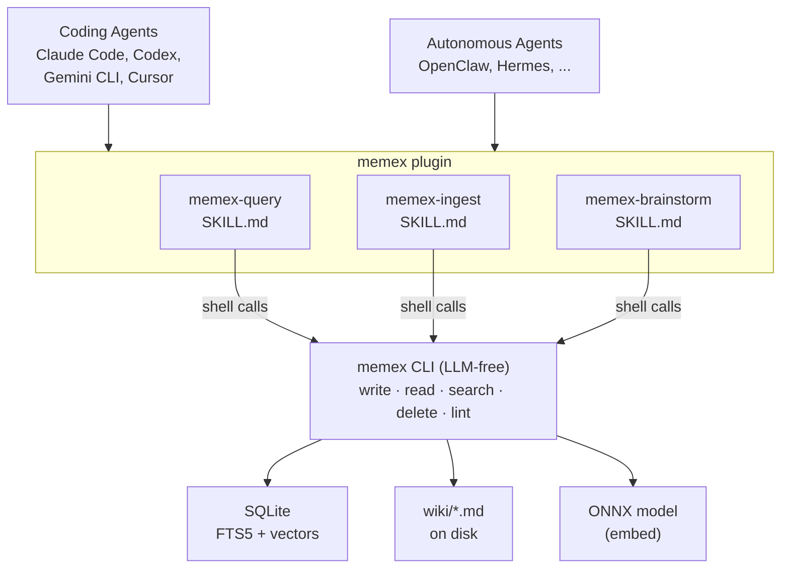
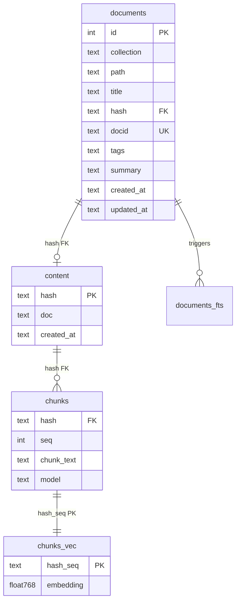
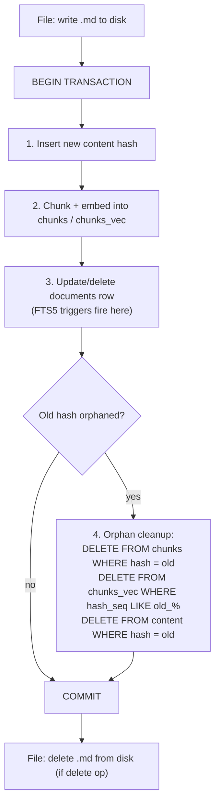
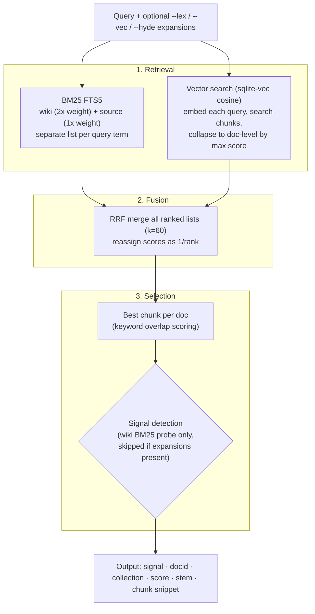
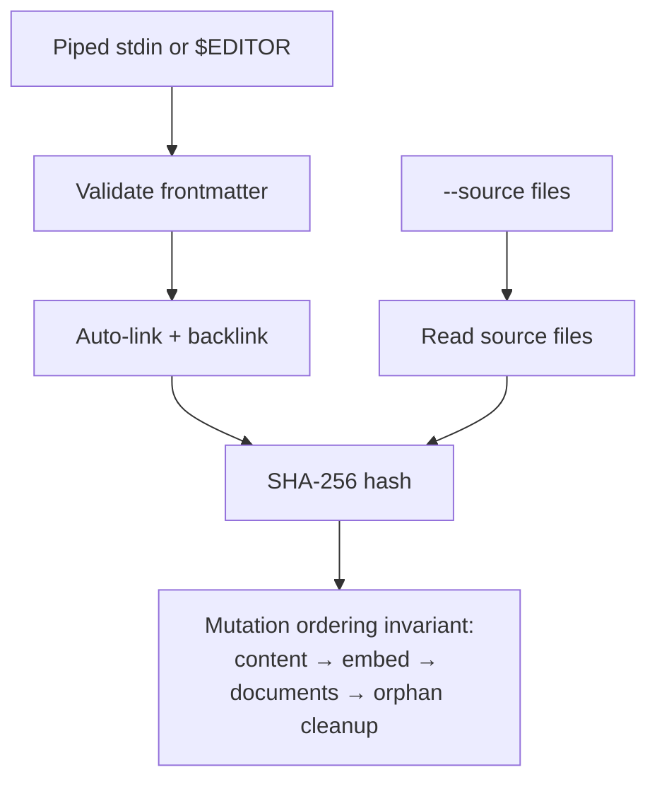
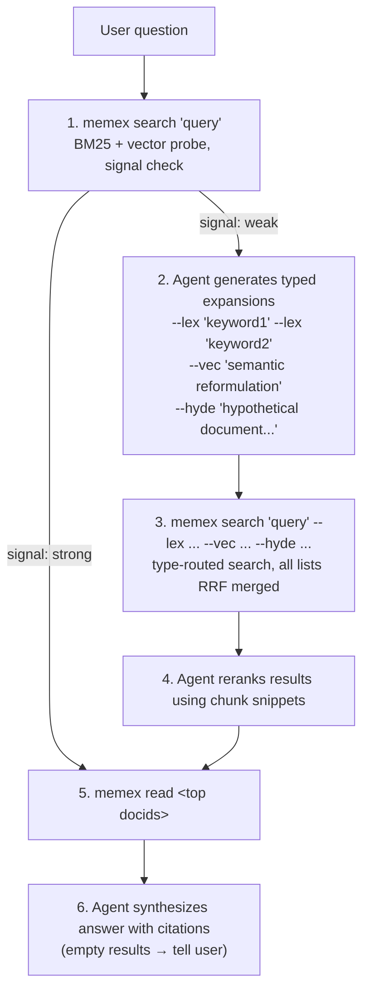
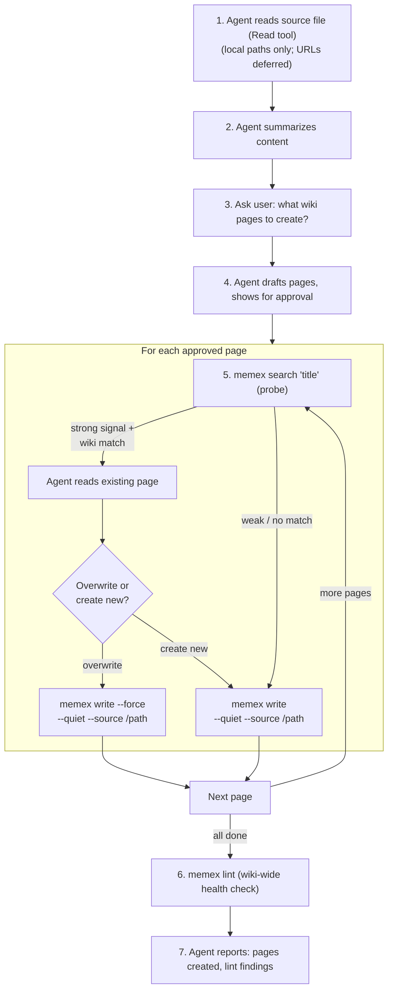
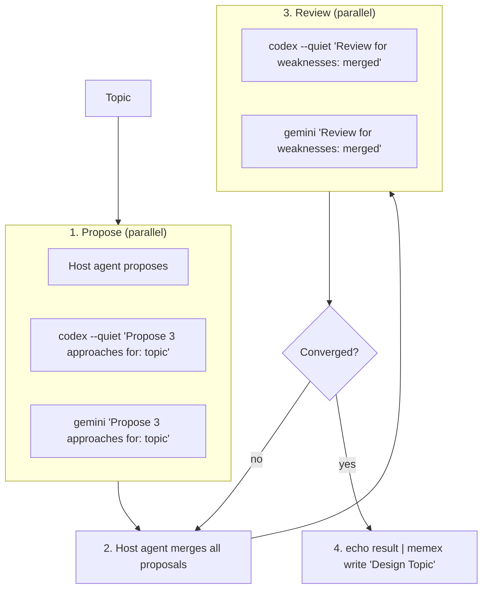

# Memex — Design Specification

**Status:** DRAFT
**Date:** 2026-04-07 (revised 2026-04-13)

---

## Overview

Memex is a personal knowledge system built on Karpathy's LLM-wiki pattern, named after Vannevar Bush's 1945 concept of a personal memory system with valued connections. It captures knowledge into a compounding wiki of interconnected pages, answers questions with full citations, and generates new knowledge through multi-LLM brainstorming.

The core insight: "the wiki is a persistent, compounding artifact." Instead of rediscovering relevant information from raw documents on every query (RAG), knowledge is extracted once, integrated into an evolving structure, and compounds over time. Cross-references are maintained automatically, contradictions are detectable via timestamps, and synthesis improves with each addition.

Memex is an independent experiment exploring the wiki synthesis pattern, separate from MemVerge's MemBox product.

### Architecture

The `memex` binary is an LLM-free wiki storage and search engine. All intelligence lives in agent skills that run inside AI agents — coding agents (Claude Code, Codex, Gemini CLI, Cursor), autonomous agents (OpenClaw, Hermes), or any agent that can invoke shell commands. Five commands: `write`, `read`, `search`, `delete`, `lint`. Skills orchestrate these commands to implement retrieval pipelines, interactive ingestion, and multi-LLM brainstorming.



| Concept | Implementation |
|---|---|
| Storage | Content-addressable SQLite following QMD (Section 2) |
| Search | BM25 + vector, typed queries (lex/vec/hyde), RRF fusion (Section 3) |
| Wiki | `~/.memex/wiki/*.md` with YAML frontmatter (Section 1) |
| Source | Original content in `source` collection, SQLite only (Section 1) |
| Skills | query, ingest, brainstorm — cross-platform SKILL.md (Section 6) |
| Plugin | npm package with bundled binary + model (Section 8) |

---

## 1. Wiki Page Format

Wiki pages and original sources serve different purposes:

| Layer | Purpose | Collection |
|---|---|---|
| Wiki page | Structured knowledge, cross-links, synthesis | `wiki` collection (also on disk as `~/.memex/wiki/*.md`) |
| Original source | Full detail, exact terms, verification | `source` collection (SQLite only) |

Wiki pages are markdown files with YAML frontmatter in `~/.memex/wiki/`.

```markdown
---
title: REST Patterns
tags:
  - api
  - design
created_at: 2026-04-06T00:00:00Z
updated_at: 2026-04-06T00:00:00Z
summary: Resource-oriented design with proper HTTP verbs and versioning.
sources: []
---

REST API patterns for resource-oriented design.

## URL Structure

Use nouns, not verbs: `/users/123` not `/getUser?id=123`.
Supports [[api-versioning]] via URL prefix.

## HTTP Methods

- GET: read
- POST: create
- PUT: replace
- PATCH: partial update
- DELETE: remove

Related: [[error-handling]], [[authentication]]
```

### Frontmatter fields

| Field | Required | Description |
|-------|----------|-------------|
| `title` | yes | Page title |
| `tags` | yes | Free-form tags (list) |
| `created_at` | yes | ISO 8601 timestamp |
| `updated_at` | yes | ISO 8601 timestamp |
| `summary` | no | One-line summary (stored in `documents.summary` for agent use) |
| `sources` | no | List of source file paths (for human readers; populated by the agent when drafting the page content, not by the binary. Not used by search or schema — purely informational.) |

### Cross-references

Wiki links use `[[page-stem]]` syntax where `page-stem` matches the filename without `.md`. Example: `[[rest-patterns]]` links to `wiki/rest-patterns.md`.

---

## 2. SQLite Schema

Follows QMD's content-addressable document model. All text lives in a single `content` table keyed by SHA-256 hash. The `documents` table stores all metadata (path, title, docid, tags, summary) and points to content via hash.



### Content table

Single source of truth for all document text. Content-addressable: identical text inserted twice is deduplicated.

**Hashed payload**: for wiki pages, the hash is computed over the **complete .md file** (frontmatter + body, exactly as written to disk). For source documents, the hash is computed over the full source file content at ingestion time. `lint --fix` detects stale wiki indexes by comparing the on-disk file hash against the stored hash (source documents are SQLite-only and not checked against disk).

```sql
CREATE TABLE IF NOT EXISTS content (
    hash       TEXT PRIMARY KEY,           -- SHA-256 of complete file content
    doc        TEXT NOT NULL,              -- full document text (frontmatter + body)
    created_at TEXT NOT NULL               -- ISO 8601 timestamp
);
```

### Documents table

Maps filesystem paths and collections to content hashes. A document is a wiki page or a source.

```sql
CREATE TABLE IF NOT EXISTS documents (
    id          INTEGER PRIMARY KEY AUTOINCREMENT,
    collection  TEXT NOT NULL,             -- 'wiki' or 'source'
    path        TEXT NOT NULL,             -- filesystem path (wiki: relative, source: absolute local path)
    title       TEXT NOT NULL,             -- extracted from frontmatter (wiki) or filename (source)
    hash        TEXT NOT NULL REFERENCES content(hash),
    docid       TEXT NOT NULL,             -- short content hash (6+ chars)
    tags        TEXT NOT NULL DEFAULT '',  -- wiki: from frontmatter; source: empty
    summary     TEXT NOT NULL DEFAULT '',  -- wiki: frontmatter summary if present, else first 120 chars of body; source: empty
    created_at  TEXT NOT NULL,              -- ISO 8601 timestamp
    updated_at  TEXT NOT NULL,             -- ISO 8601 timestamp
    UNIQUE(collection, path)
);

CREATE UNIQUE INDEX IF NOT EXISTS idx_documents_docid ON documents(docid) WHERE docid != '';
```

### FTS5 virtual table

Single FTS5 table indexing all documents. Searched with collection-filtered queries.

```sql
CREATE VIRTUAL TABLE IF NOT EXISTS documents_fts USING fts5(
    path,
    title,
    tags,
    body,
    content='',                              -- contentless: triggers manage content
    tokenize='porter unicode61'
);
```

Contentless FTS (`content=''`) because the `body` column comes from a join with `content` table, not from `documents` directly. Triggers manage all inserts/deletes. This avoids the column mismatch that `content='documents'` would cause on FTS rebuild.

FTS5 triggers join `documents` with `content` to populate the virtual table. The `body` value is the **body only** (after stripping YAML frontmatter), not the full .md file. This prevents frontmatter fields from being double-indexed (title and tags are already separate FTS columns). The same stripping applies to chunking and embedding.

```sql
CREATE TRIGGER IF NOT EXISTS documents_ai AFTER INSERT ON documents BEGIN
    INSERT INTO documents_fts(rowid, path, title, tags, body)
    VALUES (
        new.id, new.path, new.title, new.tags,
        (SELECT strip_frontmatter(doc) FROM content WHERE hash = new.hash)
    );
END;

CREATE TRIGGER IF NOT EXISTS documents_ad AFTER DELETE ON documents BEGIN
    INSERT INTO documents_fts(documents_fts, rowid, path, title, tags, body)
    VALUES ('delete', old.id, old.path, old.title, old.tags,
        (SELECT strip_frontmatter(doc) FROM content WHERE hash = old.hash)
    );
END;

CREATE TRIGGER IF NOT EXISTS documents_au AFTER UPDATE ON documents BEGIN
    INSERT INTO documents_fts(documents_fts, rowid, path, title, tags, body)
    VALUES ('delete', old.id, old.path, old.title, old.tags,
        (SELECT strip_frontmatter(doc) FROM content WHERE hash = old.hash)
    );
    INSERT INTO documents_fts(rowid, path, title, tags, body)
    VALUES (
        new.id, new.path, new.title, new.tags,
        (SELECT strip_frontmatter(doc) FROM content WHERE hash = new.hash)
    );
END;
```

`strip_frontmatter()` is a Rust function registered as a SQLite application-defined function. It strips YAML frontmatter (text between `---` delimiters at the start of the document) and returns the body only. Source documents without frontmatter are returned as-is.

### Vector search tables

Content-hash-based storage. Embeddings are keyed by content hash + chunk sequence. Survive renames and deduplicate naturally.

```sql
CREATE TABLE IF NOT EXISTS chunks (
    hash        TEXT NOT NULL REFERENCES content(hash),
    seq         INTEGER NOT NULL,          -- chunk index within document
    chunk_text  TEXT NOT NULL,             -- chunk text (body only, frontmatter stripped)
    pos         INTEGER NOT NULL,          -- character offset in body
    len         INTEGER NOT NULL,          -- character length of chunk
    model       TEXT NOT NULL,             -- embedding model name
    embedded_at TEXT NOT NULL,             -- ISO 8601 timestamp
    PRIMARY KEY(hash, seq)
);

CREATE VIRTUAL TABLE IF NOT EXISTS chunks_vec USING vec0(
    hash_seq TEXT PRIMARY KEY,             -- "{hash}_{seq}"
    embedding float[768] distance_metric=cosine
);
```

### Mutation ordering invariant

All operations that change `documents.hash` (wiki overwrite via `--force`, backlink rewrite, `lint --fix` reindex, source upsert) or delete a document follow this order:



Filesystem writes happen **outside** the transaction: file written before BEGIN, deleted after COMMIT. If crash occurs between file and DB, `lint --fix` detects the mismatch (untracked file or missing file).

This ordering ensures: FTS triggers have access to content during step 3 (old + new content rows both exist), vector search never sees a document without embeddings (step 2 before step 3), and stale data is cleaned last (step 4). The SQLite transaction guarantees crash safety — partial mutations are rolled back.

### Docid

Short identifier for each document. Every document (wiki and source) gets a docid.

- **Primary**: first 6 characters of the content hash. Extend to 7, 8, ... if another document already has that prefix.
- **Fallback**: if two documents have identical content (same full hash, different paths), the content-hash prefix can never disambiguate. In this case, hash `collection + path` and use a 6+ char prefix of that instead. This is rare (duplicate content across different paths).
- Most documents get 6-char content-hash docids (16.7M possibilities, collisions unlikely below ~5,000 documents)
- **Stability**: content-hash docids change when content is edited. Path-hash fallback docids are stable only while the duplicate-content condition persists; if a document is later edited so its content hash becomes unique, the docid reverts to content-hash-based on next recompute. In all cases, docids should be treated as short-lived lookup handles, not permanent identifiers. Agents should use filename stems in citations and cross-references. Wiki links (`[[page-stem]]`) are filename-based for this reason.
- Stored in `documents` table with unique index for O(1) lookup
- Computed on write, collision check is a single `WHERE docid = ?` query per attempt
- `memex read` and `memex delete` accept any identifier form (docid, stem, path, or title) — see identifier resolution in CLI Commands

### Summary

Frontmatter `summary` field if present; otherwise, first 120 characters of the body (after stripping frontmatter). Stored in `documents.summary`. Available for agent use via `memex read` output; not included in search output (search returns docid + score + stem + chunk snippet).

---

## 3. Search & Ranking



Subsections below define each step in this pipeline.

### Embedding model

- **Default**: embedding-gemma-300m (ONNX INT8, ~329MB)
  - 768 dimensions, 2048 token context, strong code support (90.1 on CodeSearchNet Retrieval)
- **Bundled**: model pinned by npm package version, downloaded during `postinstall` to `~/.memex/models/`. Model upgrades via `npm update`.
- **Runtime**: ONNX via `ort` crate (prebuilt binaries, no cmake needed, ~135ms/embed on CPU). GGUF/llama.cpp rejected: ~3s/embed on CPU (20x slower), requires cmake + C++ toolchain.

### Chunking

Documents are split into chunks before embedding:
- **Max chunk size**: 900 tokens (within embedding-gemma's 2048 limit)
- **Overlap**: 15% (~135 tokens)
- **Markdown-aware break points** with scored boundaries: heading h1-h6 (score 100-50), code block (80), paragraph (20), list item (5), newline (1). Higher-scored break points are preferred. Code fence protection prevents splitting inside fenced blocks.
- **Search window**: 200 tokens around target split point to find the best break point
- **Both wiki pages and source content are chunked and embedded**

### RRF fusion (following QMD)

Each document $d$ receives an RRF score summed across $n$ ranked lists:

$$\text{RRF}(d) = \sum_{i=1}^{n} \frac{w_i}{k + r_i(d)} + \text{bonus}(r_i(d))$$

where $r_i(d)$ is the **1-based rank** of document $d$ in list $i$ (rank 1 = top result). Documents not in a list are excluded from that list's contribution.

| Parameter | Value | Notes |
|---|---|---|
| $k$ | 60 | Smoothing constant |
| $w_i$ | 2.0 for wiki BM25 lists, 1.0 for all others | By collection, not by position (see below) |
| $\text{bonus}$ | +0.05 if $r = 1$, +0.02 if $r \in \{2, 3\}$ | Top-rank bonus |

**List weighting**: wiki BM25 lists (from primary query and each `--lex` term) get weight 2.0. Source BM25 lists and all vector lists get weight 1.0. This is **collection-based**, not positional — unlike QMD which weights the first 2 lists by position. Memex uses collection-based weighting because `--lex` expansion creates variable numbers of BM25 lists; positional weighting would incorrectly over-weight whichever list happens to be second.

Post-fusion scores reassigned as $s(d) = 1 / r$ where $r$ is the final rank (rank 1 = 1.0, rank 2 = 0.5, rank 3 = 0.33). No minScore filtering (QMD's `hybridQuery` default is 0).

Note: QMD blends RRF rank with local reranker scores via $s = w_{\text{rrf}} \cdot \frac{1}{r} + (1 - w_{\text{rrf}}) \cdot s_{\text{rerank}}$. Memex returns RRF scores with best-chunk snippets; the agent LLM reranks results using the snippets before reading full documents.

### BM25 column weights

| Collection | SQL | Weights |
|---|---|---|
| wiki | `bm25(documents_fts, 1.5, 4.0, 1.5, 1.0)` | path=1.5, title=4.0, tags=1.5, body=1.0 |
| source | `bm25(documents_fts, 1.5, 4.0, 0.0, 1.0)` | path=1.5, title=4.0, tags=0.0, body=1.0 |

Note: QMD has 3 FTS columns (filepath, title, body) with weights (1.5, 4.0, 1.0); memex adds a tags column. Wiki 2x weighting is applied in the RRF list weighting above, not in BM25 scores.

### Score normalization

Raw FTS5 BM25 scores (negative, lower = better) normalized via sigmoid:

$$s = \frac{|x|}{1 + |x|}$$

Query-independent mapping:

| Raw BM25 | Normalized | Interpretation |
|---|---|---|
| $-10$ | $0.91$ | Strong match |
| $-2$ | $0.67$ | Medium match |
| $-0.5$ | $0.33$ | Weak match |
| $0$ | $0$ | No match |

### Signal detection

Runs on the **initial BM25 probe only** (normalized BM25 scores before RRF fusion), not on post-fusion `1/rank` scores. This matches QMD's `hybridQuery()` which probes FTS first, then decides whether to expand.

$$\text{strong} \iff s_1 \geq 0.85 \;\wedge\; (s_1 - s_2) \geq 0.15$$

where $s_1$ and $s_2$ are the top two **normalized BM25 scores** from the wiki collection FTS probe. If fewer than 2 results, $s_2 = 0$. If no results, signal is always weak. When strong, the agent skips query expansion. Source and vector evidence do not participate in signal detection (intentional: the BM25 probe is a fast pre-check, not a full search).

### Best chunk selection

For each result document, the best-matching chunk is selected via keyword overlap scoring (primary query terms weighted 1.0, `--lex` terms weighted 1.0, `--vec`/`--hyde` terms weighted 0.5). The chunk snippet is included in the output for agent reranking.

### Vector search: chunk-to-document collapse

Each `--vec`/`--hyde` query (and the primary query) is embedded and searched via sqlite-vec cosine similarity. Chunk hits are collapsed to document-level: for each document, keep the chunk with the highest cosine score, deduplicate by document, rank by max chunk score. Each query produces one document-level ranked list fed into RRF.

### Configuration

Embedding model is a constant in the binary, pinned by the npm package version. No user-facing configuration. Model upgrades ship with npm package updates; run `memex lint --fix` after upgrade to re-embed (see lint command).

---

## 4. CLI Commands

The `memex` binary is LLM-free. No `init` (lazy init on first `write`), no `auth` (no LLM provider). Five commands: `write`, `read`, `search`, `delete`, `lint`.

### `memex write <filename|title> [--source <path> ...] [--force] [--quiet]`

Writes a wiki page. Content from piped stdin (auto-detected) or interactive `$EDITOR` (when terminal). Like `git commit` — no flag needed. Optionally attaches original source content via `--source` (repeatable).

**Filename normalization**: if the argument contains spaces or uppercase, it is normalized to a kebab-case filename stem (e.g., `"REST API Design"` → `rest-api-design.md`). If the argument already looks like a filename stem (lowercase, hyphens, no spaces), it is used as-is.



Flags:

- `--force` — overwrite if page already exists (default: fail on conflict)
- `--quiet` — reduced output (suppress linked, backlinked, suggest-create lines)

On create, checks for exact filename conflict → hard block if exists. Use `--force` to overwrite.

If no conflict (or `--force`):

1. **Lazy init** — if `~/.memex/` doesn't exist, create directory + SQLite DB
2. **Validate** — parse YAML frontmatter, reject if invalid
3. **Auto-link** — scan body for mentions of existing page titles/stems (case-insensitive), replace first occurrence of each target with `[[page-stem]]`
4. **Backlink** — scan all existing pages for mentions of this page's title/stem, add `[[page-stem]]` links to them. Backlinked pages are rewritten to disk and their content hashes updated in SQLite. Docids are **not** recomputed (they are stable once assigned). `updated_at` is **not** bumped for backlink-only edits (the page's knowledge content didn't change, only a link was added). This keeps recency truthful for stale-knowledge detection.
5. **Store content + embed + update documents** — follows the mutation ordering invariant:
   1. Hash complete .md file (frontmatter + body), `INSERT OR IGNORE` into `content` table.
   2. Chunk and embed new content hash into `chunks` + `chunks_vec`.
   3. Insert/update `documents` row (collection=`wiki`, with tags, summary, `created_at` and `updated_at` from the new page's frontmatter). The agent is responsible for setting appropriate timestamps when drafting page content.
   4. Orphan-clean old hash if overwriting.
6. **Store sources** — if `--source` provided, same mutation ordering: hash source content → `INSERT OR IGNORE` into `content` → embed → upsert `documents` (collection=`source`) → orphan-clean old hash. Source `created_at` set on first insert, `updated_at` set to current time.

Output (success):
```
written: a3f2b1
wiki_pages: 42
linked: rest-patterns, distributed-systems
backlinked: caching-strategies
suggest-create: error-handling
```

Output (success, `--quiet` flag — for bulk operations):
```
written: a3f2b1
wiki_pages: 42
```

Output (conflict):
```
conflict: api-design
existing: "REST API Design Patterns" (updated_at 2026-04-10)
```

- `written` — docid of the page
- `wiki_pages` — total wiki page count after write
- `linked` — existing pages this page now links to (auto-linked). Suppressed by `--quiet`.
- `backlinked` — existing pages that now link to this page (auto-linked). Suppressed by `--quiet`.
- `suggest-create` — topics mentioned in body with no matching page. Suppressed by `--quiet`.
- `conflict` — exact filename match (use `--force` to overwrite). Never suppressed.

### `memex read <identifier> ...`

Reads one or more documents (wiki or source). Accepts docid, filename stem, path, or title (see identifier resolution). Includes `updated_at` timestamp for contradiction resolution.

```
=== a3f2b1c9 wiki api-design-notes ===
---
title: API Design Notes
tags:
  - api
  - rest
created_at: 2026-04-06T00:00:00Z
updated_at: 2026-04-10T14:30:00Z
---

Summary of API design notes covering [[rest-patterns]] and error-handling.
```

Header line: `=== docid collection stem ===` (space-separated). Followed by the full .md content (frontmatter + body). The `updated_at` timestamp is in the frontmatter, not duplicated in the header.

Source documents are also readable by docid. The agent can read any document (wiki or source) returned by search.

**Identifier resolution**:
1. **Docid**: prefix match against `documents.docid`
2. **Filename stem**: match input against `documents.path`. For wiki docs: input `rest-patterns` matches path `wiki/rest-patterns.md` (strip directory prefix and `.md` extension). For source docs: match against the basename without extension (e.g., input `article` matches path `/path/to/article.md`). If no stem match, try exact path match.
3. **Title**: case-insensitive match against `documents.title`

First match wins across tiers. If multiple documents match within a tier (e.g., duplicate titles), return all matches for `read`, error for `delete` (must resolve to exactly one wiki document). `delete` only accepts wiki collection documents; attempting to delete a source document is an error.

### `memex search <query> [--lex <term> ...] [--vec <term> ...] [--hyde <term> ...]`

Full-text and vector search across wiki pages and source documents. Typed expansion flags follow QMD's query types. See Search & Ranking for the math.

**Simple form** (probe — both BM25 and vector):
```bash
memex search "REST API design"
```

**With typed expansions** (agent generates these):
```bash
memex search "REST API design" \
  --lex "RESTful endpoints" --lex "HTTP methods CRUD" \
  --vec "web service interface patterns" \
  --hyde "A guide to designing REST APIs with proper resource naming"
```

**Query types**:

| Flag | Routed to | Purpose |
|---|---|---|
| positional `<query>` | BM25 + vector | Primary query — probes all backends |
| `--lex <term>` | BM25 only | Keyword variants (repeatable) |
| `--vec <term>` | Vector only | Semantic reformulations (repeatable) |
| `--hyde <term>` | Vector only | Hypothetical document embedding (repeatable) |

Each flag value becomes a separate ranked list. All lists merged via RRF.

**Probe call** (`memex search "query"` — no typed flags): runs full pipeline (see Search & Ranking diagram). Returns signal + results.

**Expansion call** (`memex search "query" --lex ... --vec ... --hyde ...`): same pipeline but with additional BM25 lists (from `--lex`) and vector lists (from `--vec`/`--hyde`). Signal detection is **skipped** — no `signal:` line in output.

**Query sanitization**: quoted phrases preserved (`"exact match"` → FTS5 phrase query), negation supported (`-term` → NOT clause), hyphens converted to phrases (`multi-agent` → `"multi agent"`), bare words prefix-matched (`term` → `"term"*`), positives AND-joined.

**Probe output** (no typed flags):
```
signal: strong
a3f2b1c9  wiki  1.000  api-design-notes  REST API patterns for resource-oriented design...
7c9e4d02  wiki  0.500  rest-patterns     HTTP methods map to CRUD operations on resources...
```

**Expansion output** (typed flags present — no signal line):
```
a3f2b1c9  wiki    1.000  api-design-notes  REST API patterns for resource-oriented design...
7c9e4d02  wiki    0.500  rest-patterns     HTTP methods map to CRUD operations on resources...
e4f1a2b3  source  0.333  /path/to/article  Original REST API specification from...
```

- Probe includes `signal: strong` / `signal: weak` first line; expansion does not
- Each result line: docid + collection + post-fusion score + filename stem (wiki) or path (source) + best chunk snippet (tab-separated)
- Scores are `1/rank` (rank 1 = 1.0, rank 2 = 0.5, rank 3 = 0.33) — ordinal position, not calibrated similarity

**Two-call pattern**:

1. **Probe call**: `memex search "query"` — runs BM25 + vector, returns signal + results. Agent checks signal.
2. **Expansion call** (only if weak): `memex search "query" --lex ... --vec ... --hyde ...` — runs type-routed search, no signal detection (agent already decided to expand).

When `--lex`/`--vec`/`--hyde` flags are present, signal detection is skipped and no `signal:` line is emitted. This matches QMD's `structuredSearch()` path which takes user-provided typed queries as-is.

### `memex delete <identifier> [--force]`

Removes a wiki page. Identifier resolved via the shared identifier resolution rules (must resolve to exactly one wiki document; error on multiple matches or source documents). Prompts for confirmation when stdin is a TTY; `--force` skips the prompt. Agents (not a TTY) skip confirmation automatically. Deletes file from disk, removes `documents` row from SQLite (hard delete) following the mutation ordering invariant (FTS5 trigger fires, then orphan cleanup). Reports pages with now-dangling links.

```
deleted: a3f2b1
wiki_pages: 41
dangling: auth-overview, api-design-notes
```

- `dangling` — pages that now have broken `[[deleted-page]]` links. The agent decides whether to clean them up.

### `memex lint [--fix]`

Reports structural issues in the wiki. LLM-free.

- **Stale index** — wiki file on disk has been manually edited; content hash doesn't match SQLite
- **Dangling wiki links** — `[[page-stem]]` references to pages that don't exist
- **Missing cross-references** — page body mentions an existing page's title/stem but has no `[[...]]` link
- **Untracked file** — .md file exists in `wiki/` but has no `documents` row (crash recovery or manual file creation)
- **Missing file** — wiki `documents` row exists but .md file is missing from disk (crash recovery or manual file deletion)

Note: lint only checks wiki documents against disk. Source documents are SQLite-only (no files on disk to go stale).

Output:
```
stale-index: rest-patterns (file modified, index outdated)
dangling: api-design-notes -> [[error-handling]]
missing-link: auth-overview -> [[oauth-migration]]
untracked: wiki/new-page.md (no DB row)
missing-file: old-page (DB row, no file)
```

With `--fix`:
- **Stale index**: reindexes from disk following the mutation ordering invariant (see SQLite Schema). Preserves frontmatter `created_at` and `updated_at` timestamps as-is.
- **Outdated embeddings**: compares `chunks.model` against current model name, re-embeds all documents (wiki and source) with outdated models.
- **Untracked files**: reported only (user decides: `memex write --force < file` to index, or delete the file).
- **Missing files**: reported only (user decides: restore the file, or `memex delete` to clean the DB row).
- **Dangling links / missing cross-references**: reported but not auto-fixed.

```
fixed: rest-patterns (reindexed from disk)
re-embedded: 12 documents (model upgrade)
dangling: api-design-notes -> [[error-handling]]
missing-link: auth-overview -> [[oauth-migration]]
untracked: wiki/new-page.md (no DB row)
missing-file: old-page (DB row, no file)
```

`memex write` is the canonical write path. Manual edits are detected by lint, not first-class. `memex write` already reports per-page lint info (linked, backlinked, suggest-create). `memex lint` checks the entire wiki. Disk-level checks (stale index, untracked, missing file) apply to wiki documents only. Embedding checks (model upgrades) apply to all documents (wiki and source).

---

## 5. Auto Cross-Linking

`memex write` automatically maintains wiki cross-references. No LLM needed.

### Forward linking

On write, scan the body for mentions of existing page titles and filename stems (case-insensitive). Replace the first occurrence with a `[[page-stem]]` wiki link.

- Body: "This covers REST patterns and caching strategies."
- `rest-patterns.md` and `caching-strategies.md` exist
- After write: "This covers [[rest-patterns]] and [[caching-strategies]]."

### Backward linking

After writing a new page, scan all existing pages for mentions of the new page's title/stem. Add `[[page-stem]]` links to those pages.

- New page: `oauth-migration.md` with title "OAuth Migration"
- Existing page `auth-overview.md` body mentions "OAuth migration was completed in Q1"
- After write: "[[oauth-migration]] was completed in Q1"

### Rules

- Match longer titles before shorter ones (prevents "Rust" from consuming "Rust Borrow Checker")
- Only replace the first occurrence of each target page name (multiple different targets can each be linked once in the same page)
- Skip text already inside `[[...]]` links
- Case-insensitive matching against title and filename stem (Unicode-safe via regex)
- Don't link a page to itself

---

## 6. Skills

Three skills. All cross-platform — same SKILL.md works in any agent that can run shell commands (Claude Code, Codex, Gemini CLI, Cursor, OpenClaw, Hermes, etc.).

### `memex-query` — Full retrieval pipeline

Follows QMD's pipeline structure. The agent LLM replaces QMD's local models (Qwen3-1.7B for expansion, Qwen3-Reranker for reranking) — same pipeline, same typed queries, agent handles the intelligence.



**Typed query expansion**: when signal is weak, the agent generates three types of expansion:
- **`--lex`** — keyword variants targeting exact terms the wiki might contain (routed to BM25). Example: user asks "how do we handle auth?" → agent generates `--lex "authentication" --lex "OAuth token session"`
- **`--vec`** — semantic reformulations of the question (routed to vector search). Example: → `--vec "user identity verification and access control"`
- **`--hyde`** — a hypothetical document that would answer the question (routed to vector search). Example: → `--hyde "Authentication in this system uses OAuth 2.0 with JWT tokens stored in httpOnly cookies"`

This matches QMD's Qwen3-1.7B expansion output format, but generated by the agent LLM instead.

**Agent reranking**: search results include best-chunk snippets (see Search & Ranking). The agent reranks by relevance before reading full documents, replacing QMD's local Qwen3-Reranker.

### `memex-ingest` — Interactive source ingestion

The agent reads source material, generates wiki pages, and writes them interactively.



Pre-write check (step 5): agent uses signal, collection, and stem from search output to judge similarity. Source hits are ignored for duplicate detection. Numeric scores are ordinal (`1/rank`), not calibrated similarity — don't threshold on them.

### `memex-brainstorm` — Multi-LLM brainstorming via cross-CLI calls

Uses external agent CLIs for multi-model diversity. Discovery: `which claude codex gemini 2>/dev/null`.



**Fallback:** if only one CLI is available, single-model brainstorm with persona/temperature variation.

---

## 7. Proactive Behavior

Defined in `plugin/AGENTS.md` (cross-platform behavioral instructions). Platform-specific files (`plugin/CLAUDE.md`, `plugin/GEMINI.md`) import these triggers. Not a skill — behavioral instructions that any host agent can follow.

### Trigger 1: New knowledge produced

When the conversation produces wiki-worthy knowledge (design decisions, debugging insights, discovered patterns), the agent prompts:

> "This looks like useful knowledge for your memex. Want me to add a wiki page about [topic]?"

If yes, the agent drafts content and pipes it to `memex write`.

### Trigger 2: Stale information detected

When the agent retrieves wiki pages via `memex-query` and content contradicts the current conversation, the agent compares `updated_at` timestamps to determine recency, then prompts:

> "Your wiki page [title] (last updated [date]) seems outdated — it says X but we're seeing Y. Want me to update it?"

If yes, the agent updates via `memex write --force`.

### Trigger 3: Wiki health check

When the user asks about wiki health, issues, or maintenance, the agent runs `memex lint` and reports findings.

All triggers are opt-in — the agent prompts, the user decides.

Note: No hooks needed. `memex write` output already provides per-page lint information (linked, backlinked, suggest-create). Full wiki `memex lint` is an occasional maintenance command, not an automatic trigger.

---

## 8. Plugin Distribution

```
memex/
├── .claude-plugin/
│   └── marketplace.json        # npm source: @memverge/memex
├── Cargo.toml                  # Workspace: core, cli
├── CLAUDE.md                   # Developer instructions
├── AGENTS.md                   # Developer instructions
├── core/                       # memex-core library (storage, search, validation)
├── cli/                        # memex-cli binary (five commands)
├── plugin/                     # Cross-platform agent plugin (published as @memverge/memex)
│   ├── package.json            # npm package with postinstall script
│   ├── postinstall.js          # Downloads binary to PATH + model to ~/.memex/models/
│   ├── .claude-plugin/plugin.json
│   ├── .codex-plugin/plugin.json
│   ├── .codex/INSTALL.md
│   ├── .cursor-plugin/plugin.json
│   ├── gemini-extension.json
│   ├── CLAUDE.md               # Plugin user instructions + proactive behavior
│   ├── AGENTS.md
│   ├── GEMINI.md
│   └── skills/
│       ├── memex-query/SKILL.md
│       ├── memex-ingest/SKILL.md
│       └── memex-brainstorm/SKILL.md
└── docs/
```

### Audience separation

- Root `CLAUDE.md` / `AGENTS.md` — for developers working ON memex
- `plugin/CLAUDE.md` / `plugin/AGENTS.md` — for users of the plugin (loaded when installed)

### Install

Distributed as a single npm package (`@memverge/memex`). The `postinstall` script downloads the platform-specific prebuilt `memex` binary from GitHub Releases and the embedding model (~329MB) from HuggingFace. Everything is ready after install — no separate steps.

| Platform | Install |
|----------|---------|
| Claude Code | `/plugin install memex@memverge` (marketplace runs `npm install` automatically) |
| Codex | `npm install @memverge/memex`, configure skill directory |
| Gemini CLI | `npm install @memverge/memex`, configure extension directory |
| Cursor | `npm install @memverge/memex`, configure plugin directory |
| Any agent | `npm install @memverge/memex` |

The `postinstall` script detects the platform (macOS arm64/x86, Linux x86, Windows x86_64), downloads the correct prebuilt binary to the package's `bin/` directory, and downloads the embedding model to `~/.memex/models/`. The npm `"bin"` field in `package.json` points to a thin JS wrapper that spawns the platform binary — npm automatically makes this available on PATH (symlinks on Linux/macOS, `.cmd` wrappers on Windows). Skills call `memex` directly.

For developers building from source: `cargo install --path cli` (puts `memex` on PATH; plugin skills fall back to PATH lookup if `$PLUGIN_DIR/bin/memex` doesn't exist).

**Marketplace entry** (in root `.claude-plugin/marketplace.json`):
```json
{
  "name": "memex",
  "source": {
    "source": "npm",
    "package": "@memverge/memex"
  }
}
```

---

## 9. Deferred

- **PDF/image source extraction**: current design stores text sources only. PDF text extraction and image description generation are future additions.
- **Source content for URLs**: mechanism for storing web content fetched by the agent. May need a stdin protocol for passing pre-fetched content.
- **MCP server** — expose memex operations as MCP tools for richer structured integration

---

## References

- Karpathy's LLM-wiki idea: https://gist.github.com/karpathy/442a6bf555914893e9891c11519de94f
- QMD (Query Markup Documents): https://github.com/tobi/qmd
